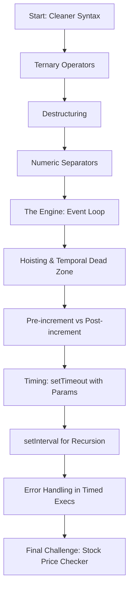

Ever felt like JavaScript does things that don't quite make sense? That's usually because the "magic" is happening in the engine foundations. This module is designed to pull back the curtain and turn "magic" into **mastery**.

:::tip
By the end of this module, you won't just write code that works; you'll understand *why* it works and how the browser handles it.
:::

## Module Roadmap

Before we start coding, let's look at the flow of this module. We move from syntax sugar to the deep architectural roots of the language.

## What’s in the Toolbox?

We aren't just looking at `if/else` statements anymore. We are leveling up our syntax and mental models.

<Tabs>
<TabItem value="syntax" label="Cleaner Syntax" default>
Learn to write less code but do more.
* **Ternary Operators:** Deep nesting without the mess.
* **Destructuring:** Extracting data like a pro.
* **Numeric Separators:** Making BigInt and large numbers actually readable (e.g., `1_000_000`).
</TabItem>
<TabItem value="engine" label="The Engine">
This is where the real "Advanced" stuff happens:
* **The Event Loop:** How JS handles concurrency.
* **Hoisting:** Understanding the Temporal Dead Zone.
* **Pre-increment vs Post-increment:** Small symbols, big differences.
</TabItem>
<TabItem value="async" label="Timing">
Mastering the clock:
* `setTimeout` with parameters.
* `setInterval` for recursive tasks.
* Error handling within timed executions.
</TabItem>
</Tabs>

## Try it Out!

Before we dive into the docs, play around with this demo. It combines **Ternary Logic**, **Timing**, and **Template Literals**—all things we will master in this section.

<CodePenEmbed 
  title="Advanced Foundations Introduction"
  penId="jErZKmj"
/>

:::info
**Try this:** Change the "Status" logic in the JS panel of the Pen to see how the UI reacts!
:::

## The Final Boss

At the end of this module, you'll face the **Stock Price Checker Super Challenge**. You'll need to combine timing, logic, and error handling to build a real-time simulation.

:::important
Don't skip the challenges! Advanced JavaScript is a muscle—you have to flex it to grow it.
:::

:::info Note on math
You might see some complex logic later. Don't worry, we use KaTeX to keep things clear, like calculating growth: $G = \frac{V_{new} - V_{old}}{V_{old}}$.
:::