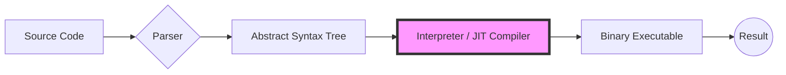
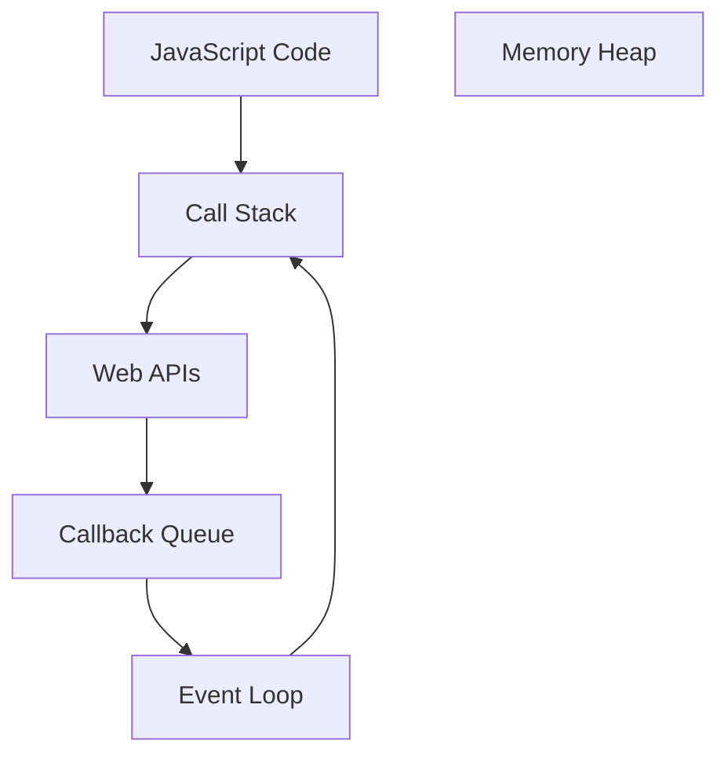

Welcome to the first module of the **Advanced JavaScript Course**. Before we build complex applications, we must master the environment where our code lives and breathes.

To become a top-tier developer, you must stop looking at JavaScript as a "black box." In this module, we peel back the layers of the browser to understand exactly how our code is executed.

:::tip Welcome Aboard!
You aren't just here to learn syntax—you're here to understand the **logic** and **architecture** of the world's most popular programming language.
:::

## What is JavaScript, Really?

JavaScript is a high-level, interpreted (or JIT-compiled), multi-paradigm language. But at its core, it follows a specific workflow to turn your text into action.

### The JavaScript Lifecycle
Using **Mermaid**, we can visualize how the Engine processes your code:

## Why Study Advanced JS?

Many developers get stuck at the "Junior" or "Intermediate" level because they don't understand the foundations. Mastering these concepts allows you to:

<Tabs>
<TabItem value="perf" label="Performance" default>
Understand **Memory Management** and the **Garbage Collector** to prevent memory leaks and slow apps.
</TabItem>
<TabItem value="debug" label="Debugging">
When you understand the **Call Stack**, you stop guessing why an error happened and start knowing exactly where the execution failed.
</TabItem>
<TabItem value="async" label="Asynchronous Mastery">
Master the **Event Loop** and **Promises** to handle complex data fetching without freezing your UI.
</TabItem>
</Tabs>

## The "Big Three" Foundations

In this section, we will deep dive into three mathematical and logical pillars of the language.

### 1. The Execution Context

The **Execution Context** is the environment where your code runs. It consists of:
- **Global Execution Context**: The default context where your code starts executing.
- **Function Execution Context**: Created whenever a function is invoked.

**Now watch this video to visualize how the Execution Context works:**

<Tabs>
<TabItem value="en" label="English" default>

<LiteYouTubeEmbed
  id="zdGfo6I1yrA"
  params="autoplay=1&autohide=1&showinfo=0&rel=0"
  title="JavaScript Visualized - Execution Contexts"
  poster="maxresdefault"
  webp
/>
</TabItem>
<TabItem value="hi" label="हिन्दी">

<LiteYouTubeEmbed
  id="HMWIyMCl6_s"
  params="autoplay=1&autohide=1&showinfo=0&rel=0"
  title="How JavaScript Works in Hindi | JavaScript Execution Context"
  poster="maxresdefault"
  webp
/>
</TabItem>
</Tabs>

 

By understanding the Execution Context, you can predict how variables and functions are scoped and accessed.

### 2. Single-Threaded Nature

JavaScript runs on a single thread, meaning it can execute one command at a time. This is crucial for understanding how tasks are queued and executed.

**Now watch this video to see how single-threading works:**

<Tabs>
<TabItem value="en" label="English" default>

<LiteYouTubeEmbed
  id="os7KcmJvtN4"
  params="autoplay=1&autohide=1&showinfo=0&rel=0"
  title="JThe Genius Behind Node.js Single Thread Model"
  poster="maxresdefault"
  webp
/>

</TabItem>
<TabItem value="hi" label="हिन्दी">

<LiteYouTubeEmbed
  id="HqetHGt4iD8"
  params="autoplay=1&autohide=1&showinfo=0&rel=0"
  title="JIs JavaScript Single Threaded ??"
  poster="maxresdefault"
  webp
/>

</TabItem>
</Tabs>

 

Now that you understand the single-threaded nature, you can see how JavaScript handles tasks without blocking the main thread.

### 3. Non-blocking I/O

JavaScript uses non-blocking I/O to handle operations like network requests and file reading without freezing the UI. This is achieved through the **Event Loop** and **Callback Queue**.

$$
OR
$$

Even though it's single-threaded, JS doesn't wait for a timer or an API call. It offloads that to the Web APIs and waits for the **Callback Queue**.

**Now watch this video to understand non-blocking I/O:**

<LiteYouTubeEmbed
  id="wB9tIg209-8"
  params="autoplay=1&autohide=1&showinfo=0&rel=0"
  title="Non-blocking I/O and how Node uses it"
  poster="maxresdefault"
  webp
/>

 

Understanding non-blocking I/O is essential for building responsive applications that can handle multiple tasks efficiently.

:::tip Key Takeaway

Mastering these three foundations will elevate your JavaScript skills and prepare you for more complex topics like Asynchronous Programming, Closures, and Prototypes.
:::

## Try it Out!

Before we move to the next lesson, see if you can predict the output of this common "Advanced Foundations" in our interactive editor.

<CodePenEmbed
title="JS Execution Context Demo"
penId="jErZKmj"
/>

In this example, you can see how the **Event Loop** manages the timer without blocking the main thread, while also using **ternary operators** for clean conditional logic.

:::info Pro Tip
Pay attention to how `setInterval` works with the **Event Loop** and **Callback Queue** to avoid blocking the main thread.
:::

## What We Will Cover in This Module

| Topic | What You'll Learn |
| --- | --- |
| **The Engine** | V8, Parsing, and Just-In-Time (JIT) compilation. |
| **Memory Heap** | Where variables are stored and how memory is allocated. |
| **The Call Stack** | How JS tracks function execution. |
| **Hoisting** | The "magic" behind variable and function declarations. |
| **Event Loop** | How JS handles asynchronous code without blocking. |

## Connect & Grow

We believe learning is better together. If you get stuck or find a "Eureka!" moment, don't keep it to yourself!

Join our [Community](https://github.com/codeharborhub) to discuss concepts, share projects, and get help from fellow learners and mentors.

:::success Next Step
Ready to see how the engine actually "thinks"? Click **Next** to dive into the **JavaScript Engine and Runtime!**
:::
