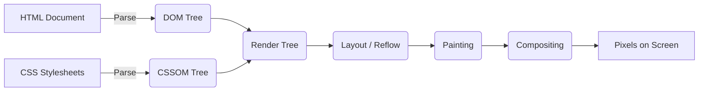

**CSS (Cascading Style Sheets)** is the language used to specify the presentation, layout, and visual formatting of web pages written in HTML.

While **HTML** defines the structural raw content (headings, paragraphs, buttons) and **JavaScript** adds dynamic behavior, **CSS** controls visual layout, typography, colors, animations, and responsive screen adaptation.

:::info Why "Cascading"?
The term "cascading" refers to the way CSS rules are applied in a hierarchical manner, where multiple rules can target the same element. The browser determines which rule takes precedence based on specificity, source order, and importance.
:::

## How the Browser Engine Renders CSS

To understand CSS deeply, you must understand how a browser rendering engine (like Blink, Gecko, or WebKit) converts raw code into actual pixels on a screen.




### 1. Constructing the DOM and CSSOM

* **DOM (Document Object Model):** The browser parses HTML markup into a tree structure of nodes representing page elements.
* **CSSOM (CSS Object Model):** Simultaneously, the browser parses external stylesheets, style tags, and inline styles into a tree structure representing style rules.

### 2. The Render Tree

The browser combines the DOM and CSSOM trees into a **Render Tree**. Unlike the DOM, the Render Tree only includes nodes required for visual rendering. Elements styled with `display: none` are excluded entirely from the Render Tree (though elements with `visibility: hidden` remain included).

### 3. Layout (Reflow)

The rendering engine calculates the exact geometry—width, height, and spatial coordinates (`x, y`)—for every node in the Render Tree relative to the viewport.

### 4. Painting

The engine converts calculated geometry into visual pixels, drawing text, borders, colors, shadows, and backgrounds across software paint layers.

### 5. Compositing

The browser merges separate paint layers into a single image displayed on the screen, offloading transformed or animated elements to the GPU (Graphics Processing Unit) when GPU acceleration is triggered.

---

## Interactive Playground: The Impact of CSS

Explore how plain HTML elements transform when styling rules are applied. Edit the CSS below to observe live rendering changes:

<CodePreview
  defaultHtml={`<div class="card-container">
  <span class="badge">Lecture 1</span>
  <h2>Browser Rendering</h2>
  <p>HTML provides structure. CSS provides typography, color, spacing, and layout context.</p>
  <button class="action-btn">Learn More</button>
</div>`}
  defaultCss={`.card-container {
  background-color: #0f172a;
  color: #f8fafc;
  padding: 1.5rem;
  border-radius: 12px;
  border: 1px solid #1e293b;
  font-family: system-ui, sans-serif;
}

.badge {
  background-color: #38bdf8;
  color: #0f172a;
  font-size: 0.75rem;
  font-weight: 700;
  padding: 0.25rem 0.5rem;
  border-radius: 4px;
  text-transform: uppercase;
}

.card-container h2 {
  margin: 0.75rem 0 0.5rem 0;
  font-size: 1.25rem;
}

.card-container p {
  color: #94a3b8;
  font-size: 0.9rem;
  line-height: 1.5;
  margin-bottom: 1rem;
}

.action-btn {
  background-color: #2563eb;
  color: #ffffff;
  border: none;
  padding: 0.5rem 1rem;
  border-radius: 6px;
  font-weight: 600;
  cursor: pointer;
  transition: background-color 0.2s;
}

.action-btn:hover {
  background-color: #1d4ed8;
}`}
  height="360px"
/>

---

## Three Methods to Link CSS to HTML

There are three ways to apply CSS to HTML documents:

### 1. External Stylesheet (Recommended)
Links an independent `.css` file via the `<link>` tag placed inside the `<head>` of your HTML document.

```html title="index.html"
<head>
  <link rel="stylesheet" href="styles.css">
</head>
```

:::tip Why External?
External stylesheets encourage clean separation of concerns, allow rule caching across pages, and promote scalable styling patterns across large web platforms like CodeHarborHub.
:::

### 2. Internal Style Tag

Embeds CSS directly within a `<style>` block in the HTML document `<head>`.

```html title="index.html"
<head>
  <style>
    body {
      background-color: #f8fafc;
      color: #0f172a;
    }
  </style>
</head>

```

### 3. Inline Styles

Applies styling rules directly to individual HTML elements using the `style` attribute.

```html title="index.html"
<h1 style="color: #2563eb; font-size: 2rem;">CodeHarborHub</h1>
```

:::caution Avoid Inline Styles
Inline styles override external stylesheet rules, bypass the cascade, clutter HTML semantics, and create severe maintainability challenges in large applications.
:::

---

## Summary Checklist

| Topic | Key Concept |
| --- | --- |
| **DOM Tree** | Structural tree built from HTML elements |
| **CSSOM Tree** | Style tree built from parsed CSS rules |
| **Render Tree** | Combined tree containing visible nodes with styled attributes |
| **Reflow / Layout** | Phase calculating geometric positions and dimensions |
| **Repaint / Paint** | Phase rasterizing visual pixels onto screen layers |