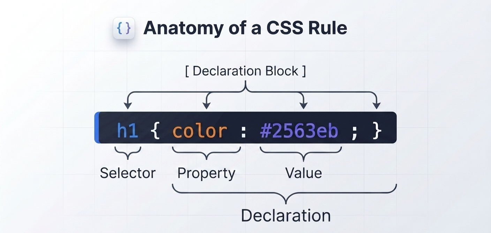

To write clean, predictable stylesheets, you need a precise understanding of CSS syntax. A stylesheet consists of individual **rule sets** (often called **rules**) that instruct the browser how to style specific elements in the document tree.

## Anatomical Breakdown of a CSS Rule

A single CSS rule set is composed of five distinct components:

```css title="Example CSS Rule"
h1 {
  color: #2563eb;
  font-size: 2rem;
}
```

**Where:**



|Component | Code Segment | Description |
|:----------|:--------------|:-------------|
|Selector | h1 | The target pattern that tells the browser which HTML elements to style. |
|Declaration Block | `{ ... }` | The pair of curly braces containing one or more style declarations. |
|Property | color, font-size | The specific human-readable visual characteristic you want to change. |
|Value | #2563eb, 2rem | The specific parameter or metric assigned to a property. |
|Declaration | color: #2563eb; | A single property-value pair separated by a colon (:) and terminated by a semicolon (;). |

## Detailed Component Analysis

### 1. The Selector

The selector sits outside the declaration block. It can target elements based on their tag name, class name, ID, attributes, relationship in the DOM tree, or dynamic user interaction states.

```css title="Example Selectors"
/* Element Selector */
p { line-height: 1.6; }

/* Class Selector */
.card { padding: 1rem; }

/* ID Selector */
#main-header { background-color: #0f172a; }
```

### 2. The Declaration Block

Enclosed by opening `{` and closing `}` curly braces, the declaration block acts as a container for all style rules applied to the selector.

```css title="Example Declaration Block"
.badge {
  /* Everything inside these braces is the declaration block */
  display: inline-block;
  padding: 0.25rem 0.5rem;
  font-weight: 600;
}
```

### 3. Properties and Values

A property names the feature (e.g., margin, background-color, border-radius), while a value sets its visual outcome. Values can take many forms:

* **Keywords:** `bold`, `flex`, `relative`, `center`
* **Numeric Units:** `16px`, `1.5rem`, `50%`, `2vh`
* **Colors:** Named colors (`navy`), Hex values (`#2563eb`), RGB/RGBA (`rgb(37, 99, 235)`), HSL/HSLA (`hsl(221, 83%, 53%)`)
* **Functions:** `calc(100% - 2rem)`, `var(--primary-color)`, `linear-gradient(...)`

:::caution The Essential Semicolon
Every declaration must end with a semicolon ;. Omitting a semicolon causes the parser to merge two consecutive declarations together, rendering both invalid.
:::

## Interactive Playground: Dissecting a Rule

Use the editor below to modify the selectors, properties, and values inside the declaration block. Observe how changing property parameters alters the live preview instantly:

<CodePreview
defaultHtml={`
<div class="card">
  <h1>Welcome to CodeHarborHub</h1>
  <p>Learn CSS with interactive examples!</p>
  <button class="action-btn">Get Started</button>
</div>`}
defaultCss={`.card {
  background-color: #0f172a;
  color: #f8fafc;
  padding: 1.5rem;
  border-radius: 12px;
  border: 1px solid #1e293b;
  font-family: system-ui, sans-serif;
}
.action-btn {
  background-color: #2563eb;
  color: #ffffff;
  border: none;
  padding: 0.5rem 1rem;
  border-radius: 6px;
  font-weight: 600;
  cursor: pointer;
  transition: background-color 0.2s;
  margin-top: 1rem;
}
.action-btn:hover {
  background-color: #1d4ed8;
}`}
/>

## Common Formatting Practices

While whitespace (spaces, tabs, line breaks) is ignored by the CSS parser, clean formatting improves readability and team collaboration on platform projects:

### Single-line vs. Multi-line Rules

```css title="Single-line vs Multi-line CSS Rules"
/* Multi-line Format (Recommended for readability) */
.user-avatar {
  width: 48px;
  height: 48px;
  border-radius: 50%;
  object-fit: cover;
}

/* Single-line Format (Used occasionally for small utility classes) */
.text-center { text-align: center; }
.hidden { display: none; }
```

:::tip CodeHarborHub Style Guide
Stick to multi-line rules with 2-space indentation for regular components. Keep property names in lowercase and always include a space after the colon separating properties from values (color: #2563eb;).
:::

## Summary Checklist

| Concept	| Structure	| Quick Example |
|----------|--------------|----------------|
|Rule Set	|Selector + Declaration Block	|`h1 { color: red; }`|
|Selector	|Targets DOM node(s)	|`.button`, `#app`, `div`|
|Declaration	|Property + Value pair	|font-size: 16px;|
|Delimiter	|Separates property & value	|`:` (Colon)|
|Terminator	|Concludes a declaration	|`;` (Semicolon)|