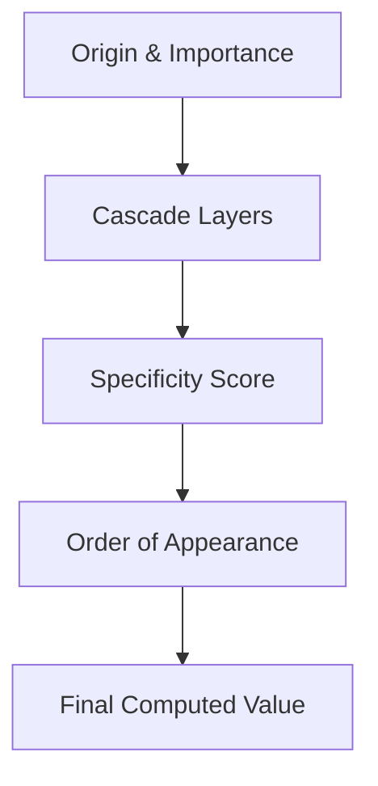

When multiple CSS rules target the exact same HTML element and try to set conflicting values for the same property, how does the browser decide which rule wins?

The answer lies in three fundamental mechanisms that power the CSS rendering engine:
1. **The Cascade:** The high-level algorithm that sorts conflicting declarations by origin, layer, and order.
2. **Specificity:** The numerical weighting system used to evaluate selector strength.
3. **Inheritance:** The automated propagation of property values from parent DOM nodes to child nodes.

## 1. The Cascade Algorithm

The **Cascade** is the process browsers use to combine property values coming from different sources. When resolving property conflicts, the rendering engine evaluates rules in a strict hierarchical order:



### Order of Origin & Importance

The browser collects declarations from three main origins:

* **User Agent Styles:** Default styles built into the browser (e.g., `<h1>` default font size, `<a>` underline).
* **User Styles:** Custom styles defined by the user (e.g., custom accessibility fonts or dark mode overrides).
* **Author Styles:** Styles written by web developers in the application code.

When calculating priority, `!important` flags invert the default origin hierarchy:

| Priority Order | Origin & Importance Level |
| :--- | :--- |
| **1 (Highest)** | Transition declarations |
| **2** | User Agent `!important` |
| **3** | User `!important` |
| **4** | Author `!important` |
| **5** | Animation declarations |
| **6** | Normal Author Styles |
| **7** | Normal User Styles |
| **8 (Lowest)** | Normal User Agent Styles |

:::danger The `!important` Trap
`!important` does not add specificity—it alters the cascade origin. Overusing `!important` breaks natural cascade flow and creates maintainability bottlenecks. Use it only for utility classes or overriding third-party library styles when no other method exists.
:::

## 2. Specificity Calculation Math

When competing rules come from the same origin level, the browser calculates the **Specificity Score** of their selectors.

Specificity is represented as a tuple of three distinct component counts: **`(A, B, C)`**.

```
( A , B , C )
  |   |   |
  |   |   └── Type Selectors (h1, p) & Pseudo-elements (::before)
  |   └────── Class (.card), Attribute ([type="text"]), & Pseudo-classes (:hover)
  └────────── ID Selectors (#header)

```

### Specificity Value Matrix

| Selector Category | Represented Vector | Score Component | Example Selectors |
| :--- | :---: | :---: | :--- |
| **Inline Styles** | `style="..."` | Overrides (A, B, C) | `<div style="color: red;">` |
| **A: ID Selectors** | `(1, 0, 0)` | **A** Component | `#nav-main`, `#user-profile` |
| **B: Classes, Attributes & Pseudo-classes** | `(0, 1, 0)` | **B** Component | `.btn`, `[type="submit"]`, `:hover`, `:nth-child(2)` |
| **C: Type Selectors & Pseudo-elements** | `(0, 0, 1)` | **C** Component | `h1`, `p`, `div`, `::before`, `::after` |
| **Universal & Combinators** | `(0, 0, 0)` | None | `*`, `>`, `+`, `~`, `:where()` |

:::note Vector Comparison Rule
Specificity vectors are compared **column by column from left to right**, not as base-10 numbers. An ID selector `(1, 0, 0)` will always beat 1,000 stacked class selectors `(0, 1000, 0)`.
:::

### Scoring Examples

| Selector | (A, B, C) Vector | Total Calculated Weight |
| :--- | :---: | :--- |
| `p` | `(0, 0, 1)` | 1 Type |
| `.card p` | `(0, 1, 1)` | 1 Class + 1 Type |
| `#main-content .card p` | `(1, 1, 1)` | 1 ID + 1 Class + 1 Type |
| `#main-content .card p:hover` | `(1, 2, 1)` | 1 ID + 1 Class + 1 Pseudo-class + 1 Type |
| `ul.nav > li a:hover::after` | `(0, 2, 3)` | 1 Class + 1 Pseudo-class + 3 Types + 1 Pseudo-element |

### Source Order (The Tie-Breaker)

If two competing rules have the exact same specificity vector score, **the rule defined latest in the stylesheet wins**.

```css title="Example Source Order Tie-Breaker"
/* Specificity: (0, 1, 0) */
.button-primary { background-color: #2563eb; }

/* Specificity: (0, 1, 0) — WINS because it appears later */
.button-danger { background-color: #dc2626; }
```

## 3. Structural Inheritance

Inheritance is the mechanism by which property values applied to a parent HTML node are automatically passed down to its child DOM nodes.

Not all properties inherit by default:

* **Inherited Properties (Text-related):** color, font-family, font-size, line-height, text-align, letter-spacing, visibility.
* **Non-Inherited Properties (Box Model & Position):** margin, padding, border, background, width, height, display, position.

### Explicit Control Keywords

CSS provides four universal value keywords to control inheritance on any property explicitly:

1. **inherit:** Forces a child element to take the property value of its parent node.
2. **initial:** Resets a property to its default value defined in the W3C CSS specification.
3. **unset:** Acts as inherit if the property is naturally inherited, or initial if it is not.
4. **revert:** Rolls back the property to the browser's default User Agent stylesheet.

```css title="Example Inheritance Control"
.card-content p {
  /* Forces margin to inherit from parent card even though margin is non-inherited */
  margin: inherit;
  /* Resets color back to browser default */
  color: initial;
}
```

## Interactive Playground: Conflict Resolution

Test your understanding of specificity and source order in the editor below. Try adding IDs, classes, or !important declarations to observe which rule takes control of the preview component:

<CodePreview
defaultHtml={`<div class="card">
  <h1 id="main-title">Card Title</h1>
  <p class="card-text">This is a sample card description.</p>
  <button class="btn btn-primary">Click Me</button>
</div>`}
defaultCss={`.card {
  background-color: #f8fafc;
  padding: 1.5rem;
  border-radius: 12px;
  border: 1px solid #e2e8f0;
}

#main-title {
  color: #2563eb;
}

.card-text {
  color: #1e293b;
  font-size: 1rem;
  line-height: 1.5rem;
}

.btn {
  background-color: #2563eb;
  color: #ffffff;
  padding: 0.5rem 1rem;
  border-radius: 6px;
  font-weight: 600;
  cursor: pointer;
}
.btn:hover {
  background-color: #1d4ed8;
}
`}

/>