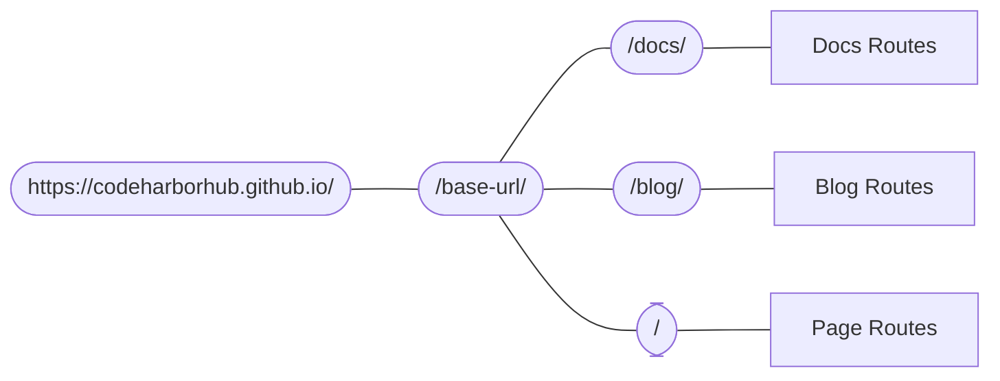

```mdx-code-block
import {useActiveDocContext} from '@docusaurus/plugin-content-docs/client';
import {useLocation} from '@docusaurus/router';
import BrowserOnly from '@docusaurus/BrowserOnly';
```

Docusaurus uses a **single-page application (SPA)** routing system — meaning every route corresponds to **one component**.

In this guide, we’ll explore how Docusaurus manages routing for **Docs**, **Blog**, and **Pages**, and then dive deeper into how the routing system itself works behind the scenes.

---

## Routing in Content Plugins {#routing-in-content-plugins}

Each content plugin defines a `routeBasePath`, which tells Docusaurus **where to mount routes**.

- **Docs plugin:** `/docs` by default
- **Blog plugin:** `/blog`
- **Pages plugin:** `/`

Here’s how these routes connect in the URL hierarchy:



When a user visits `/docs/configuration`, Docusaurus finds the `/docs` branch, and then loads the corresponding document route.

You can fully customize your route structure. For instance, setting `routeBasePath: '/'` in **Docs-only mode** removes the `/docs` prefix while keeping all other plugins intact.

---

## Pages Routing {#pages-routing}

**Pages** are the simplest form of routes — file paths directly map to URLs.  
For example:

```
src/pages/about.mdx  →  /about
src/pages/index.js   →  /
```

- Markdown pages render using `@theme/MDXPage`.
- React components render directly as route components.

See [Creating Pages](../guides/creating-pages.mdx#routing) for more details.

---

## Blog Routing {#blog-routing}

The blog plugin auto-generates several types of routes:

| Route Type          | Example URL                   | Customizable Option | Component                  |
| ------------------- | ----------------------------- | ------------------- | -------------------------- |
| **Posts List**      | `/`, `/page/2`, `/page/3`     | `pageBasePath`      | `@theme/BlogListPage`      |
| **Individual Post** | `/2025/10/08/launch-post`     | `slug` front matter | `@theme/BlogPostPage`      |
| **Tags List**       | `/tags`                       | `tagsBasePath`      | `@theme/BlogTagsListPage`  |
| **Tag Pages**       | `/tags/education`, `/tags/ai` | `permalink` in tag  | `@theme/BlogTagsPostsPage` |
| **Archive Page**    | `/archive`                    | `archiveBasePath`   | `@theme/BlogArchivePage`   |

Each route is generated automatically, but you can override any path with custom front matter.

---

## Docs Routing {#docs-routing}

Docs routing is **hierarchical** and **versioned**. Each version has its own route tree, sidebar, and context.

For example:

```
/docs/ → Current version
/docs/next → Next version
/docs/1.0.0 → Past version
```

This allows seamless version switching while preserving sidebar state.

```mdx-code-block
export const URLPath = () => <BrowserOnly>{()=><code>{useLocation().pathname}</code>}</BrowserOnly>
export const FilePath = () => <BrowserOnly>{() => {
  const currentVersion = useActiveDocContext('default').activeVersion.name;
  return <code>{currentVersion === 'current' ? './docs/' : `./versioned_docs/version-${currentVersion}/`}advanced/routing.md</code>;
}}</BrowserOnly>
```

This page, <URLPath />, is generated from <FilePath />. The doc content is displayed inside `@theme/DocPage`, which manages layout, sidebar, and navigation.

---

## File Paths vs URL Paths {#file-paths-and-url-paths}

In Docusaurus, **file paths map to URL paths**, unless overridden using the `slug` front matter.

### Example Mapping

| File Path                      | URL Path                  |
| ------------------------------ | ------------------------- |
| `./docs/advanced/routing.md`   | `/docs/advanced/routing`  |
| `./blog/2025-10-08-launch.mdx` | `/blog/2025/10/08/launch` |

### Rules for Markdown Links

- `@site` prefix → Asset file path
- `http(s)://` prefix → External URL
- No extension → URL path
- `.md(x)` extension → Converts file path to URL
- Other extensions → Treated as [assets](../guides/markdown-features/markdown-features-assets.mdx)

---

## Routes Become HTML Files {#routes-become-html-files}

Every route in Docusaurus compiles into a **static HTML file** during build. For instance, the route `/docs/advanced/routing` maps to:

```
/build/docs/advanced/routing/index.html
```

If `trailingSlash` is disabled, the same route becomes `routing.html`.

This allows hosting on any static server (like GitHub Pages or Vercel) — Docusaurus handles **server-side rendering → static HTML conversion** automatically.

### Example

```bash
build/
├── docs/
│   └── advanced/
│       └── routing/
│           └── index.html  # /docs/advanced/routing
└── index.html              # /
```

When using a custom `baseUrl`, ensure assets resolve correctly (e.g., `/base/assets/js/...`).

---

## Generating and Accessing Routes {#generating-and-accessing-routes}

Use the `addRoute` lifecycle method to programmatically add routes:

```js title="plugin-example.js"
actions.addRoute({
  path: "/custom",
  component: "@site/src/pages/CustomPage.js",
});
```

All routes are aggregated in `.docusaurus/routes.js`.  
You can inspect them in the [Debug Routes Panel](/__docusaurus/debug/routes).

### Accessing Routes in React

You can access route data using `@docusaurus/router`, a wrapper around React Router.

```jsx title="RouteInfo.js"
import React from "react";
import { useLocation } from "@docusaurus/router";

export function PageRoute() {
  const location = useLocation();
  return (
    <span>
      You are currently on <code>{location.pathname}</code>
    </span>
  );
}
```

<BrowserWindow>
<BrowserOnly>
  {
    ()=> <span> You are currently on <code>{location.pathname}</code></span>
  }
  </BrowserOnly>
</BrowserWindow>

---

## Escaping SPA Redirects {#escaping-from-spa-redirects}

Because Docusaurus is an SPA, it handles navigation through React Router. However, if you link to static HTML files that aren’t part of Docusaurus routes, use the special `pathname://` protocol to perform a **non-SPA redirect**.

```md
- [pathname:///static-page](pathname:///static-page)
```

<BrowserWindow>

- [`pathname:///static-page`](pathname:///static-page)

</BrowserWindow>

This ensures Docusaurus doesn’t attempt to render missing routes or show a 404 page.

You can also use `pathname://` for static assets:

```md title="my-doc.md"


[Download PDF](pathname:///files/tutorial.pdf)
```

---

## Summary

- Docusaurus follows a **SPA routing system** built on React Router.
- Every content plugin defines its **route base path**.
- **Docs** support **nested and versioned** routes.
- URLs map directly from files but can be customized using `slug`.
- During build, routes become **static HTML files** for deployment.
- Use `pathname://` for non-SPA links or static assets.

With this routing power, our **CodeHarborHub** site can scale efficiently — from a simple landing page to a complex multi-version documentation ecosystem.
