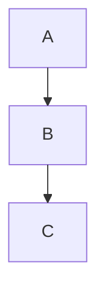

Visualize your ideas directly inside Markdown using **[Mermaid](https://mermaid-js.github.io/mermaid/)**. Mermaid lets you create flowcharts, sequence diagrams, class diagrams, and more, using a simple text syntax.

<AdsComponent />

## Installation {#installation}

Install the official Mermaid theme for Docusaurus:

```bash npm2yarn
npm install --save @docusaurus/theme-mermaid
```

Then enable Mermaid support by updating your **`docusaurus.config.js`**:

```js title="docusaurus.config.js"
export default {
  markdown: {
    mermaid: true,
  },
  themes: ['@docusaurus/theme-mermaid'],
};
```

This configuration activates the Markdown engine to recognize `mermaid` code blocks.

<AdsComponent />

## Usage {#usage}

Create a Mermaid diagram by using a fenced code block with the language set to `mermaid`:

````md title="Example Mermaid diagram"

`````

This renders as:


Check the [Mermaid Syntax Reference](https://mermaid-js.github.io/mermaid/#/./n00b-syntaxReference) to explore flowcharts, sequence diagrams, Gantt charts, and more.

<AdsComponent />

## Theming {#theming}

Customize diagram colors for light and dark mode:

```js title="docusaurus.config.js"
export default {
  themeConfig: {
    mermaid: {
      theme: { light: 'neutral', dark: 'forest' },
    },
  },
};
```

Available themes include `default`, `forest`, `neutral`, `dark`, and more. Refer to the [Mermaid Theme Docs](https://mermaid-js.github.io/mermaid/#/theming) for a full list.

<AdsComponent />

## Mermaid Config {#configuration}

Pass advanced configuration directly to Mermaid:

```js title="docusaurus.config.js"
export default {
  themeConfig: {
    mermaid: {
      options: {
        maxTextSize: 50,
        securityLevel: 'loose',
      },
    },
  },
};
```

See the [Mermaid Config Reference](https://mermaid-js.github.io/mermaid/#/./Setup?id=configuration) and [Type Definitions](https://github.com/mermaid-js/mermaid/blob/master/packages/mermaid/src/config.type.ts) for all available options.

<AdsComponent />

## Dynamic Mermaid Component {#component}

For **interactive or programmatically generated diagrams**,
you can use the `Mermaid` React component inside an `.mdx` file:

```mdx title="Dynamic Mermaid component"
import Mermaid from '@theme/Mermaid';

<Mermaid
  value={`graph TD;
    Start-->Process;
    Process-->End;`}
/>
```

This is useful for rendering diagrams from data or props.

---

## Layout Engines {#layouts}

Mermaid supports different layout engines for arranging nodes:

* **`dagre`** – default engine (no extra dependencies)
* **`elk`** – advanced layout; install with:

```bash npm2yarn
npm install --save @mermaid-js/layout-elk
```

Then specify it inside the code block frontmatter:

````md

````


