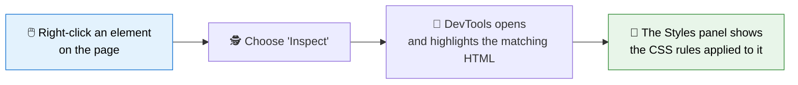
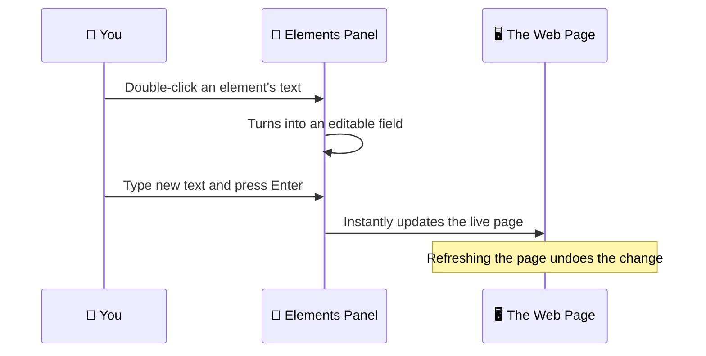
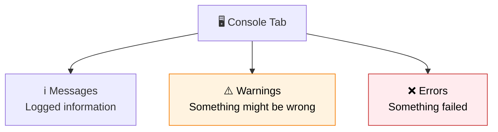

Here is a secret every professional web developer relies on daily: **you can peek inside any website's HTML and CSS, right from your own browser, for free, without installing anything.**

The tool that makes this possible is called **Developer Tools**, or **DevTools** for short. It is built into every modern browser, and learning to use it is one of the biggest confidence boosts you will get early in your HTML journey.

In this lesson, you will learn to open DevTools, read a page's real structure, experiment safely, catch mistakes, and even preview how a page looks on a phone, all without touching a single line of code on the actual server.

:::info Why this lesson matters
Reading *about* HTML only gets you so far. DevTools lets you **see HTML working live**, on real websites, which makes everything you have learned so far click into place.
:::

<AdsComponent />
<br />

## What Are Developer Tools?

Developer Tools are a set of panels built directly into your browser that let you:

- **Inspect** the exact HTML and CSS behind any element on a page.
- **Edit** that HTML and CSS temporarily, just in your browser, to experiment.
- **Read messages and errors** from JavaScript in the Console.
- **Measure performance**, network requests, and much more.

Think of it like an **X-ray machine for websites**. Point it at any part of a page, and you instantly see the code creating it.

:::note Nothing you change is permanent
Anything you edit in DevTools only affects **your own view**, in **your own browser**, for as long as the page stays open. Refresh the page, and everything returns to normal. This makes DevTools a completely safe place to experiment.
:::

## Step 1: Opening Developer Tools

Every major browser includes DevTools, and they all work in a very similar way. Pick your browser below.

<Tabs>
<TabItem value="chrome" label="🟢 Chrome" default>

Use any of these methods:

- **Right-click** anywhere on a page and choose **"Inspect."**
- Press **F12**
- Press **Ctrl+Shift+I** (Windows/Linux) or **Cmd+Option+I** (macOS)
- Click the **⋮** menu → **More tools → Developer tools**

</TabItem>
<TabItem value="firefox" label="🟠 Firefox">

Use any of these methods:

- **Right-click** anywhere on a page and choose **"Inspect."**
- Press **F12**
- Press **Ctrl+Shift+I** (Windows/Linux) or **Cmd+Option+I** (macOS)
- Click the **☰** menu → **More tools → Web Developer Tools**

</TabItem>
<TabItem value="edge" label="🔵 Edge">

Use any of these methods:

- **Right-click** anywhere on a page and choose **"Inspect."**
- Press **F12**
- Press **Ctrl+Shift+I** (Windows/Linux) or **Cmd+Option+I** (macOS)
- Click the **⋯** menu → **More tools → Developer tools**

</TabItem>
<TabItem value="safari" label="🍎 Safari">

Safari hides this feature by default, so you need to enable it once:

1. Open **Safari → Settings → Advanced**.
2. Turn on **"Show features for web developers."**
3. Now right-click any page and choose **"Inspect Element,"** or press **Cmd+Option+I**.

</TabItem>
</Tabs>

A panel will appear, either docked to the side or the bottom of your browser window, packed with several tabs. Don't feel overwhelmed. As a beginner, you really only need **two** of them: **Elements** and **Console**.

## Step 2: The Elements Panel (Your New Best Friend)

The **Elements** panel (called **Inspector** in Firefox) shows you the **live HTML** of the current page, formatted as a neat, expandable tree, exactly like the DOM tree you learned about in [How the Web Works](./how-the-web-works.mdx).



### Try it right now

Here is a small sample page. Right-click directly on the heading below, and choose **"Inspect"** (this works because it is real HTML rendered in your browser):

<BrowserWindow url="https://codeharborhub.github.io">
<>
<h1 style={{color: 'royalblue'}}>Inspect Me!</h1>
<p>Right-click this paragraph and choose "Inspect" to see its HTML.</p>
<button>Click me too</button>
</>
</BrowserWindow>

When you do this on a real webpage, DevTools will:

1. Open automatically.
2. **Highlight** the exact line of HTML for the element you clicked.
3. Show its CSS rules in a side panel.

This single trick, **right-click → Inspect**, is the fastest way to understand how *any* website on the internet is built.

<AdsComponent />
<br />

## Step 3: Live-Editing HTML and CSS

Once you have an element selected in the Elements panel, you can **double-click its text** to edit the HTML directly.



### Fun experiments to try

- Find a heading on any news website and **change the text** to something silly.
- Select an image and try **changing its `src` attribute** to a different picture URL.
- Click the **Styles** tab, find a `color` value, and change it to `red` or `hotpink`.
- **Uncheck a CSS property** in the Styles panel by clicking its checkbox, and watch the style disappear from the page.

:::tip This is how professionals prototype
Real developers use exactly this technique to test a design change before writing the "real" code in their project files. It is fast, safe, and encourages experimentation.
:::

## Step 4: Meet the Console

The **Console** tab is where JavaScript messages, warnings, and errors appear. Even before you write JavaScript yourself, the Console is useful, because it often reveals **why a page is broken**.



You can also type directly into the Console and press Enter to run a quick command:

```js
console.log("Hello from DevTools!");
document.querySelectorAll("p").length;
```

The first line prints a message. The second line counts how many `<p>` elements exist on the current page. Don't worry about fully understanding this yet. You will learn JavaScript basics later; for now, just know this powerful tool exists.

## Step 5: Testing Responsive Design

One of the most practical DevTools features for an HTML learner is the **Device Toolbar**, which simulates how a page looks on phones and tablets.

<Tabs>
<TabItem value="chrome-device" label="Chrome / Edge" default>

1. Open DevTools.
2. Click the small **phone and tablet icon** in the top-left of the DevTools panel (or press **Ctrl+Shift+M** / **Cmd+Shift+M**).
3. Choose a device from the dropdown, such as "iPhone 14" or "iPad Air."
4. The page redraws at that device's exact screen size.

</TabItem>
<TabItem value="firefox-device" label="Firefox">

1. Open DevTools.
2. Click the **Responsive Design Mode** icon (it looks like a phone and tablet).
3. Or press **Ctrl+Shift+M** (Windows/Linux) or **Cmd+Option+M** (macOS).
4. Choose or type a screen size to preview.

</TabItem>
</Tabs>

This is exactly how professional developers check that a site looks good on every screen size, and it connects directly back to why we added the `<meta name="viewport">` tag in the [HTML Document Structure](./html-document-structure.mdx) lesson.

## A Quick Tour of the Other Panels

You do not need these yet, but it helps to recognize their names as you keep learning:

| Panel | What it is for |
|-------|-----------------|
| **Elements / Inspector** | View and edit live HTML and CSS. |
| **Console** | See messages, warnings, and errors; run quick JavaScript. |
| **Sources / Debugger** | Read and step through JavaScript files. |
| **Network** | See every file a page downloads, and how long each takes. |
| **Application / Storage** | Inspect data saved in `localStorage`, cookies, and caches. |
| **Performance** | Measure how fast a page loads and renders. |
| **Lighthouse / Audits** | Get an automated report on performance, accessibility, and SEO. |

<AdsComponent />
<br />

## A Simple DevTools Challenge

Try this three-minute exercise on any website you like:

1. Open the site and press **F12** to launch DevTools.
2. Right-click the main heading and choose **Inspect**.
3. In the Elements panel, double-click the heading's text and change it to your own name.
4. Open the **Styles** panel and change its `color` to your favorite color.
5. Open the **Device Toolbar** and preview the page as if it were on a phone.
6. Refresh the page and watch your changes disappear, proving nothing was permanently changed.

:::tip Why this exercise matters
You just navigated the DOM, edited live HTML and CSS, and tested responsive design, the exact same first steps every professional developer takes when reviewing a website.
:::

## Common Beginner Confusions

<details>
<summary>Will editing HTML in DevTools break the real website?</summary>

No. Every change you make in DevTools only exists in your own browser tab, temporarily. The website's actual files on the server are never touched, and a simple page refresh undoes everything.

</details>

<details>
  <summary>Why does the HTML in DevTools look different from "View Page Source"?</summary>

"View Page Source" (Ctrl+U) shows the **original HTML file** sent by the server. The Elements panel shows the **live DOM**, which may have been changed by JavaScript after the page loaded. For learning HTML structure, both are useful, but DevTools shows the current, real state of the page.

</details>

<details>
  <summary>I see red text in the Console. Did I break something?</summary>

Not necessarily, and definitely not if you are just browsing someone else's website. Many production websites show warnings or minor errors in their Console that do not affect regular visitors. As you write your own JavaScript later, red Console messages will become one of your most useful debugging clues.

</details>

<details>
  <summary>Do I need to keep DevTools open all the time?</summary>

No. Open it only when you want to inspect, learn from, or debug a page. Keeping it open uses a small amount of extra memory, so most developers close it when they are done.

</details>

## Quick Recap

- **DevTools** is a free, built-in browser feature for inspecting and debugging web pages.
- Open it with **right-click → Inspect**, or the shortcut **F12** / **Ctrl+Shift+I**.
- The **Elements panel** shows the live HTML and CSS of a page.
- Changes made in DevTools are **temporary** and disappear on refresh.
- The **Console** shows messages, warnings, and errors, and can run quick JavaScript.
- The **Device Toolbar** lets you preview how a page looks on phones and tablets.

## Frequently Asked Questions

<details>
  <summary>How do I open Developer Tools?</summary>

Right-click anywhere on a webpage and choose "Inspect," or press F12, or press Ctrl+Shift+I on Windows and Linux (Cmd+Option+I on macOS).

</details>

<details>
  <summary>Is it safe to use browser DevTools?</summary>

Yes. DevTools only affects what you see in your own browser tab. It cannot change the real website's files on its server, and your edits vanish when you refresh the page.

</details>

<details>
  <summary>What is the difference between Inspect Element and View Page Source?</summary>

"Inspect Element" opens the full DevTools panel and shows the live, current state of the page's HTML. "View Page Source" shows only the original HTML file exactly as it was sent by the server, before any JavaScript changes.

</details>

<details>
  <summary>Can I use DevTools to learn how other websites are built?</summary>

Yes, this is one of its best beginner uses. Inspecting real websites you admire is a great way to see practical HTML and CSS techniques in action.

</details>

<details>
  <summary>Do all browsers have the same developer tools?</summary>

Chrome, Firefox, and Edge all include very similar DevTools with the same core features. Safari has an equivalent but needs to be enabled first in its settings.

</details>

## Test Your Understanding

1. Name two ways to open Developer Tools.
2. What is the difference between the Elements panel and "View Page Source"?
3. If you edit an element's text in DevTools, will other visitors to the site see your change? Why or why not?
4. What kind of information appears in the Console tab?
5. Which DevTools feature helps you test how a page looks on a mobile phone?

## Module Complete!

Congratulations, you have finished the **Getting Started with HTML** module! Let's look back at everything you have accomplished:

- ✅ Learned [what HTML is](./what-is-html.mdx) and how it structures the web.
- ✅ Explored the [history of HTML](./html-history.mdx), from CERN to today's Living Standard.
- ✅ Compared [HTML and HTML5](./html-vs-html5.mdx) and their key differences.
- ✅ Understood [how the web works](./how-the-web-works.mdx), from URLs to rendering.
- ✅ Mastered [HTML document structure](./html-document-structure.mdx).
- ✅ Built [your first HTML page](./create-your-first-html-page.mdx) with your own hands.
- ✅ Learned to use **browser developer tools** to inspect and debug any page.

You now have a genuinely solid foundation. In the next module, you will start writing real HTML tags in depth, text elements, links, images, lists, and much more, and turn everything you have learned into real, structured web pages.