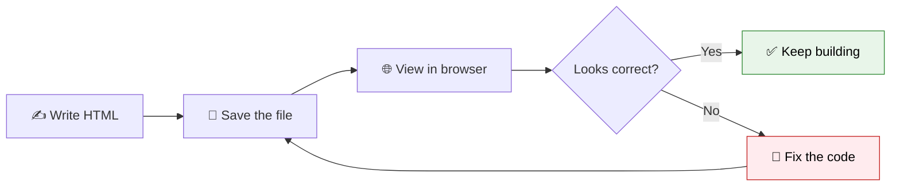

You have learned what HTML is, where it came from, how HTML5 improved it, how the web delivers pages, and how a document is structured. Time for the fun part: **building something real with your own hands.**

By the end of this lesson, you will have written, saved, and opened your very first HTML page, and even built a tiny personal profile page. Let's get started!

:::info What you will build
A simple **"About Me"** page containing a heading, a photo placeholder, a short paragraph, a list of hobbies, and a link. Small, but 100% yours.
:::

<AdsComponent />
<br />

## Step 1: Set Up Your Workspace

You only need three things to write HTML: a **code editor**, a **browser**, and a **folder** to keep your files organized.

<Tabs>
  <TabItem value="vscode" label="💙 Visual Studio Code" default>

**Recommended for this tutorial.**

1. Download it for free from [code.visualstudio.com](https://code.visualstudio.com/).
2. Install it like any other application.
3. Open it once to make sure it launches correctly.

VS Code gives you syntax highlighting, auto-completion, and helpful extensions, which make learning much smoother.

  </TabItem>
  <TabItem value="notepad" label="📝 Plain text editor">

If you cannot install anything right now, a plain text editor works too:

- **Windows:** Notepad
- **macOS:** TextEdit (make sure to use **Plain Text** mode, found under *Format → Make Plain Text*)
- **Linux:** gedit or any default text editor

You will just need to remember to save your file with a `.html` extension.

  </TabItem>
  <TabItem value="online" label="🌐 Online editor">

No installation at all? Try an online playground such as:

- [CodePen](https://codepen.io/)
- [JSFiddle](https://jsfiddle.net/)
- [CodeSandbox](https://codesandbox.io/)

These are great for quick experiments, though installing VS Code is worth it as soon as you can.

  </TabItem>
</Tabs>

### Create a project folder

Create one folder on your computer to hold all your practice files, for example:

```text
html-practice/
└── index.html
```

Keeping everything in one place will make it much easier to find your work later.

## Step 2: Create the HTML File

<Tabs>
  <TabItem value="vscode-steps" label="In VS Code" default>

1. Open VS Code.
2. Click **File → Open Folder** and select your `html-practice` folder.
3. In the sidebar, click the **New File** icon.
4. Name the file exactly: `index.html`

:::tip Why "index.html"?
When a browser or server looks for a webpage in a folder without a specific filename, it automatically looks for a file called **`index.html`**. It is the standard "homepage" name across the entire web.
:::

  </TabItem>
  <TabItem value="manual-steps" label="Without VS Code">

1. Open your text editor.
2. Create a new file.
3. Save it inside your `html-practice` folder.
4. When naming it, type `index.html` and make sure the extension is exactly `.html`, not `.html.txt`.

:::warning Watch the file extension
Some editors add `.txt` automatically. Choose **"All Files"** in the save dialog, or explicitly type the `.html` extension, to avoid this trap.
:::

  </TabItem>
</Tabs>

## Step 3: Write the Boilerplate

Open your empty `index.html` file and type this structure. Typing it yourself (rather than copying) really helps it stick in your memory.

```html title="index.html"
<!DOCTYPE html>
<html lang="en">
  <head>
    <meta charset="UTF-8" />
    <meta name="viewport" content="width=device-width, initial-scale=1.0" />
    <title>My First Page</title>
  </head>
  <body>

  </body>
</html>
```

:::tip VS Code shortcut
In VS Code, create an empty `.html` file, type a single **`!`**, then press **Tab**. It will generate this entire boilerplate for you automatically thanks to Emmet, a built-in shortcut tool.
:::

If you already forgot what any of these lines mean, that's completely fine. Revisit the [HTML Document Structure](./html-document-structure.mdx) lesson any time.

## Step 4: Add Your First Content

Inside the `<body>` tags, add a heading and a paragraph:

```html title="index.html" {9,10}
<!DOCTYPE html>
<html lang="en">
  <head>
    <meta charset="UTF-8" />
    <meta name="viewport" content="width=device-width, initial-scale=1.0" />
    <title>My First Page</title>
  </head>
  <body>
    <h1>Hello, World!</h1>
    <p>This is my very first web page, built with HTML.</p>
  </body>
</html>
```

Save the file now with **Ctrl+S** (Windows/Linux) or **Cmd+S** (macOS). Saving often is a great habit to build early.

## Step 5: Open It in a Browser

<Tabs>
  <TabItem value="double-click" label="🖱️ Double-click method" default>

1. Open your file explorer or Finder.
2. Navigate to your `html-practice` folder.
3. **Double-click `index.html`.**

It should open directly in your default browser, showing your heading and paragraph. The address bar will show something like `file:///C:/Users/you/html-practice/index.html`.

  </TabItem>
  <TabItem value="live-server" label="⚡ Live Server (recommended)">

**Live Server** is a free VS Code extension that opens your page in a real local server and **automatically refreshes** it every time you save. This mirrors how real websites work and saves you from constantly clicking "refresh."

1. In VS Code, open the **Extensions** panel (the icon with four squares).
2. Search for **"Live Server"** by Ritwick Dey.
3. Click **Install**.
4. Right-click anywhere inside `index.html` and choose **"Open with Live Server."**
5. Your default browser opens automatically at an address like `http://127.0.0.1:5500/index.html`.

From now on, every time you save your file, the browser refreshes instantly!

  </TabItem>
</Tabs>

Here is what your page should look like right now:

<BrowserWindow url="http://127.0.0.1:5500/index.html">
<>
<h1>Hello, World!</h1>
<p>This is my very first web page, built with HTML.</p>
</>
</BrowserWindow>

🎉 **Congratulations!** You just built and viewed your first web page from scratch.

<AdsComponent />
<br />

## Step 6: Build a Small "About Me" Page

Let's practice a bit more by expanding the page into something more personal. Replace the content inside your `<body>` with the following, and feel free to change the details to describe yourself:

```html title="index.html"
<!DOCTYPE html>
<html lang="en">
  <head>
    <meta charset="UTF-8" />
    <meta name="viewport" content="width=device-width, initial-scale=1.0" />
    <title>About Me</title>
  </head>
  <body>
    <h1>Hi, I'm Alex 👋</h1>

    

    <p>
      I am learning web development with
      <strong>CodeHarborHub</strong>, starting with HTML.
    </p>

    <h2>My Hobbies</h2>
    <ul>
      <li>Reading science fiction</li>
      <li>Playing the guitar</li>
      <li>Hiking on weekends</li>
    </ul>

    <p>
      Want to see more of my work?
      <a href="https://codeharborhub.github.io">Visit my portfolio</a>.
    </p>
  </body>
</html>
```

Save the file, and if you are using Live Server, watch the browser update instantly. Here is the result:

<BrowserWindow url="http://127.0.0.1:5500/index.html">
<>
<h1>Hi, I'm Alex 👋</h1>

<p>I am learning web development with <strong>CodeHarborHub</strong>, starting with HTML.</p>
<h2>My Hobbies</h2>
<ul>
<li>Reading science fiction</li>
<li>Playing the guitar</li>
<li>Hiking on weekends</li>
</ul>
<p>Want to see more of my work? <a href="https://codeharborhub.github.io">Visit my portfolio</a>.</p>
</>
</BrowserWindow>

Notice the new elements you just used:

| Tag | Purpose |
|-----|---------|
| `` | Displays an image. `src` points to the file or URL, and `alt` describes it. |
| `<strong>` | Marks text as important, usually shown in bold. |
| `<h2>` | A secondary heading, smaller than `<h1>`. |
| `<ul>` and `<li>` | An unordered (bulleted) list and its items. |
| `<a>` | A link. The `href` attribute holds the destination address. |

:::tip Always use alt text
The `alt` attribute on `` describes the picture for people using screen readers, and it displays if the image fails to load. Never leave it out.
:::

## Step 7: Inspect Your Work

Before moving on, let's build the habit of checking your own code:



This **write, save, check, fix** loop is exactly what professional developers do all day, just with more advanced tools. You are already forming the right habits.

## Troubleshooting Common Issues

<details>
  <summary>My page shows blank or nothing appears</summary>

- Make sure your content is inside the `<body>` tags, not the `<head>`.
- Check that you saved the file after making changes.
- Confirm you opened the correct file, especially if you have multiple HTML files.

</details>

<details>
  <summary>My file opened as plain text instead of a web page</summary>

Your file probably was not saved with a proper `.html` extension. Rename it, making sure it ends in `.html` and not `.html.txt` or `.txt`.

</details>

<details>
  <summary>Live Server does not open a browser tab</summary>

- Make sure the extension installed correctly and VS Code was reloaded.
- Try right-clicking directly inside the HTML file's code, not on the file name in the sidebar.
- Check that no other application is already using port 5500.

</details>

<details>
  <summary>My image is not showing up</summary>

- Double-check the `src` path. A typo in the file name or folder path is the most common cause.
- If using a local image, make sure it is saved inside your project folder.
- If using a web image, confirm the URL is correct and publicly accessible.

</details>

<AdsComponent />
<br />

## Quick Recap

- You need only a **code editor**, a **browser**, and a **project folder** to start.
- HTML files are saved with the **`.html`** extension, and `index.html` is the standard homepage name.
- **Live Server** in VS Code auto-refreshes your browser every time you save, which speeds up learning enormously.
- You practiced new tags: **``, `<strong>`, `<h2>`, `<ul>`, `<li>`, and `<a>`.**
- The professional habit is: **write, save, check, and fix.**

## Frequently Asked Questions

<details>
  <summary>Do I need to install any software to write HTML?</summary>

No, a plain text editor and any browser are enough. A code editor like VS Code simply makes the process faster and less error-prone.

</details>

<details>
  <summary>Why is my homepage file called index.html?</summary>

Browsers and web servers look for a file named `index.html` by default when no specific page is requested, which is why it is used as the standard homepage filename.

</details>

<details>
  <summary>What is Live Server, and do I really need it?</summary>

Live Server is a free VS Code extension that serves your files locally and refreshes the browser automatically on save. It is optional but highly recommended, since it closely mirrors how real websites are served.

</details>

<details>
  <summary>Can I use images from the internet in my practice page?</summary>

Yes, for practice you can link to any public image URL. For real projects, always make sure you have the rights to use an image.

</details>

<details>
  <summary>What should I name my HTML files?</summary>

Use lowercase letters, avoid spaces (use hyphens instead, like `about-me.html`), and always end with the `.html` extension.

</details>

## Test Your Understanding

1. What file name should you give your homepage, and why?
2. What is the purpose of the `alt` attribute on an `` tag?
3. What advantage does Live Server offer over double-clicking a file?
4. Which tag did you use to create a bulleted list of hobbies?
5. What is the "write, save, check, fix" loop, and why does it matter?