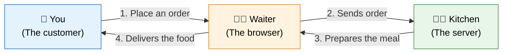
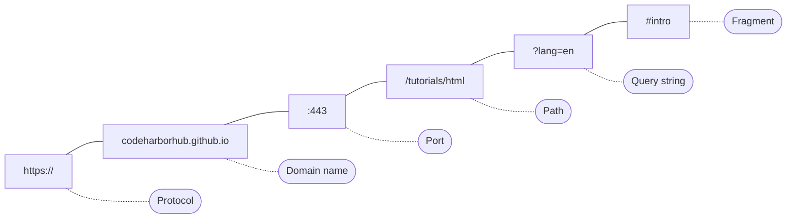
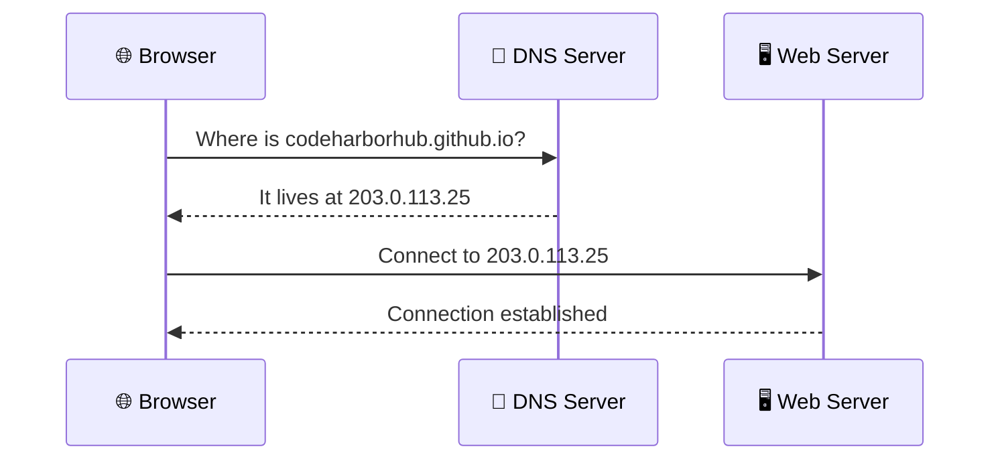
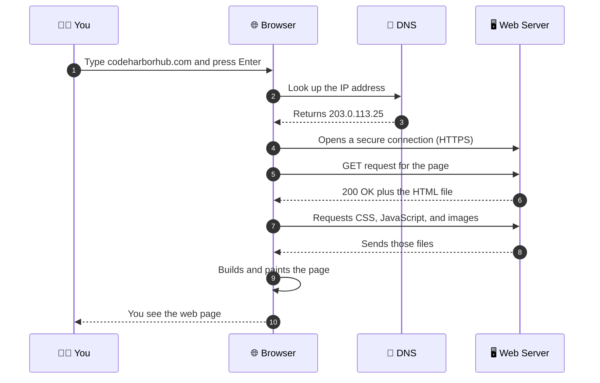
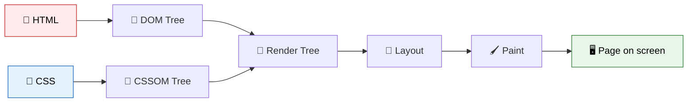
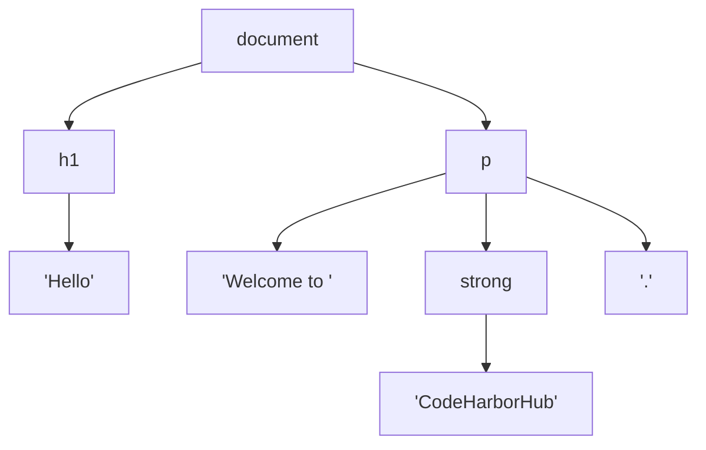

You type a web address, press **Enter**, and in less than a second a full page appears on your screen. It feels like magic, but behind that instant result, dozens of small steps happen across computers that might be thousands of kilometers apart.

Understanding this journey is one of the most valuable things a new web developer can do. When you know *how* a page travels from a server to your screen, you will write better HTML, debug problems faster, and understand why some sites load quickly while others crawl.

In this lesson, you will follow that journey step by step, in plain language.

:::info What you will learn
- The difference between the **internet** and the **web**
- What **clients** and **servers** are
- How a **URL**, **DNS**, and an **IP address** work together
- How **HTTP** and **HTTPS** requests and responses work
- How a browser turns HTML into a visible page
:::

<AdsComponent />
<br />

## The Internet vs. The Web

People use these two words as if they mean the same thing, but they do not.

| | The Internet | The Web |
|---|--------------|---------|
| **What is it?** | A giant worldwide **network of connected computers**. | A **service** that runs on the internet, made of web pages and websites. |
| **Analogy** | The roads and highways. | The shops and houses you visit using those roads. |
| **Examples** | Cables, routers, Wi-Fi, data centers. | Websites, blogs, web apps. |
| **Other services on it** | Email, online gaming, video calls. | Accessed through a browser. |

:::tip Remember it this way
The **internet** is the road. The **web** is one of the many kinds of traffic that travels on it.
:::

## The Restaurant Analogy

The easiest way to understand the web is to imagine a restaurant.



- **You** decide what you want (by typing a URL or clicking a link).
- **The waiter (browser)** carries your request to the kitchen.
- **The kitchen (server)** finds or prepares what you asked for.
- **The waiter** brings the result back to your table (your screen).

This is called the **client-server model**, and it is the heart of the web.

## Clients and Servers

### What is a client?

A **client** is any device or program that *asks* for information. When you open Chrome, Firefox, Safari, or Edge on your laptop or phone, that browser is acting as the client.

### What is a server?

A **server** is a powerful computer that is always switched on and connected to the internet. It **stores** website files (HTML, CSS, JavaScript, images, and data) and **sends** them to any client that asks.

Every website you visit lives on a server somewhere in the world. The company that rents out these servers is called a **web hosting provider**.

## Understanding a URL

Every resource on the web has a unique address called a **URL** (Uniform Resource Locator). Let's dissect one:

```text
https://codeharborhub.github.io/tutorials/html/?lang=en#intro
```



| Part | Example | What it means |
|------|---------|---------------|
| **Protocol** | `https://` | The set of rules used for communication. |
| **Domain name** | `codeharborhub.github.io` | The human-friendly name of the website. |
| **Port** | `:443` | The "door" on the server (usually hidden). |
| **Path** | `/tutorials/html` | Which page or file you want. |
| **Query string** | `?lang=en` | Extra information sent to the server. |
| **Fragment** | `#intro` | Jumps to a specific section of the page. |

## DNS: The Internet's Phone Book

Computers do not understand names like `codeharborhub.github.io`. They find each other using numbers called **IP addresses**, such as `203.0.113.25`.

Remembering numbers for every website would be impossible, so we use the **Domain Name System (DNS)**. It works like a giant phone book: you look up a name, and it gives you a number.



:::note
Browsers and operating systems **remember (cache)** recent DNS lookups, so repeat visits to a site are faster.
:::

## HTTP: How Browsers and Servers Talk

Once the browser knows the server's address, they need a shared language to communicate. That language is **HTTP** (HyperText Transfer Protocol).

HTTP works as a simple conversation of **requests** and **responses**.

<Tabs>
<TabItem value="request" label="📤 The Request" default>

The browser asks for a page:

```http title="HTTP Request"
GET /tutorials/html HTTP/1.1
Host: www.codeharborhub.com
User-Agent: Mozilla/5.0
Accept: text/html
```

* **`GET`** is the *method*: "please give me this."
* **`/tutorials/html`** is the resource being requested.
* **Headers** carry extra details about the request.

</TabItem>
<TabItem value="response" label="📥 The Response">

The server replies with a status and the content:

```http title="HTTP Response"
HTTP/1.1 200 OK
Content-Type: text/html; charset=UTF-8

<!DOCTYPE html>
<html lang="en">
  <head><title>HTML Tutorial</title></head>
  <body><h1>Welcome!</h1></body>
</html>
```

- **`200 OK`** is the *status code*: "success!"
- **Headers** describe the content being sent.
- The **body** holds the HTML itself.

</TabItem>
</Tabs>

### Common HTTP methods

| Method | Purpose | Everyday example |
|--------|---------|------------------|
| `GET` | Retrieve data | Opening a web page |
| `POST` | Send data to create something | Submitting a signup form |
| `PUT` | Update or replace data | Editing your profile |
| `DELETE` | Remove data | Deleting a comment |

### Common HTTP status codes

| Code | Meaning | What you see |
|------|---------|--------------|
| **200** | OK | The page loads normally. |
| **301** | Moved permanently | You get redirected to a new address. |
| **403** | Forbidden | You are not allowed to view this page. |
| **404** | Not found | The famous "page not found" error. |
| **500** | Internal server error | Something broke on the server. |

<AdsComponent />
<br />

## HTTP vs. HTTPS

You have probably noticed a small padlock 🔒 in your browser's address bar. That means the site uses **HTTPS**, the secure version of HTTP. The extra **S** stands for **Secure**.

<Tabs groupId="protocol">
<TabItem value="http" label="HTTP" default>

- Data travels as **plain text**.
- Anyone intercepting the connection could read it.
- Browsers may label the site as **"Not secure."**

</TabItem>
<TabItem value="https" label="HTTPS">

- Data is **encrypted** using TLS (Transport Layer Security).
- Protects passwords, payments, and personal details.
- Boosts user trust and helps with **search engine ranking**.

</TabItem>
</Tabs>

:::warning Always use HTTPS
Never type passwords or payment details on a site that does not use HTTPS. As a developer, always deploy your own websites with HTTPS enabled.
:::

## The Full Journey: What Happens When You Visit a Website?

Now let's connect all the pieces. Here is the complete story from pressing **Enter** to seeing a page.



In words:

1. **You enter a URL** in the browser.
2. **DNS translates** the domain name into an IP address.
3. **The browser connects** to the server, securely if HTTPS is used.
4. **The browser sends an HTTP request** asking for the page.
5. **The server responds** with the HTML file.
6. **The browser reads the HTML** and discovers it also needs CSS, JavaScript, and images, so it requests those too.
7. **The browser renders** everything into the page you see.

## How the Browser Renders a Page

Receiving the HTML is only half the job. The browser then has to turn that text into pixels. This process is called **rendering**, and it follows a clear pipeline:



| Step | What happens |
|------|--------------|
| **Parse HTML** | The browser reads your HTML and builds the **DOM** (Document Object Model), a tree of every element. |
| **Parse CSS** | It reads your styles and builds the **CSSOM**, a tree of style rules. |
| **Render tree** | It combines the DOM and CSSOM to decide what is visible and how it looks. |
| **Layout** | It calculates the exact size and position of every element. |
| **Paint** | It draws the pixels on your screen. |

Here is a tiny example. This HTML:

```html
<h1>Hello</h1>
<p>Welcome to <strong>CodeHarborHub</strong>.</p>
```

becomes this DOM tree in the browser's memory:



And finally, the browser paints it:

<BrowserWindow url="https://www.codeharborhub.com">
<>
<h1>Hello</h1>
<p>Welcome to <strong>CodeHarborHub</strong>.</p>
</>
</BrowserWindow>

:::tip Why this matters for HTML writers
Clean, well-structured HTML is faster for browsers to parse. Placing heavy scripts at the wrong spot can delay rendering, and that is why so many performance tips start with "optimize your HTML."
:::

## Why Are Some Websites Faster Than Others?

Many things affect loading speed. A few important ones:

- **Server distance.** Data has to travel farther from a server on another continent.
- **File size.** Large images and scripts take longer to download.
- **Number of requests.** Every extra file requires another round trip.
- **CDNs.** A **Content Delivery Network** stores copies of your site on servers around the world, so visitors download from a nearby location.
- **Caching.** Browsers save files locally so they do not need to re-download them.

<details>
  <summary>What is a CDN in simple terms?</summary>

Imagine a popular book that is only stored in one library in another country. Everyone would wait a long time for it. A **CDN** is like placing copies of that book in libraries all over the world, so each reader gets it from the closest one.

</details>

## Quick Recap

- The **internet** is the global network, and the **web** is a service running on it.
- The web uses a **client-server model**: browsers ask, servers answer.
- A **URL** is the address of a resource, made of a protocol, domain, path, and more.
- **DNS** translates domain names into IP addresses.
- **HTTP** defines requests and responses, and **HTTPS** encrypts them.
- Browsers **render** pages by building the DOM, applying CSS, then laying out and painting.

<AdsComponent />
<br />

## Frequently Asked Questions

<details>
  <summary>What is the difference between the internet and the web?</summary>

The internet is the worldwide network of connected computers. The web is one service on that network, made up of websites and pages that you view in a browser.

</details>

<details>
  <summary>What happens when I type a URL in my browser?</summary>

Your browser uses DNS to find the server's IP address, connects to that server, sends an HTTP request, receives the HTML (and other files) in response, and then renders the page on your screen.

</details>

<details>
  <summary>What is an IP address?</summary>

An IP address is a unique number that identifies a device or server on a network, similar to a home address for a computer.

</details>

<details>
  <summary>Why does my browser show "404 Not Found"?</summary>

A 404 status code means the server could not find the page you requested, usually because the URL is mistyped or the page has been moved or deleted.

</details>

<details>
  <summary>Is HTTPS really necessary for small websites?</summary>

Yes. HTTPS protects visitors' data, builds trust, and is favored by search engines. Most hosting providers now offer free HTTPS certificates.

</details>

<details>
  <summary>Is a browser the same as a search engine?</summary>

No. A **browser** (like Chrome or Firefox) is the software you use to view web pages. A **search engine** (like Google or Bing) is a website that helps you find pages.

</details>

## Test Your Understanding

1. In the client-server model, which side stores the website files?
2. What does DNS do, and why is it needed?
3. What is the difference between `HTTP` and `HTTPS`?
4. What does a `404` status code mean?
5. Name the main steps a browser takes to turn HTML into a visible page.