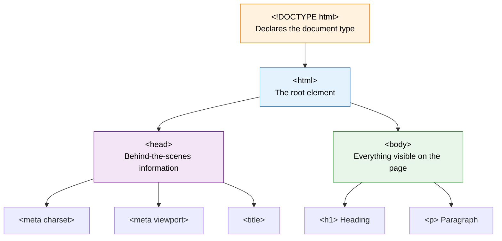
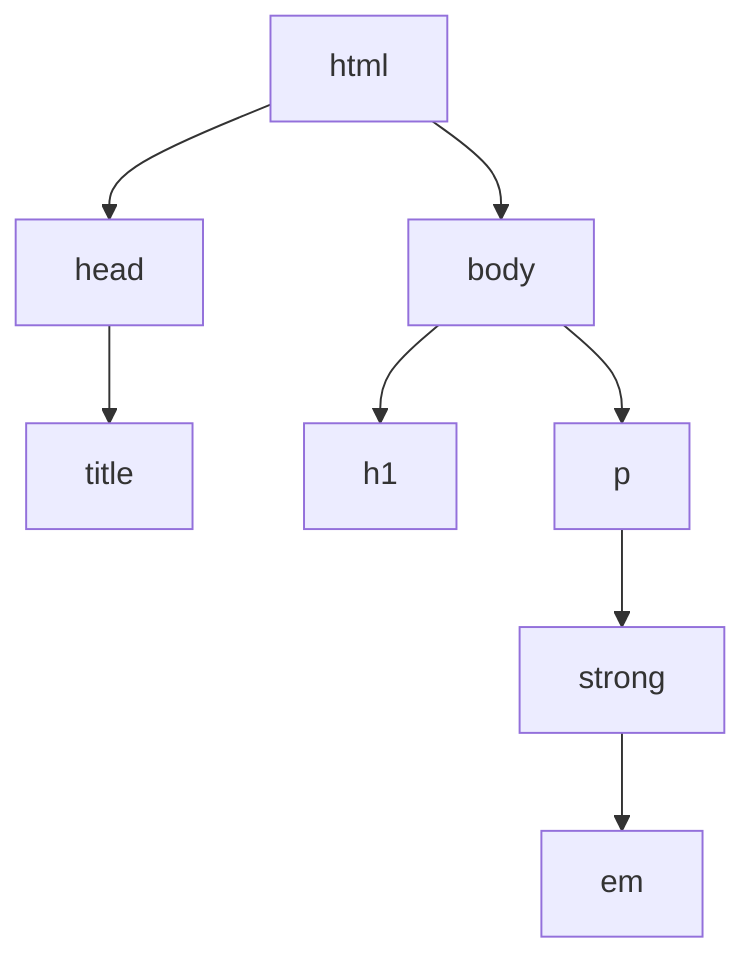

Every well-built house starts with a solid foundation: walls, a roof, and a floor plan. Web pages are no different. Every HTML page, from a tiny personal note to a giant online store, follows the **same basic skeleton**.

In the last lesson, you saw [how the web works](./how-the-web-works.mdx) and how a browser receives an HTML file. Now let's open that file and understand what is inside it, line by line.

By the end of this lesson, you will be able to write a complete, valid HTML page from memory.

<AdsComponent />
<br />

## The Skeleton of Every HTML Page

Here is the minimal structure that almost every HTML document uses. Take a moment to read it, and don't worry if some lines are new. We will explain each one.

```html title="index.html" {1,2,3,7,8,11,12}
<!DOCTYPE html>
<html lang="en">
  <head>
    <meta charset="UTF-8" />
    <meta name="viewport" content="width=device-width, initial-scale=1.0" />
    <title>My First Web Page</title>
  </head>
  <body>
    <h1>Hello, World!</h1>
    <p>Welcome to my website.</p>
  </body>
</html>
```

The highlighted lines show the four main building blocks. Let's see how they relate to each other:



Think of the page like a **book**:

- The **`<head>`** is like the cover and copyright page: title, language, and information *about* the book.
- The **`<body>`** is like the chapters: the actual content readers see.

## The DOCTYPE Declaration

```html
<!DOCTYPE html>
```

This must be the **very first line** of your document. It tells the browser: *"This page is written in modern HTML5. Please read it that way."*

Without it, browsers may switch into **quirks mode**, an old compatibility mode that can make your page look and behave unpredictably.

:::note Good to know
- `DOCTYPE` is **not** an HTML tag. It is an instruction to the browser.
- It is **not case-sensitive**, so `<!doctype html>` works too. Most developers write `<!DOCTYPE html>`.
:::

## The `<html>` Element

```html
<html lang="en">
  ...
</html>
```

The `<html>` element is the **root** of the page. Every other element lives inside it. It should contain exactly two children: one `<head>` and one `<body>`.

### Why the `lang` attribute matters

The `lang="en"` attribute declares the page's language. It may look small, but it is powerful:

- **Screen readers** pronounce words correctly.
- **Search engines** understand which audience the page is for.
- **Browsers** can offer accurate translation and correct hyphenation.

| Language | Attribute |
|----------|-----------|
| English | `lang="en"` |
| Hindi | `lang="hi"` |
| Spanish | `lang="es"` |
| French | `lang="fr"` |
| Arabic | `lang="ar"` |

## The `<head>` Element

The `<head>` contains **metadata**, which means *information about the page* rather than content visitors see on the page itself. Nothing placed directly in the head is displayed in the main browser window.

### What goes inside the head?

<Tabs>
  <TabItem value="charset" label="charset" default>

```html
<meta charset="UTF-8" />
```

Sets the **character encoding** so text in almost every language, plus symbols and emojis, displays correctly. Always place it near the top of the head.

  </TabItem>
  <TabItem value="viewport" label="viewport">

```html
<meta name="viewport" content="width=device-width, initial-scale=1.0" />
```

Makes your page **responsive** on phones and tablets. Without it, mobile browsers may show a tiny zoomed-out version of your desktop layout.

  </TabItem>
  <TabItem value="title" label="title">

```html
<title>HTML Tutorial for Beginners | CodeHarborHub</title>
```

Sets the text shown on the **browser tab**, in **bookmarks**, and as the **clickable headline in search results**. It is one of the most important SEO elements.

  </TabItem>
  <TabItem value="description" label="description">

```html
<meta
  name="description"
  content="Learn HTML step by step with beginner-friendly lessons."
/>
```

Provides a short summary that search engines often show under your title in search results.

  </TabItem>
  <TabItem value="link" label="link">

```html
<link rel="stylesheet" href="styles.css" />
<link rel="icon" href="favicon.ico" />
```

Connects **external resources** such as your CSS stylesheet and the **favicon** (the small icon on the browser tab).

  </TabItem>
  <TabItem value="script" label="script">

```html
<script src="app.js" defer></script>
```

Loads JavaScript. The `defer` attribute tells the browser to run the script only *after* the HTML has been read, which keeps your page fast.

  </TabItem>
</Tabs>

<AdsComponent />
<br />

### Quick reference: common head elements

| Element | Purpose |
|---------|---------|
| `<title>` | The page title (tab, bookmarks, search results). |
| `<meta charset>` | Character encoding. |
| `<meta name="viewport">` | Mobile responsiveness. |
| `<meta name="description">` | Search result summary. |
| `<link>` | Links stylesheets, icons, and other resources. |
| `<style>` | Writes CSS directly in the page. |
| `<script>` | Loads or writes JavaScript. |
| `<base>` | Sets a base URL for relative links. |

## The `<body>` Element

```html
<body>
  <h1>Hello, World!</h1>
  <p>Welcome to my website.</p>
</body>
```

The `<body>` holds **everything visitors actually see and interact with**: headings, paragraphs, images, links, buttons, forms, videos, and more. If it appears on the screen, it lives in the body.

You will spend most of your time inside this element as you learn HTML.

### Head vs. Body at a glance

| | `<head>` | `<body>` |
|---|----------|----------|
| **Contains** | Metadata and resources | Visible content |
| **Visible on the page?** | No (except the title on the tab) | Yes |
| **Typical elements** | `title`, `meta`, `link`, `script`, `style` | `h1`, `p`, `img`, `a`, `form`, `div` |
| **How many allowed?** | Exactly one | Exactly one |

## Seeing It in Action

Type this into a file called `index.html`:

```html title="index.html"
<!DOCTYPE html>
<html lang="en">
  <head>
    <meta charset="UTF-8" />
    <meta name="viewport" content="width=device-width, initial-scale=1.0" />
    <title>CodeHarborHub | My First Page</title>
  </head>
  <body>
    <h1>Hello, CodeHarborHub! 👋</h1>
    <p>I just built my first HTML page.</p>
  </body>
</html>
```

Open it in a browser and you will see the following. Notice how the `<title>` appears on the tab, while the body content fills the page:

<BrowserWindow url="http://127.0.0.1:5500/index.html">
<>
<h1>Hello, CodeHarborHub! 👋</h1>
<p>I just built my first HTML page.</p>
</>
</BrowserWindow>

## Nesting: Elements Inside Elements

HTML elements are **nested**, meaning they sit inside one another like Russian dolls. The structure always follows one strict rule: **close the tag you opened last, first.**

<Tabs groupId="nesting">
  <TabItem value="correct" label="✅ Correct nesting" default>

```html
<p>This is <strong>very <em>important</em></strong> text.</p>
```

Each inner element is fully closed before its parent closes.

  </TabItem>
  <TabItem value="incorrect" label="❌ Incorrect nesting">

```html
<p>This is <strong>very <em>important</strong></em> text.</p>
```

The tags **overlap**. Browsers may try to fix it, but the result can be unpredictable.

  </TabItem>
</Tabs>

A helpful way to picture nesting is as a **family tree**:



Elements directly inside another are called **children**, the element that contains them is the **parent**, and elements sharing the same parent are **siblings**.

## HTML Comments

Comments let you leave notes in your code. Browsers ignore them, so visitors never see them.

```html
<!-- This is a comment. It will not appear on the page. -->
<p>This paragraph is visible.</p>

<!--
  Comments can also
  span multiple lines.
-->

```

Use comments to explain tricky sections, organize long files, or temporarily disable a piece of code while testing.

:::warning Comments are not private
Anyone can read your HTML comments by viewing the page source. Never put passwords or secret information in them.
:::

## Whitespace and Formatting

Browsers **collapse extra spaces and line breaks** into a single space. So these two snippets look identical on the page:

```html
<p>Hello     World</p>

<p>Hello
World</p>
```

Both display as: *Hello World*.

That means you are free to use **indentation** to make your code readable. The common convention is **2 or 4 spaces** per nesting level. Consistent formatting is a hallmark of professional code.

## A Ready-to-Use Template

Bookmark this one. It is a great starting point for any project. You can also generate it instantly in Visual Studio Code by typing `!` in an empty HTML file and pressing **Tab**.

<Tabs groupId="template">
  <TabItem value="basic" label="Basic template" default>

```html title="basic-template.html"
<!DOCTYPE html>
<html lang="en">
  <head>
    <meta charset="UTF-8" />
    <meta name="viewport" content="width=device-width, initial-scale=1.0" />
    <title>Document</title>
  </head>
  <body>

  </body>
</html>
```

  </TabItem>
  <TabItem value="pro" label="SEO-ready template">

```html title="seo-template.html"
<!DOCTYPE html>
<html lang="en">
  <head>
    <meta charset="UTF-8" />
    <meta name="viewport" content="width=device-width, initial-scale=1.0" />

    <title>Page Title | Your Site Name</title>
    <meta name="description" content="A short, helpful summary of this page." />

    <!-- Social sharing -->
    <meta property="og:title" content="Page Title" />
    <meta property="og:description" content="A short summary for social media." />
    <meta property="og:image" content="https://example.com/preview.png" />

    <link rel="icon" href="favicon.ico" />
    <link rel="stylesheet" href="styles.css" />
    <script src="app.js" defer></script>
  </head>
  <body>
    <header>...</header>
    <main>...</main>
    <footer>...</footer>
  </body>
</html>
```

  </TabItem>
</Tabs>

## Common Beginner Mistakes

<details>
  <summary>1. Forgetting the DOCTYPE</summary>

Without `<!DOCTYPE html>`, the browser may enter quirks mode and render your page inconsistently. Always start with it.

</details>

<details>
  <summary>2. Putting visible content in the head</summary>

Headings and paragraphs belong in the `<body>`. Only metadata belongs in the `<head>`.

</details>

<details>
  <summary>3. Forgetting the viewport meta tag</summary>

Your page may look tiny and hard to read on phones. Always include the viewport tag.

</details>

<details>
  <summary>4. Missing or overlapping closing tags</summary>

Unclosed or overlapping tags cause layout bugs that are hard to track down. Close every element properly.

</details>

<details>
  <summary>5. Skipping the lang attribute</summary>

It is easy to forget, but it hurts accessibility and SEO. Always set `lang` on the `<html>` tag.

</details>

<AdsComponent />
<br />

## Quick Recap

- Every HTML page starts with **`<!DOCTYPE html>`**.
- The **`<html>`** element is the root and should carry a **`lang`** attribute.
- The **`<head>`** holds metadata: charset, viewport, title, links, and scripts.
- The **`<body>`** holds all the visible content.
- Elements are **nested**, and tags must be closed in the correct order.
- **Comments** are ignored by browsers, and extra **whitespace** is collapsed.

## Frequently Asked Questions

<details>
  <summary>What is the basic structure of an HTML document?</summary>

A basic HTML document has a `<!DOCTYPE html>` declaration, an `<html>` root element, a `<head>` for metadata, and a `<body>` for visible content.

</details>

<details>
  <summary>Is the head element required?</summary>

Browsers will often create one automatically, but you should always write it yourself. It is where the title, charset, and viewport tags live, all of which are important.

</details>

<details>
  <summary>What is the difference between title and h1?</summary>

The `<title>` appears on the browser tab and in search results. The `<h1>` is the main heading displayed inside the page. They can be similar, but they serve different purposes.

</details>

<details>
  <summary>Can I have more than one body or head element?</summary>

No. A valid HTML document contains exactly one `<head>` and one `<body>`.

</details>

<details>
  <summary>Why is the doctype not a normal HTML tag?</summary>

It is a document type declaration, an instruction to the browser about which version of HTML to use, rather than an element that appears in the page.

</details>

## Test Your Understanding

1. What must be the very first line of an HTML5 document?
2. What is the difference between the `<head>` and the `<body>`?
3. Why is the `<meta name="viewport">` tag important?
4. What is wrong with `<b><i>Hello</b></i>`?
5. Do browsers display HTML comments to visitors?