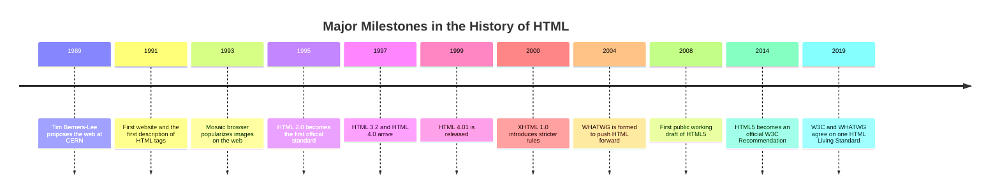
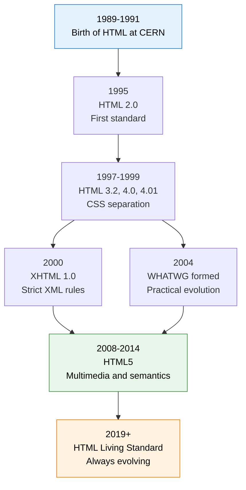

In the previous lesson, you learned [what HTML is](./what-is-html.mdx). Now let's answer a fun follow-up question: **where did it come from?**

The story of HTML is really the story of the web itself. It began as a simple idea to help scientists share documents, and it grew into the language that powers billions of web pages today. Knowing this journey will help you understand *why* HTML looks and behaves the way it does.

:::info Why should a beginner care about history?
Because you will meet old code, old tutorials, and old tags all over the internet. Understanding how HTML evolved helps you tell **modern best practice** from **outdated habits**.
:::

<AdsComponent />
<br />

## Who Invented HTML?

HTML was created by **Sir Tim Berners-Lee**, a British computer scientist working at **CERN**, the European physics research organization in Switzerland.

In the late 1980s, CERN had a real problem. Thousands of researchers were creating documents on different computers, in different formats, and finding anything was painful. In **March 1989**, Berners-Lee proposed a system to link documents together using **hypertext**, so that anyone could jump from one piece of information to another with a click.

To make that idea real, he built the three pillars of the early web:

| Invention | What it does |
|-----------|--------------|
| **HTML** | The language for writing web documents. |
| **HTTP** | The protocol for sending documents between computers. |
| **URL** | The address system for locating any document. |

By **1990**, he had also created the first web browser (called *WorldWideWeb*) and the first web server. The first website went live at CERN, and it opened to the public in **1991**.

## The HTML Timeline at a Glance

Here is the whole story on one page. Read it top to bottom, then we will explore each chapter.



## The Story, Chapter by Chapter

### Chapter 1: The Early Days (1989 to 1993)

In **1991**, Berners-Lee shared a short document describing about **18 HTML tags**. It was tiny compared with today's HTML, but it already included the essentials: headings, paragraphs, lists, and, most importantly, **links**.

In **1993**, a browser called **Mosaic** was released by the NCSA in the United States. Mosaic was a turning point. It introduced the `` tag, letting web pages show pictures inline for the first time. Suddenly, the web became visual, and ordinary people started to care.

### Chapter 2: Becoming a Standard (1994 to 1996)

As the web exploded in popularity, browsers began inventing their own tags. That created chaos, because a page might look fine in one browser and broken in another.

To bring order, Berners-Lee founded the **World Wide Web Consortium (W3C)** in **1994**. Its mission was to develop open web standards.

In **1995**, **HTML 2.0** was published. This was the first official, agreed-upon version of HTML, and it added forms so users could submit information.

:::note What about HTML 1.0 and 3.0?
There was no widely adopted "HTML 1.0". The early language was informal. A proposal called HTML 3.0 also existed but was never fully adopted, and **HTML 3.2** (released in 1997) took its place.
:::

### Chapter 3: The Browser Wars (Late 1990s)

In the mid to late 1990s, **Netscape Navigator** and **Internet Explorer** fought fiercely for control of the web. Each added its own exclusive features to attract users. Developers were forced to write extra code just to make one page work everywhere.

This era gave us **HTML 3.2** (1997) and **HTML 4.0** (1997), followed by **HTML 4.01** (1999). HTML 4 was a big step forward. It encouraged developers to separate **content** (HTML) from **presentation** (CSS), instead of using tags like `<font>` to style text.

<Tabs>
  <TabItem value="old-way" label="❌ The old way (1990s style)" default>

```html title="Presentation mixed into HTML"
<font face="Arial" color="red">Welcome to my site</font>
<center>Hello!</center>
```

Styling tags like `<font>` and `<center>` are **deprecated**. Never use them in modern projects.

  </TabItem>
  <TabItem value="new-way" label="✅ The modern way">

```html title="Structure in HTML, style in CSS"
<h1 class="welcome">Welcome to my site</h1>
```

```css title="styles.css"
.welcome {
  font-family: Arial, sans-serif;
  color: red;
  text-align: center;
}
```

HTML describes the content, and CSS handles the look.

  </TabItem>
</Tabs>

<AdsComponent />
<br />

### Chapter 4: The XHTML Detour (2000 to 2008)

In **2000**, the W3C introduced **XHTML 1.0**, which reformulated HTML using the stricter rules of XML. It demanded things like:

- All tags must be **lowercase**.
- All elements must be **properly closed**.
- All attribute values must be **quoted**.

Many developers loved the discipline, but the strictness had a cost: a single small mistake could stop a page from displaying in strict XML mode. Meanwhile, the W3C's planned successor, **XHTML 2.0**, was not backward compatible with existing pages, and the developer community pushed back hard.

### Chapter 5: The Rebellion and the Birth of WHATWG (2004)

Frustrated with the direction of XHTML 2.0, engineers from **Apple, Mozilla, and Opera** formed a new group in **2004** called the **WHATWG** (Web Hypertext Application Technology Working Group).

Their philosophy was practical: **evolve HTML gradually, stay compatible with existing websites, and focus on what real web applications need.** This work became the foundation of HTML5.

### Chapter 6: HTML5 Changes Everything (2008 to 2014)

The first public draft of **HTML5** appeared in **2008**, and the W3C finalized it as an official **Recommendation in October 2014**.

HTML5 was more than a small update. It brought native support for things that previously required plugins like Flash:

- Built-in **audio and video** with `<audio>` and `<video>`
- Meaningful **semantic elements** like `<header>`, `<nav>`, `<article>`, and `<footer>`
- The **canvas** element for drawing graphics
- Better **forms** with new input types
- **Local storage** and other powerful browser APIs

It also simplified the very first line of every page. Compare the old and new declarations:

<Tabs groupId="doctype">
  <TabItem value="html4" label="HTML 4.01" default>

```html
<!DOCTYPE HTML PUBLIC "-//W3C//DTD HTML 4.01//EN"
  "http://www.w3.org/TR/html4/strict.dtd">
```

  </TabItem>
  <TabItem value="html5" label="HTML5">

```html
<!DOCTYPE html>
```

  </TabItem>
</Tabs>

Much easier to remember, right? 😄

### Chapter 7: The Living Standard (2019 to Today)

For years, the W3C and WHATWG maintained two competing versions of HTML. In **2019**, they agreed to work together, with the **WHATWG HTML Living Standard** as the single, continuously updated reference.

That means there is no "HTML6" on the horizon. Instead, HTML now **evolves constantly**, with new features added and improved as browsers adopt them.

:::tip What this means for you
When someone says "HTML" today, they almost always mean the **HTML Living Standard**, which grew out of HTML5. You do not need to memorize version numbers. Just learn modern HTML, and you will be up to date.
:::

## How HTML Evolved: The Big Picture



## HTML Versions Compared

| Version | Year | Key highlights |
|---------|------|----------------|
| **HTML (early)** | 1991 | About 18 tags, links, headings, and basic text. |
| **HTML 2.0** | 1995 | First official standard, added forms. |
| **HTML 3.2** | 1997 | Tables, applets, and text flow around images. |
| **HTML 4.01** | 1999 | Stylesheet support, scripting, and better accessibility. |
| **XHTML 1.0** | 2000 | HTML rewritten with strict XML syntax. |
| **HTML5** | 2014 | Audio, video, canvas, semantic tags, and modern APIs. |
| **HTML Living Standard** | 2019+ | Continuously updated single standard. |

## See How Far HTML Has Come

Here is a page written in the spirit of the **early web**, followed by a **modern** equivalent. Notice how much cleaner and more meaningful today's HTML is.

<Tabs>
  <TabItem value="early" label="Early web style" default>

```html title="old-page.html"
<HTML>
<HEAD><TITLE>My Page</TITLE></HEAD>
<BODY BGCOLOR="white">
<H1>Welcome</H1>
<FONT COLOR="blue">Hello, visitor!</FONT>
</BODY>
</HTML>
```

  </TabItem>
  <TabItem value="modern" label="Modern HTML5 style">

```html title="modern-page.html"
<!DOCTYPE html>
<html lang="en">
  <head>
    <meta charset="UTF-8" />
    <title>My Page</title>
  </head>
  <body>
    <main>
      <h1>Welcome</h1>
      <p>Hello, visitor!</p>
    </main>
  </body>
</html>
```

  </TabItem>
</Tabs>

And this is what the modern page looks like in a browser:

<BrowserWindow url="http://127.0.0.1:5500/modern-page.html">
<>
<h1>Welcome</h1>
<p>Hello, visitor!</p>
</>
</BrowserWindow>

## Quick Recap

- **Tim Berners-Lee** invented HTML at **CERN** around 1989 to 1991.
- **HTML 2.0 (1995)** was the first official standard.
- **HTML 4.01 (1999)** promoted separating content from style with CSS.
- **XHTML (2000)** brought strictness, but the community wanted flexibility.
- **WHATWG (2004)** pushed HTML forward in a practical, compatible way.
- **HTML5 (2014)** added multimedia, semantics, and powerful APIs.
- Today, HTML is a continuously updated **Living Standard**.

<AdsComponent />
<br />

## Frequently Asked Questions

<details>
  <summary>Who invented HTML?</summary>

HTML was invented by **Tim Berners-Lee** at CERN in the early 1990s, as part of his work creating the World Wide Web.

</details>

<details>
  <summary>What was the first version of HTML?</summary>

The earliest description of HTML appeared in 1991, but the first official standard was **HTML 2.0**, published in 1995.

</details>

<details>
  <summary>Is there an HTML6?</summary>

No. HTML is now maintained as a **Living Standard**, which is updated continuously rather than released in numbered versions.

</details>

<details>
  <summary>What is the difference between W3C and WHATWG?</summary>

The **W3C** is the standards body founded by Tim Berners-Lee in 1994. The **WHATWG** was formed in 2004 by browser makers. Since 2019, they collaborate, and the WHATWG Living Standard is the main HTML specification.

</details>

<details>
  <summary>Should I still learn XHTML?</summary>

You do not need to. Just learn modern HTML5. However, the good habits XHTML encouraged, such as lowercase tags and properly closed elements, are still worth following.

</details>

## Test Your Understanding

1. Who created HTML, and where was he working?
2. Which version of HTML was the first official standard?
3. Why did developers push back against XHTML 2.0?
4. What does it mean that HTML is a "Living Standard"?