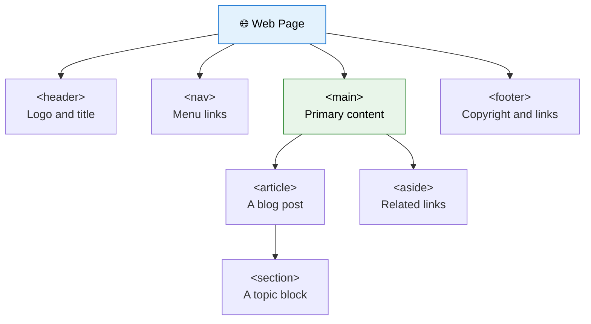
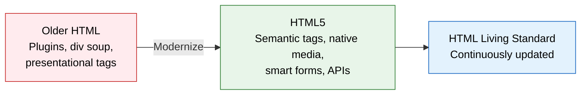

If you have searched for HTML tutorials online, you have probably seen both **"HTML"** and **"HTML5"** and wondered: *are they two different languages? Which one should I learn?*

Good news: it is much simpler than it sounds. **HTML5 is simply the modern version of HTML.** It is the same language you are already learning, upgraded with cleaner syntax, meaningful tags, built-in multimedia, and powerful browser features.

In this lesson, you will see exactly **what changed**, **why it matters**, and **what to use in your own projects today**.

:::info The short answer
There is no separate "HTML5 language" to learn. When people say *HTML*, they usually mean HTML5 and the modern HTML Living Standard that grew from it. Older versions (HTML 4.01 and XHTML) are now mostly of historical interest.
:::

<AdsComponent />
<br />

## HTML vs HTML5 at a Glance

| Feature | Older HTML (4.01 / XHTML) | HTML5 |
|---------|---------------------------|-------|
| **Doctype** | Long and hard to remember | Short: `<!DOCTYPE html>` |
| **Character encoding** | Verbose `http-equiv` meta tag | Simple `<meta charset="UTF-8">` |
| **Page structure** | Generic `<div>` everywhere | Semantic tags like `<header>`, `<main>`, `<footer>` |
| **Audio and video** | Needed plugins like Flash | Native `<audio>` and `<video>` |
| **Graphics** | Images or plugins | `<canvas>` and inline `<svg>` |
| **Forms** | Only basic input types | Email, date, number, range, color, and more |
| **Browser APIs** | Very limited | Local storage, geolocation, drag and drop, and more |
| **Error handling** | Rigid rules | Forgiving, consistent parsing rules |
| **Mobile friendliness** | Not designed for it | Built with mobile devices in mind |

Let's explore each of these differences in detail.

## A Simpler Start: Doctype and Charset

The very first lines of an HTML document tell the browser how to read it. HTML5 made them dramatically shorter.

<Tabs>
  <TabItem value="old" label="Older HTML 4.01" default>

```html title="index.html"
<!DOCTYPE HTML PUBLIC "-//W3C//DTD HTML 4.01//EN"
  "http://www.w3.org/TR/html4/strict.dtd">
<html>
  <head>
    <meta http-equiv="Content-Type" content="text/html; charset=UTF-8">
    <title>My Page</title>
  </head>
  <body>
    Hello!
  </body>
</html>
```

  </TabItem>
  <TabItem value="new" label="HTML5">

```html title="index.html"
<!DOCTYPE html>
<html lang="en">
  <head>
    <meta charset="UTF-8" />
    <title>My Page</title>
  </head>
  <body>
    Hello!
  </body>
</html>
```

  </TabItem>
</Tabs>

The HTML5 version is shorter, easier to remember, and adds `lang="en"`, which helps screen readers and search engines understand your page's language.

## Semantic Elements: Tags That Mean Something

This is arguably the **biggest everyday improvement** in HTML5.

In older HTML, developers built page layouts using generic `<div>` tags with class names like `header` or `footer`. The browser had no idea what each block meant. HTML5 introduced **semantic elements**, which describe their own purpose.

<Tabs groupId="html-version">
  <TabItem value="old" label="Older HTML 4.01" default>

```html
<div id="header">...</div>
<div id="nav">...</div>
<div id="content">
  <div class="post">...</div>
</div>
<div id="footer">...</div>
```

  </TabItem>
  <TabItem value="new" label="HTML5">

```html
<header>...</header>
<nav>...</nav>
<main>
  <article>...</article>
</main>
<footer>...</footer>
```

  </TabItem>
</Tabs>

Here is how a semantic page layout is organized:



### Why semantic tags matter

- **Better accessibility.** Screen readers can jump straight to the `<main>` content or the `<nav>` menu.
- **Better SEO.** Search engines understand the structure and importance of your content.
- **Cleaner code.** Your HTML becomes easier for humans to read and maintain.

:::tip Rule of thumb
Reach for a semantic element first. Use a plain `<div>` only when no meaningful tag fits.
:::

## Native Audio and Video

Before HTML5, playing a video on a web page usually meant installing a plugin such as **Adobe Flash**. Plugins were slow, insecure, and did not work on most phones. Flash has since been discontinued entirely.

HTML5 fixed this by adding `<audio>` and `<video>` elements directly into the language.

```html title="Embedding a video in HTML5"
<video controls width="480" poster="thumbnail.jpg">
  <source src="lesson.mp4" type="video/mp4" />
  <source src="lesson.webm" type="video/webm" />
  Your browser does not support the video tag.
</video>

<audio controls>
  <source src="podcast.mp3" type="audio/mpeg" />
  Your browser does not support the audio element.
</audio>
```

Any text placed inside the tags acts as a **fallback message** for very old browsers.

<AdsComponent />
<br />

## Smarter Forms

HTML5 gave forms a huge upgrade with **new input types** and **built-in validation**, so browsers can check user input without any JavaScript.

<Tabs>
  <TabItem value="code" label="💻 Code" default>

```html title="HTML5 form inputs"
<input type="email" placeholder="you@example.com" required />
<input type="date" />
<input type="number" min="1" max="10" />
<input type="range" min="0" max="100" />
<input type="color" />
<input type="search" placeholder="Search tutorials..." />
```

  </TabItem>
  <TabItem value="preview" label="👀 Preview">

<BrowserWindow url="http://127.0.0.1:5500/form.html">
<>
<p><input type="email" placeholder="you@example.com" required /></p>
<p><input type="date" /></p>
<p><input type="number" min="1" max="10" /></p>
<p><input type="range" min="0" max="100" /></p>
<p><input type="color" /></p>
<p><input type="search" placeholder="Search tutorials..." /></p>
</>
</BrowserWindow>

  </TabItem>
</Tabs>

New helpful attributes arrived too:

| Attribute | What it does |
|-----------|--------------|
| `placeholder` | Shows a hint inside an empty field. |
| `required` | Prevents submitting the form if the field is empty. |
| `autofocus` | Puts the cursor in the field when the page loads. |
| `pattern` | Validates input against a regular expression. |
| `min` / `max` | Sets allowed number or date ranges. |

On mobile devices, these input types even trigger the **right keyboard** automatically, such as a number pad for `type="number"`.

## Graphics with Canvas and SVG

HTML5 introduced two powerful ways to draw graphics directly in the browser:

- **`<canvas>`** lets you draw pixels with JavaScript. It is great for games, charts, and animations.
- **`<svg>`** lets you embed crisp, scalable vector graphics that never blur at any size.

```html title="A simple inline SVG"
<svg width="120" height="120" viewBox="0 0 120 120">
  <circle cx="60" cy="60" r="50" fill="royalblue" />
</svg>
```

<BrowserWindow url="http://127.0.0.1:5500/circle.html">
<>
<svg width="120" height="120" viewBox="0 0 120 120">
  <circle cx="60" cy="60" r="50" fill="royalblue" />
</svg>
</>
</BrowserWindow>

## Powerful Built-in APIs

HTML5 is not just about tags. It shipped alongside a family of **JavaScript APIs** that let websites behave more like real applications.

| API | What you can do with it |
|-----|-------------------------|
| **Web Storage** | Save data in the browser with `localStorage` and `sessionStorage`. |
| **Geolocation** | Find a user's location (with their permission). |
| **Drag and Drop** | Let users drag elements around the page. |
| **Web Workers** | Run heavy tasks in the background without freezing the page. |
| **WebSocket** | Build real-time features like chat. |
| **History API** | Change the URL without reloading the page. |

```js title="Saving data with Web Storage"
localStorage.setItem("username", "CodeHarborHub");
console.log(localStorage.getItem("username")); // CodeHarborHub
```

## Out with the Old: Removed and Deprecated Tags

HTML5 also cleaned house. Tags that controlled **appearance** were removed, because that job belongs to CSS. Others were dropped because better alternatives exist.

| ❌ Old tag | ✅ Use this instead |
|-----------|---------------------|
| `<font>` | CSS `color`, `font-family`, `font-size` |
| `<center>` | CSS `text-align: center` |
| `<big>` and `<tt>` | CSS font properties |
| `<strike>` | `<s>` or `<del>` |
| `<acronym>` | `<abbr>` |
| `<frame>` and `<frameset>` | `<iframe>` or modern layout with CSS |
| `<applet>` | `<object>` or `<embed>` |

:::warning Avoid these in new projects
Browsers may still display some of these tags for backward compatibility, but they are **obsolete** and fail modern validation. Always use the recommended replacements.
:::

<details>
  <summary>🤔 Why did HTML5 remove presentational tags?</summary>

Mixing style into HTML makes pages harder to maintain. If you wanted to change a color across a 100-page site, you would need to edit every `<font>` tag by hand. With CSS, you change one rule in one file. HTML5 strengthened the principle: **HTML for structure, CSS for style, JavaScript for behavior.**

</details>

## Friendlier Error Handling

Older HTML was vague about what a browser should do when it met broken code, so every browser guessed differently. HTML5 defined a **precise parsing algorithm**, so all modern browsers now handle even messy markup in the same way. That means fewer surprises and more consistent pages across Chrome, Firefox, Safari, and Edge.

## The Upgrade Journey



## Try It Yourself: Upgrade a Page

Here is an old-style page. Can you spot what should change before you scroll down?

```html title="old-style.html"
<html>
<body>
<div id="header"><font color="blue">My Blog</font></div>
<div id="content">
  <center>Welcome to my blog!</center>
</div>
<div id="footer">Copyright 2026</div>
</body>
</html>
```

<details>
  <summary>👀 Click to see the modernized version</summary>

```html title="modern-style.html"
<!DOCTYPE html>
<html lang="en">
  <head>
    <meta charset="UTF-8" />
    <meta name="viewport" content="width=device-width, initial-scale=1.0" />
    <title>My Blog</title>
    <style>
      h1 { color: blue; }
      main p { text-align: center; }
    </style>
  </head>
  <body>
    <header>
      <h1>My Blog</h1>
    </header>
    <main>
      <p>Welcome to my blog!</p>
    </main>
    <footer>
      <p>Copyright 2026</p>
    </footer>
  </body>
</html>
```

**What improved?**

- Added `<!DOCTYPE html>`, `lang`, `charset`, and the viewport meta tag.
- Replaced `<div>` blocks with `<header>`, `<main>`, and `<footer>`.
- Removed `<font>` and `<center>`, and used CSS instead.

</details>

<AdsComponent />
<br />

## HTML5 Migration Checklist

Use this quick checklist whenever you write or update a page:

- [x] Start with `<!DOCTYPE html>`
- [x] Add `lang` to the `<html>` tag
- [x] Use `<meta charset="UTF-8" />`
- [x] Add the responsive viewport meta tag
- [x] Replace layout `<div>` blocks with semantic elements
- [x] Remove obsolete presentational tags
- [x] Use native `<video>` and `<audio>` instead of plugins
- [x] Take advantage of HTML5 form types and validation

## Quick Recap

- **HTML5 is the modern version of HTML**, not a separate language.
- It simplified the **doctype** and **charset** declarations.
- It added **semantic elements** for clearer, more accessible pages.
- It brought native **audio, video, canvas, and SVG** support.
- It introduced **smarter forms** and powerful **browser APIs**.
- It removed **obsolete presentational tags** in favor of CSS.
- Today's HTML continues to evolve as a **Living Standard**.

## Frequently Asked Questions

<details>
  <summary>Is HTML5 different from HTML?</summary>

HTML5 is the fifth major version of HTML. It is the same language, but with new features, cleaner syntax, and removal of outdated elements.

</details>

<details>
  <summary>Which should I learn, HTML or HTML5?</summary>

Learn modern HTML, which means HTML5 and beyond. Everything in this tutorial follows current best practice.

</details>

<details>
  <summary>Do all browsers support HTML5?</summary>

Yes. All current major browsers, including Chrome, Firefox, Safari, and Edge, support HTML5 on desktop and mobile.

</details>

<details>
  <summary>Is HTML5 a programming language?</summary>

No. Like earlier versions, HTML5 is a markup language. Although it comes with JavaScript APIs, the HTML itself only describes structure and content.

</details>

<details>
  <summary>Will there be an HTML6?</summary>

There is no plan for a numbered HTML6. HTML is now a continuously updated Living Standard, with features added over time.

</details>

<details>
  <summary>Do I need to write HTML5 tags in lowercase?</summary>

HTML5 is case-insensitive, but lowercase is the widely accepted convention. It keeps your code consistent and easy to read.

</details>

## Test Your Understanding

1. What is the HTML5 doctype declaration?
2. Name three semantic elements introduced in HTML5.
3. Which HTML5 elements replaced the need for Flash video plugins?
4. Why was the `<font>` tag removed, and what should you use instead?
5. Give two examples of new HTML5 input types.