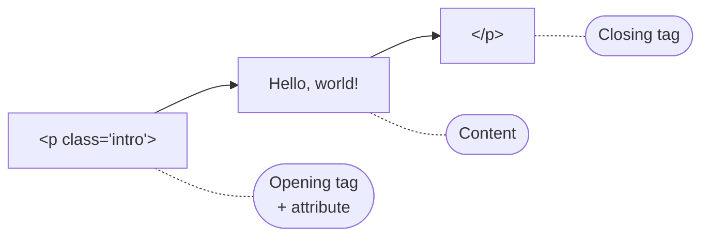
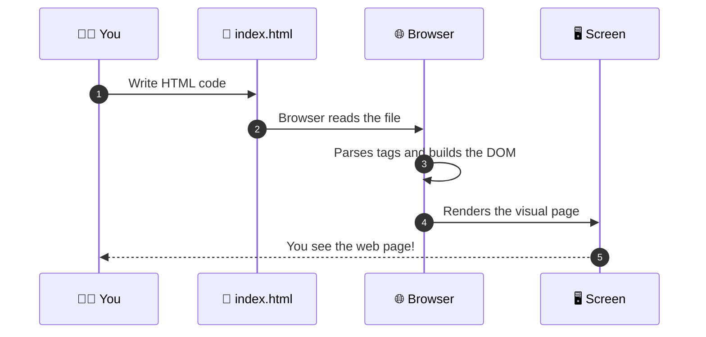
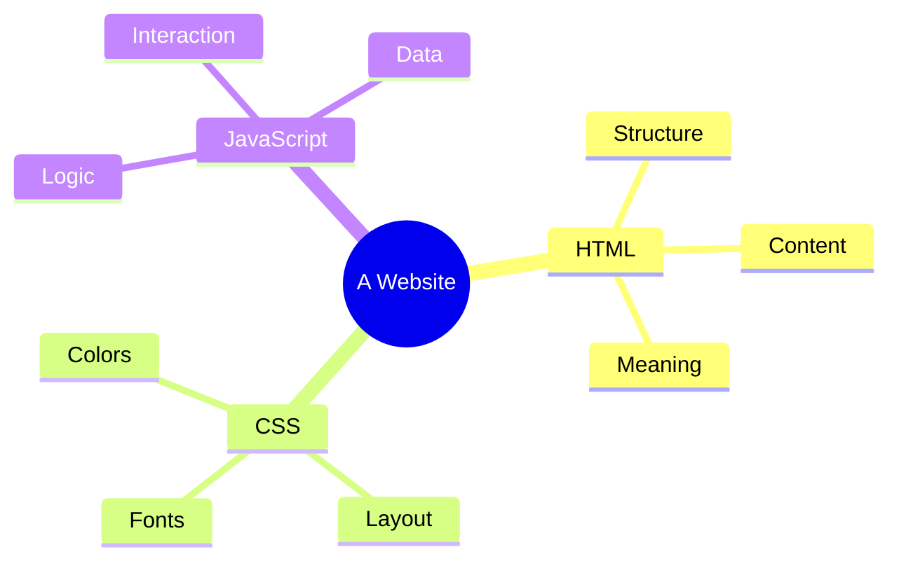

Open any website right now: a news site, a video platform, an online shop. Behind the colors, animations, and buttons, there is one language quietly holding everything together: **HTML**.

If the web were a house, **HTML would be the bricks, walls, doors, and windows**. CSS would be the paint and interior design, and JavaScript would be the electricity that makes things move and respond.

In this lesson, you will learn what HTML really is, how it works, and why it is the very first thing every web developer learns. No jargon, no pressure, just clear explanations and hands-on examples.

<AdsComponent />
<br />

## HTML Definition (in Plain English)

**HTML** stands for **HyperText Markup Language**. Let's break that name into three easy pieces:

| Word | Meaning | Simple explanation |
|------|---------|--------------------|
| **Hyper** | Beyond linear | You are not forced to read top to bottom. You can jump anywhere using links. |
| **Text** | Written content | Words, headings, paragraphs, lists, and other readable content. |
| **Markup** | Labels around content | Special tags that tell the browser *what each piece of content is*. |
| **Language** | A set of rules | A defined vocabulary and grammar that browsers understand. |

:::info The short version
HTML is a **markup language** that describes the **structure and meaning** of content on a web page. It tells the browser: *"This is a heading, this is a paragraph, this is an image, and this is a link."*
:::

### Is HTML a programming language?

This is one of the most common questions beginners ask, and the honest answer is: **no**.

HTML does not have logic like `if` statements, loops, or variables. It does not *calculate* or *decide* anything. It only **describes** content. That is why we call it a **markup language**, not a programming language.

That is also good news for you: HTML is one of the **easiest** technologies to start with.

## The Big Idea: Structure Through Tags

Imagine you are writing a school essay. You would naturally use a title, some paragraphs, maybe a list, and a picture. HTML lets you do the same thing for the web, by **wrapping content in tags**.

```html title="A simple HTML snippet"
<h1>My Favorite Fruits</h1>
<p>Here are three fruits I really enjoy:</p>
<ul>
  <li>Mango</li>
  <li>Strawberry</li>
  <li>Pineapple</li>
</ul>
```

Here is what the browser shows you when it reads that code:

<BrowserWindow url="http://127.0.0.1:5500/index.html">
<>
<h1>My Favorite Fruits</h1>
<p>Here are three fruits I really enjoy:</p>
<ul>
  <li>Mango</li>
  <li>Strawberry</li>
  <li>Pineapple</li>
</ul>
</>
</BrowserWindow>

Notice something important: **you never told the browser how big the heading should be or what a bullet looks like.** You only described *what* each piece of content is. The browser handled the rest.

## Anatomy of an HTML Element

Every piece of HTML you write is made of **elements**. An element usually has three parts:

```html
<p class="intro">Hello, world!</p>
```

- **Opening tag**: `<p class="intro">` starts the element.
- **Content**: `Hello, world!` is what appears on the page.
- **Closing tag**: `</p>` ends the element.



### Tags vs. Elements vs. Attributes

Beginners often mix these three terms up. Here is a quick cheat sheet:

- A **tag** is the label written inside angle brackets, like `<p>` or `</p>`.
- An **element** is the *complete package*: opening tag + content + closing tag.
- An **attribute** is extra information added to an opening tag, like `class="intro"` or `href="https://..."`.

:::tip Memory trick
Think of an element as a **sandwich**. The tags are the two slices of bread, and the content is the filling. 🥪
:::

<details>
  <summary>🤔 What are "void" (self-closing) elements?</summary>

Some elements have no content, so they do not need a closing tag. These are called **void elements**. Common examples include:

- `` for images
- `<br />` for a line break
- `<hr />` for a horizontal line
- `<input />` for form fields

```html

```

</details>

## How Does HTML Actually Work?

You write HTML in a plain text file, usually saved with the `.html` extension. When you open that file in a browser, a fascinating process happens behind the scenes:



1. **You write** HTML code in a text file.
2. **The browser reads** the file from top to bottom.
3. **It parses** (understands) each tag and builds a tree-like structure called the **DOM** (Document Object Model).
4. **It renders** that structure as the page you see on screen.

:::note
You will learn about the DOM in depth later in this tutorial series. For now, just remember: *the browser turns your HTML text into a visual page.*
:::

<AdsComponent />
<br />

## What is HTML Used For?

HTML is everywhere. Here are some of the things it powers:

- **Websites and blogs** of every size, from personal portfolios to global companies.
- **Web applications** like online email, document editors, and dashboards.
- **Email newsletters** with rich formatting.
- **Mobile apps** built with hybrid frameworks that render web content.
- **Online courses and documentation**, just like the page you are reading right now!

Whatever you want to build for the web, HTML is the **foundation**.

## HTML, CSS, and JavaScript: The Web Trio

HTML never works alone. Modern websites are built on three core technologies that each have a clear job:

<Tabs>
  <TabItem value="html" label="HTML" default>

**Role: Structure and content.**

HTML decides *what* is on the page: headings, text, images, links, and forms.

```html
<button>Click me</button>
```

  </TabItem>
  <TabItem value="css" label="CSS">

**Role: Style and layout.**

CSS decides *how* things look: colors, fonts, spacing, and positioning.

```css
button {
  background-color: royalblue;
  color: white;
  padding: 10px 20px;
  border-radius: 8px;
}
```

  </TabItem>
  <TabItem value="js" label="JavaScript">

**Role: Behavior and interactivity.**

JavaScript decides *what happens* when users interact: clicks, typing, animations, and data loading.

```js
document.querySelector("button").addEventListener("click", () => {
  alert("Hello from CodeHarborHub!");
});
```

  </TabItem>
</Tabs>

Now watch how all three combine into a single interactive button:

<Tabs groupId="web-trio">
  <TabItem value="html-only" label="HTML only" default>

<BrowserWindow url="http://127.0.0.1:5500/index.html">
<>
<button>Click me</button>
</>
</BrowserWindow>

Plain and functional, but not very exciting yet.

  </TabItem>
  <TabItem value="html-css" label="HTML + CSS">

<BrowserWindow url="http://127.0.0.1:5500/index.html">
<>
<button style={{backgroundColor: 'royalblue', color: 'white', padding: '10px 20px', border: 'none', borderRadius: '8px', cursor: 'pointer'}}>Click me</button>
</>
</BrowserWindow>

Same structure, but now it looks polished and professional.

  </TabItem>
</Tabs>



:::tip Learning order matters
Always learn **HTML first**, then CSS, then JavaScript. Trying to style or animate something that has no structure is like decorating a house that has not been built yet.
:::

## Your First Real HTML Page

Let's put everything together. Here is a complete HTML document that you can copy, save, and open in any browser:

```html title="index.html" {1,2,7,8}
<!DOCTYPE html>
<html lang="en">
  <head>
    <meta charset="UTF-8" />
    <title>Welcome to CodeHarborHub</title>
  </head>
  <body>
    <h1>Hello, CodeHarborHub! 👋</h1>
    <p>This is my very first web page.</p>
    <a href="https://codeharborhub.github.io">Visit CodeHarborHub</a>
  </body>
</html>
```

And here is how it looks in the browser:

<BrowserWindow url="http://127.0.0.1:5500/index.html">
<>
<h1>Hello, CodeHarborHub! 👋</h1>
<p>This is my very first web page.</p>
<a href="https://codeharborhub.github.io">Visit CodeHarborHub</a>
</>
</BrowserWindow>

:::warning Don't worry about every line yet
You may be wondering about `<!DOCTYPE html>`, `<head>`, and `lang="en"`. We will cover every one of them in the upcoming lesson on **HTML Document Structure**. For now, focus on the big picture.
:::

## Why Should You Learn HTML?

- **It is beginner-friendly.** No complex logic to memorize.
- **It is universal.** Every browser on every device understands HTML.
- **It is the gateway to a career.** Frontend, full-stack, and UI/UX roles all begin with HTML.
- **It is free and open.** All you need is a browser and a text editor.
- **It improves SEO and accessibility.** Well-written HTML helps search engines and screen readers understand your content.

## Quick Recap

- HTML stands for **HyperText Markup Language**.
- It is a **markup language**, not a programming language.
- It uses **tags** to describe the structure and meaning of content.
- An **element** = opening tag + content + closing tag.
- Browsers read HTML and turn it into the **visual pages** you see.
- HTML works together with **CSS** (style) and **JavaScript** (behavior).

<AdsComponent />
<br />

## Frequently Asked Questions

<details>
  <summary>What does HTML stand for?</summary>

HTML stands for **HyperText Markup Language**. "Hypertext" refers to text that links to other text, and "markup" refers to the tags used to label content.

</details>

<details>
  <summary>Is HTML hard to learn?</summary>

Not at all. HTML is widely considered the easiest web technology to learn. Most beginners can build a simple web page within their first hour.

</details>

<details>
  <summary>Do I need to install anything to write HTML?</summary>

No. A basic text editor and any web browser are enough. A code editor like Visual Studio Code makes the experience nicer, but it is optional.

</details>

<details>
  <summary>Is HTML a programming language?</summary>

No. HTML is a **markup language**. It structures content but does not contain programming logic such as loops or conditions.

</details>

<details>
  <summary>Can I build a full website with only HTML?</summary>

Yes, you can build a basic website with HTML alone. However, most modern sites combine HTML with CSS for design and JavaScript for interactivity.

</details>

<details>
  <summary>What version of HTML should I learn?</summary>

Learn **HTML5**, the current standard. We will explain exactly what changed in the lesson on *HTML vs HTML5*.

</details>

## Test Your Understanding

Try answering these questions without scrolling up. If you get stuck, that is completely fine. Just revisit the section.

1. What does each letter in **HTML** stand for?
2. What is the difference between a **tag** and an **element**?
3. Which technology controls the *colors and layout* of a page: HTML, CSS, or JavaScript?
4. Name two **void elements**.