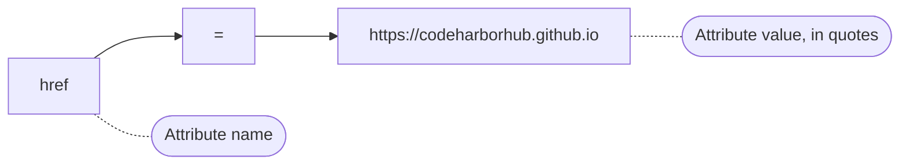

Tags tell the browser *what* something is. **Attributes** tell the browser *more details* about it. An `` tag says "there's an image here," but it's the attributes that say *which* image file, *how big*, and *what to describe it as* if it fails to load.

If elements are the nouns of HTML, **attributes are the adjectives**. They add detail, behavior, and meaning to the tags you already know.

:::info Quick definition
An **attribute** is extra information added inside an element's **start tag**, always written as a **name**, usually followed by an **equals sign** and a **value** in quotes.
:::

<AdsComponent />
<br />

## Anatomy of an Attribute

```html
<a href="https://codeharborhub.github.io" target="_blank">Visit CodeHarborHub</a>
```



| Part | Example | Meaning |
|------|---------|---------|
| **Name** | `href` | What kind of information this is. |
| **Equals sign** | `=` | Connects the name to its value. |
| **Value** | `"https://codeharborhub.github.io"` | The actual information, wrapped in quotes. |

An element's start tag can carry **as many attributes as it needs**, separated by spaces:

```html

```

:::tip Where do attributes go?
Attributes only ever appear in the **start tag**. A closing tag, like `</a>` or `</p>`, never carries attributes.
:::

## Quoting Rules

HTML gives you some flexibility in how you quote attribute values, but one option is clearly the professional standard.

<Tabs>
  <TabItem value="double" label='✅ Double quotes (recommended)' default>

```html
<a href="https://example.com">Link</a>
```

This is the convention used across virtually every style guide, framework, and real-world codebase. Use this by default.

  </TabItem>
  <TabItem value="single" label="🟡 Single quotes (also valid)">

```html
<a href='https://example.com'>Link</a>
```

Technically valid HTML, but far less common. Useful in rare cases where your value itself contains double quotes.

  </TabItem>
  <TabItem value="none" label="❌ No quotes (avoid)">

```html
<a href=https://example.com>Link</a>
```

This works **only** if the value has no spaces or special characters, but it's fragile, inconsistent, and considered bad practice. Never rely on it.

  </TabItem>
</Tabs>

:::warning Always quote your attribute values
Even when HTML technically allows skipping quotes, a single space or special character in an unquoted value can silently break your markup. Quoting every value removes this entire category of bugs.
:::

## Categories of Attributes

Not all attributes behave the same way. Let's group them by how they work.

### 1. Required attributes

Some attributes are essential for an element to function correctly, even though HTML won't stop you from omitting them.

```html

<a href="https://example.com">Click here</a>
```

Without `src`, an `` has nothing to display. Without `href`, an `<a>` isn't really a link at all, just plain text.

### 2. Optional attributes

These add extra behavior or refinement but are not strictly necessary for the element to work.

```html

```

Here, `width` and `loading` are helpful, but the image would still display without them.

### 3. Boolean attributes

These are special: their **mere presence** turns a feature on. They don't need a value at all, and writing them any of these ways means the same thing:

<Tabs groupId="boolean-style">
  <TabItem value="bare" label="Bare (recommended)" default>

```html
<input type="text" disabled />
```

  </TabItem>
  <TabItem value="empty" label="Empty string">

```html
<input type="text" disabled="" />
```

  </TabItem>
  <TabItem value="repeat" label="Value equals name">

```html
<input type="text" disabled="disabled" />
```

  </TabItem>
</Tabs>

All three examples disable the input. The first style, just the bare attribute name, is the cleanest and most widely used.

| Boolean attribute | What it does |
|--------------------|--------------|
| `disabled` | Disables a form field or button |
| `checked` | Pre-checks a checkbox or radio button |
| `required` | Makes a form field mandatory |
| `readonly` | Prevents editing, but still submits the value |
| `autofocus` | Focuses the field automatically on page load |
| `multiple` | Allows selecting multiple values |

:::note If you don't want the feature, remove the attribute entirely
Unlike other attributes, you cannot "turn off" a boolean attribute by setting it to `"false"`. Writing `disabled="false"` is still treated as **present**, and the field stays disabled. To disable the behavior, delete the attribute completely.
:::

<AdsComponent />
<br />

## Global vs. Specific Attributes

Some attributes work on **almost any element** (`id`, `class`, `title`, `style`), while others only make sense on specific tags.

<Tabs>
  <TabItem value="global" label="Works almost everywhere" default>

```html
<p id="intro" class="highlight" title="Introduction paragraph">
  Welcome!
</p>
<div id="sidebar" class="highlight"></div>
```

  </TabItem>
  <TabItem value="specific" label="Specific to certain tags">

```html
<a href="https://example.com">Only links use href</a>

<input type="email" />
```

  </TabItem>
</Tabs>

The "works almost everywhere" group is called **global attributes**, and they deserve their own full lesson because there is quite a bit to cover.

👉 See the next lesson: **[Global Attributes](./global-attributes.mdx)**

## A Field Guide to Common Attributes

<Tabs>
  <TabItem value="links-media" label="Links & Media" default>

| Attribute | Used on | Purpose |
|-----------|---------|---------|
| `href` | `<a>`, `<link>` | The destination URL |
| `src` | ``, `<video>`, `<script>` | The source file |
| `alt` | `` | Alternative text description |
| `target` | `<a>` | Where to open the link (e.g. `_blank`) |
| `width` / `height` | ``, `<video>` | Dimensions |

  </TabItem>
  <TabItem value="forms" label="Forms">

| Attribute | Used on | Purpose |
|-----------|---------|---------|
| `type` | `<input>` | The kind of field (text, email, checkbox...) |
| `name` | Form fields | The field's identifier when submitted |
| `value` | Form fields | The field's current or default value |
| `placeholder` | `<input>`, `<textarea>` | A hint shown in an empty field |
| `required` | Form fields | Marks the field as mandatory |

  </TabItem>
  <TabItem value="general" label="General purpose">

| Attribute | Used on | Purpose |
|-----------|---------|---------|
| `id` | Almost any element | A unique identifier |
| `class` | Almost any element | A reusable style/JS hook |
| `style` | Almost any element | Inline CSS |
| `title` | Almost any element | A tooltip shown on hover |
| `lang` | `<html>` | The document or section's language |

  </TabItem>
</Tabs>

## Attributes in Action

Let's see a form input change behavior live, purely through its attributes:

<Tabs groupId="attr-demo">
  <TabItem value="normal" label="Normal input" default>

```html
<input type="text" placeholder="Type your name" />
```

<BrowserWindow url="http://127.0.0.1:5500/form.html">
<>
<input type="text" placeholder="Type your name" />
</>
</BrowserWindow>

  </TabItem>
  <TabItem value="disabled" label="Disabled input">

```html
<input type="text" placeholder="Type your name" disabled />
```

<BrowserWindow url="http://127.0.0.1:5500/form.html">
<>
<input type="text" placeholder="Type your name" disabled />
</>
</BrowserWindow>

  </TabItem>
  <TabItem value="required" label="Required + type=email">

```html
<input type="email" placeholder="you@example.com" required />
```

<BrowserWindow url="http://127.0.0.1:5500/form.html">
<>
<input type="email" placeholder="you@example.com" required />
</>
</BrowserWindow>

  </TabItem>
</Tabs>

Same `<input>` tag every time. Completely different behavior, purely because of the attributes attached to it.

## Custom `data-*` Attributes

Sometimes you need to attach your **own custom information** to an element, information meant for your JavaScript, not for the browser's built-in behavior. HTML provides an official, valid way to do this: **`data-*` attributes**.

```html
<button data-user-id="4821" data-role="admin">Delete User</button>
```

You can name anything after `data-`, as long as it's lowercase and hyphen-separated. JavaScript can then read these values easily:

```js
const button = document.querySelector("button");
console.log(button.dataset.userId); // "4821"
console.log(button.dataset.role);   // "admin"
```

:::tip Why not just use a random made-up attribute?
Inventing your own attribute like `<button userid="4821">` is invalid HTML and can clash with future standard attributes. The `data-*` prefix is officially reserved for this exact purpose, so it's always safe and valid.
:::

<AdsComponent />
<br />

## Common Attribute Mistakes

<details>
  <summary>1. Forgetting quotes around a value with spaces</summary>

```html
<!-- ❌ Breaks: the browser reads "profile" as a second attribute -->


<!-- ✅ Correct -->

```

</details>

<details>
  <summary>2. Using the same attribute twice on one tag</summary>

```html
<!-- ❌ Confusing and invalid: which class actually applies? -->
<p class="intro" class="highlight">Hello</p>

<!-- ✅ Correct: combine values with a space -->
<p class="intro highlight">Hello</p>
```

</details>

<details>
  <summary>3. Trying to "disable" a boolean attribute with a false value</summary>

```html
<!-- ❌ Still disabled! Presence alone matters, not the value -->
<input type="text" disabled="false" />

<!-- ✅ Correct: remove the attribute entirely to enable the field -->
<input type="text" />
```

</details>

<details>
  <summary>4. Forgetting essential attributes</summary>

```html
<!-- ❌ A link with no destination, and an image with no fallback text -->
<a>Click here</a>


<!-- ✅ Correct -->
<a href="https://example.com">Click here</a>

```

</details>

## Quick Recap

- An **attribute** adds extra information to a tag, written as `name="value"`.
- Attributes live only in the **start tag**, never in a closing tag.
- Always wrap attribute values in **double quotes**.
- **Boolean attributes** (like `disabled` and `checked`) turn a feature on just by being present.
- **Global attributes** (like `id` and `class`) work on nearly every element.
- Custom **`data-*` attributes** let you safely attach your own information for JavaScript to use.

## Frequently Asked Questions

<details>
  <summary>What is an HTML attribute?</summary>

An HTML attribute provides extra information about an element, written inside the start tag as a name and value pair, such as `src="photo.jpg"`.

</details>

<details>
  <summary>Do all attributes need a value?</summary>

No. Boolean attributes, like `disabled` and `checked`, only need to be present to take effect and do not require a value.

</details>

<details>
  <summary>Can an element have more than one attribute?</summary>

Yes, an element can have as many attributes as needed, separated by spaces, for example ``.

</details>

<details>
  <summary>Is it okay to skip quotes around attribute values?</summary>

It is technically allowed for simple values with no spaces, but it is considered bad practice. Always use double quotes to avoid subtle bugs.

</details>

<details>
  <summary>What is a data-* attribute used for?</summary>

Custom `data-*` attributes let you attach your own information to an element for JavaScript to read later, without creating invalid or non-standard HTML.

</details>

## Test Your Understanding

1. What is the basic syntax pattern for writing an attribute?
2. Why should attribute values always be quoted?
3. What makes a "boolean attribute" different from a regular attribute?
4. How would you correctly disable, then later re-enable, an `<input>` element?
5. Why are `data-*` attributes preferred over inventing your own custom attribute names?