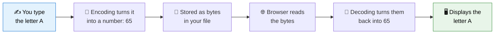
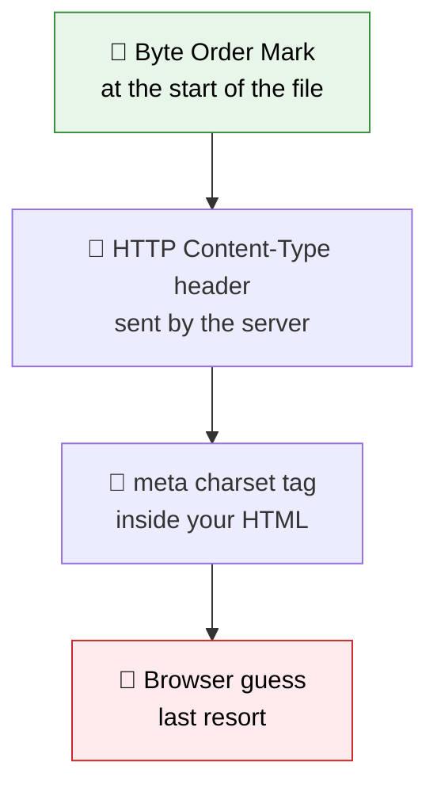
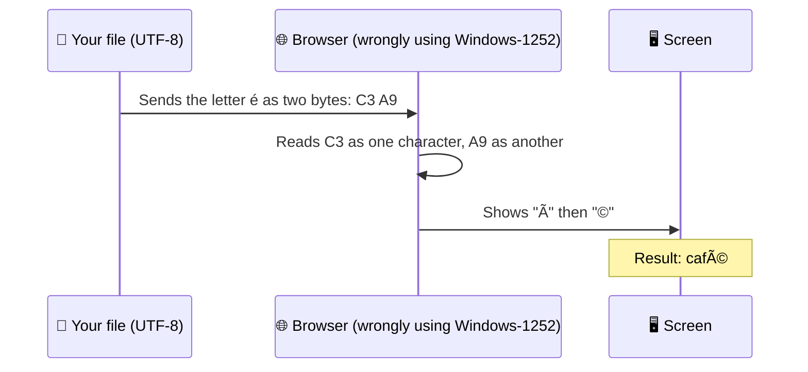

Since your very first HTML page, you have been typing this line inside the `<head>` without much explanation:

```html
<meta charset="UTF-8" />
```

It is easy to copy it and move on, but this one small line quietly decides whether your visitors see clean text or a jumble of strange symbols. In this lesson, you will finally learn what it does, why it exists, and how to fix things when text goes wrong.

Let's start with a real example of what *going wrong* looks like. Imagine you wrote the word **café** in your HTML, but the browser reads the file with the wrong settings:

<BrowserWindow url="http://127.0.0.1:5500/index.html">
<>
<p>What you typed: <strong>café</strong></p>
<p>What the browser showed: <strong>café</strong></p>
</>
</BrowserWindow>

That garbled result has a name: **mojibake** (a Japanese word meaning "character transformation"). By the end of this lesson, you will know exactly why it happens and how to prevent it.

:::info Quick definition
**Character encoding** is a system that maps characters (letters, digits, symbols, emoji) to numbers, and those numbers to bytes that can be stored in a file or sent over the internet. To read text correctly, the browser must know which system was used to write it.
:::

<AdsComponent />
<br />

## Why Encoding Exists

Computers do not understand letters. They only understand numbers, and at the lowest level, only bytes. So when you type the letter **A** and save your file, something has to decide which number represents it.



Encoding is the "code book" used to convert characters into numbers and back again. **Problems happen when the writer and the reader use different code books.** That is exactly what produces garbled text.

## A Short History: ASCII, Legacy Encodings, and Unicode

To understand why UTF-8 is the standard today, it helps to see what came before it.

### ASCII: the original

**ASCII** was created in the 1960s and defines **128 characters**: English letters (uppercase and lowercase), digits, punctuation, and a few control codes. It was perfect for English, but it had no room for é, ü, ñ, ₹, 日本語, or Arabic.

### The legacy chaos

To fit other languages, different regions created their own extended encodings, each reusing the same numbers for different characters. Examples include ISO-8859-1 (Western Europe), Windows-1252, Shift JIS (Japanese), and many more.

The result was a mess: the same bytes meant *different characters* depending on the encoding. A file written in one could look like nonsense in another.

### Unicode: one system for everyone

**Unicode** solved this by giving **every character in every language its own unique number**, called a **code point**. It now contains more than 150,000 characters, covering hundreds of writing systems plus symbols and emoji.

| Character | Unicode code point |
|-----------|--------------------|
| A | U+0041 |
| é | U+00E9 |
| € | U+20AC |
| ₹ | U+20B9 |
| 日 | U+65E5 |
| 😀 | U+1F600 |

:::note Unicode vs. UTF-8
People often mix these up. **Unicode** is the giant catalog that assigns a number to every character. **UTF-8** is one specific way of turning those numbers into bytes for storage and transfer. Unicode is the *what*; UTF-8 is the *how*.
:::

## ⭐ UTF-8: The Encoding You Should Always Use

**UTF-8** (Unicode Transformation Format, 8-bit) is the dominant encoding of the web, used by the overwhelming majority of websites. It is the encoding recommended by the HTML standard, and it is the one you should use for every project.

### Why UTF-8 wins

- **It supports every character in Unicode**, so one file can safely mix English, Hindi, Arabic, Chinese, and emoji.
- **It is backward compatible with ASCII.** Plain English text has exactly the same bytes as it would in ASCII.
- **It is space-efficient.** It uses a variable number of bytes per character, from 1 to 4, so common characters stay small.
- **It is universal.** Browsers, servers, editors, and programming languages all support it.

| Characters | Bytes used in UTF-8 |
|------------|---------------------|
| English letters, digits, basic punctuation | 1 byte |
| Accented letters like é, ü, ñ | 2 bytes |
| Most Indian scripts, Chinese, Japanese, Korean, ₹, € | 3 bytes |
| Emoji and rare symbols | 4 bytes |

Here is a page that mixes many languages, all working together thanks to UTF-8:

```html title="multilingual.html"
<!DOCTYPE html>
<html lang="en">
  <head>
    <meta charset="UTF-8" />
    <title>Hello in Many Languages</title>
  </head>
  <body>
    <p>English: Hello</p>
    <p>Hindi: नमस्ते</p>
    <p>Spanish: ¡Hola!</p>
    <p>Japanese: こんにちは</p>
    <p>Arabic: مرحبا</p>
    <p>Emoji: 👋😀🚀</p>
  </body>
</html>
```

<BrowserWindow url="http://127.0.0.1:5500/multilingual.html">
<>
<p>English: Hello</p>
<p>Hindi: नमस्ते</p>
<p>Spanish: ¡Hola!</p>
<p>Japanese: こんにちは</p>
<p>Arabic: مرحبا</p>
<p>Emoji: 👋😀🚀</p>
</>
</BrowserWindow>

<AdsComponent />
<br />

## Declaring Encoding with the meta Tag

Browsers cannot magically know which encoding your file uses, so you must **tell them**. In HTML5, you do this with a single `<meta>` element inside the `<head>`:

```html
<meta charset="UTF-8" />
```

<Tabs groupId="charset-style">
  <TabItem value="modern" label="✅ Modern (HTML5)" default>

```html
<meta charset="UTF-8" />
```

Short, clear, and the only form you need to write today.

  </TabItem>
  <TabItem value="legacy" label="🕰️ Legacy (HTML 4)">

```html
<meta http-equiv="Content-Type" content="text/html; charset=UTF-8" />
```

This older, longer form still works, but you will only see it in outdated tutorials and old codebases. Prefer the modern version.

  </TabItem>
</Tabs>

### Where should it go?

The placement matters. Follow these two rules:

1. Put it **inside the `<head>`**, as one of the very first elements.
2. Place it **before the `<title>`** and before any other element containing text, and within the **first 1024 bytes** of the file.

```html title="Correct placement" {4}
<!DOCTYPE html>
<html lang="en">
  <head>
    <meta charset="UTF-8" />
    <meta name="viewport" content="width=device-width, initial-scale=1.0" />
    <title>My Page</title>
  </head>
  <body>
    ...
  </body>
</html>
```

:::tip Why so early?
The browser starts reading the file from the top, and it needs to know the encoding **before** it decodes text like your title. If the declaration comes too late, the browser may already have guessed wrong.
:::

## Who Wins When Signals Disagree?

The `meta` tag is not the only way a browser learns about encoding. Multiple signals can exist, and the browser follows a priority order.



| Priority | Signal | What it is |
|----------|--------|------------|
| 1 | **Byte Order Mark (BOM)** | A tiny invisible marker some editors add at the very start of a file |
| 2 | **HTTP header** | A `Content-Type: text/html; charset=UTF-8` header sent by the web server |
| 3 | **`<meta charset>`** | The tag you write in your HTML |
| 4 | **Browser guess** | An unreliable fallback if nothing else is available |

For a beginner, the takeaway is simple: **make sure your file is saved as UTF-8, and declare UTF-8 in your `meta` tag.** In most setups, everything then agrees, and nothing goes wrong.

## The Other Half: Saving Your File as UTF-8

Here is the detail many beginners miss. The `meta` tag only **declares** what encoding the file uses. It does not **change** the file's actual encoding. Your editor decides how the file is really saved.

If your file is saved in one encoding but your `meta` tag claims another, you get garbled text.

<Tabs>
  <TabItem value="vscode" label="💙 VS Code" default>

VS Code saves new files as UTF-8 by default. To check or change it:

1. Look at the **bottom-right corner** of the window. It should say **UTF-8**.
2. If it shows something else, click it and choose **"Save with Encoding."**
3. Select **UTF-8** from the list.

  </TabItem>
  <TabItem value="notepad" label="📝 Notepad (Windows)">

1. Choose **File → Save As**.
2. Find the **Encoding** dropdown next to the Save button.
3. Select **UTF-8** and save.

Modern versions of Notepad save as UTF-8 by default, but older versions used ANSI, which is a common cause of garbled text.

  </TabItem>
  <TabItem value="textedit" label="🍎 TextEdit (macOS)">

1. Open **TextEdit → Settings → Open and Save**.
2. Under **Plain text encoding**, set both *Opening files* and *Saving files* to **Unicode (UTF-8)**.
3. Make sure the document is in **Plain Text** mode via **Format → Make Plain Text**.

  </TabItem>
</Tabs>

## What Really Goes Wrong: Anatomy of Mojibake

Let's look closely at why "café" turned into "café". It is a great way to see encoding in action.



In UTF-8, the letter **é** is stored as **two bytes**. A browser mistakenly using a single-byte legacy encoding reads those as **two separate characters**, and displays two wrong symbols instead of one correct letter.

### A mojibake cheat sheet

If you see these patterns, you are almost certainly looking at UTF-8 text being read as a legacy encoding:

| What you see | What it should be |
|--------------|-------------------|
| `é` | é |
| `ü` | ü |
| `ñ` | ñ |
| `’` | ’ (curly apostrophe) |
| `“` and `â€` | “ and ” (curly quotes) |
| `€` | € |
| `�` or a � symbol | Unknown or broken character |

:::tip Your diagnosis rule
Strange two- or three-character sequences that start with **Ã** or **â** are the classic fingerprint of **UTF-8 being decoded as something else**. Check that your `meta charset` is present and your file really is saved as UTF-8.
:::

<AdsComponent />
<br />

## Troubleshooting Garbled Text

<details>
  <summary>1. The meta charset tag is missing</summary>

Without the declaration, the browser has to guess, and guesses vary. Add `<meta charset="UTF-8" />` as the first element in your `<head>`.

</details>

<details>
  <summary>2. The tag is there, but the file is not saved as UTF-8</summary>

Your editor may have saved the file as ANSI, Windows-1252, or another legacy encoding. Re-save the file explicitly as UTF-8 using your editor's "Save with Encoding" option, then re-check any characters that already look wrong, since they may need to be retyped.

</details>

<details>
  <summary>3. The meta tag is too far down the file</summary>

If the `meta charset` sits after a long comment or many other tags, it may fall outside the first 1024 bytes. Move it to the top of the `<head>`.

</details>

<details>
  <summary>4. The server sends a conflicting header</summary>

A server can send an HTTP header specifying a different charset, and that header wins over your `meta` tag. If everything in your file looks correct but the text is still broken online, check your hosting settings. Most modern servers default to UTF-8.

</details>

<details>
  <summary>5. The character shows as a box or question mark</summary>

If the encoding is right but a character still appears as a square or �, the issue is usually the **font**, not the encoding. The font may simply not include a glyph for that character. Try a different font.

</details>

## Encoding vs. Entities vs. Language

Beginners often mix up three related ideas. Here is how they differ:

| Concept | What it controls | Example |
|---------|-------------------|---------|
| **Character encoding** | How characters are stored as bytes in the file | `<meta charset="UTF-8" />` |
| **Entities** | A way to write specific characters using codes | `&copy;` or `&#169;` |
| **Language attribute** | Which human language the content is written in | `<html lang="hi">` |

They work together but solve different problems. You met entities in the [Entities](./entities.mdx) lesson, and the `lang` attribute in the [HTML Document Structure](/html/getting-started/html-document-structure) lesson.

:::note
Declaring `lang="hi"` does **not** make Hindi characters display correctly. UTF-8 encoding does that. The `lang` attribute is for accessibility, translation, and search engines.
:::

## Try It Yourself

Here is a page whose encoding setup breaks a best practice. Can you spot what is out of place?

```html title="problem.html"
<!DOCTYPE html>
<html lang="en">
  <head>
    <title>Café Menu</title>
    <link rel="stylesheet" href="styles.css" />
    <meta charset="UTF-8" />
  </head>
  <body>
    <h1>Café Menu</h1>
    <p>Crème brûlée — ₹250</p>
  </body>
</html>
```

<details>
  <summary>👀 Click to reveal the answer</summary>

The `meta charset` tag appears **after** the `<title>` and the stylesheet link. The title contains the accented character **é**, so the browser should learn the encoding *before* it reaches that text.

In practice, browsers scan the first 1024 bytes of a file for the declaration, so this small page would probably still display correctly. But the habit is risky: on a real page with a long comment or many tags above it, the declaration could slip past that limit and the text would break. The safe fix is to move it to the very top of the `<head>`:

```html title="fixed.html"
<!DOCTYPE html>
<html lang="en">
  <head>
    <meta charset="UTF-8" />
    <title>Café Menu</title>
    <link rel="stylesheet" href="styles.css" />
  </head>
  <body>
    <h1>Café Menu</h1>
    <p>Crème brûlée — ₹250</p>
  </body>
</html>
```

Also confirm the file itself is saved as UTF-8 in your editor.

</details>

## Quick Recap

- **Character encoding** maps characters to numbers and bytes, so text can be stored and shared.
- **ASCII** covers only 128 characters, and older regional encodings clashed with each other.
- **Unicode** assigns a unique code point to every character, and **UTF-8** is the standard way to store it.
- Declare it with **`<meta charset="UTF-8" />`**, placed at the top of the `<head>` and before the title.
- The tag **declares** the encoding, but your editor decides how the file is **actually saved**, so both must match.
- Garbled text like **café** is called **mojibake**, and usually means UTF-8 was read as a legacy encoding.
- Encoding, entities, and the `lang` attribute are related but different tools.

## Frequently Asked Questions

<details>
  <summary>What is character encoding in HTML?</summary>

Character encoding is the system that maps characters to numbers and bytes. In HTML, you declare which system your file uses with the `meta charset` tag so the browser can decode the text correctly.

</details>

<details>
  <summary>Which character encoding should I use?</summary>

Always use UTF-8. It supports every character in Unicode, works with all modern browsers and tools, and is the encoding recommended by the HTML standard.

</details>

<details>
  <summary>What is the difference between Unicode and UTF-8?</summary>

Unicode is the catalog that assigns a unique number to every character. UTF-8 is a method of encoding those numbers as bytes for storage and transfer. Unicode is the list, and UTF-8 is how the list gets written to a file.

</details>

<details>
  <summary>Why do I see strange symbols like é on my page?</summary>

This is called mojibake. It happens when UTF-8 text is decoded using a different encoding. Add `<meta charset="UTF-8" />` near the top of your head, and make sure your file is saved as UTF-8.

</details>

<details>
  <summary>Do I still need HTML entities if I use UTF-8?</summary>

Only for reserved characters like the less-than sign, the greater-than sign, and the ampersand, and for the non-breaking space. Most other symbols and accented letters can be typed directly into a UTF-8 file.

</details>

<details>
  <summary>Does the meta charset tag change my file's actual encoding?</summary>

No. It only tells the browser how to read the file. The real encoding is set when your editor saves the file, so both must agree.

</details>

## Test Your Understanding

1. What problem does a character encoding solve?
2. What is the difference between Unicode and UTF-8?
3. Where should `<meta charset="UTF-8" />` be placed, and why?
4. What is mojibake, and what is one common cause?
5. If your `meta` tag says UTF-8 but your file was saved in a different encoding, what will probably happen?