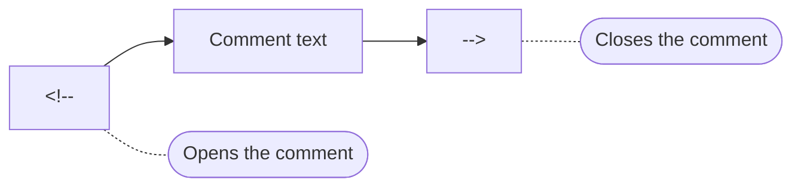
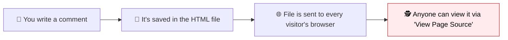

As your HTML files grow longer and more complex, you will often want to leave yourself, or your teammates, a small note directly inside the code. Maybe you want to explain *why* a section exists, temporarily hide a piece of markup, or mark a spot to fix later. HTML has a built-in way to do exactly this: **comments**.

:::info Quick definition
An **HTML comment** is text written inside your code that the **browser completely ignores** when rendering the page. Comments are for humans reading the source code, not for visitors viewing the page.
:::

<AdsComponent />
<br />

## Comment Syntax

An HTML comment starts with `<!--` and ends with `-->`. Anything in between is invisible to anyone simply viewing the rendered page.

```html
<!-- This is a comment. It will not appear on the page. -->
<p>This paragraph is visible.</p>
```



See it live. The comment below exists in the code, but produces nothing on the rendered page:

<BrowserWindow url="http://127.0.0.1:5500/index.html">
<>
<p>This paragraph is visible.</p>
</>
</BrowserWindow>

:::tip Try it yourself
Open your browser's DevTools (right-click → Inspect) on this very page, and use "View Page Source." You'll likely notice that comments a developer writes in their raw HTML never make it into what a regular visitor experiences, exactly the behavior you're learning here.
:::

## Single-Line and Multi-Line Comments

Unlike some programming languages, HTML uses the **same syntax** for both short and long comments. There's no special shorthand for single-line comments; you just use `<!-- -->` either way.

<Tabs>
  <TabItem value="single" label="One line" default>

```html
<!-- TODO: Replace this placeholder image before launch -->

```

  </TabItem>
  <TabItem value="multi" label="Multiple lines">

```html
<!--
  This section displays the user's dashboard summary.
  It pulls data from the /api/summary endpoint.
  Last reviewed: January 2026
-->
<section id="dashboard-summary">
  ...
</section>
```

  </TabItem>
</Tabs>

Everything between `<!--` and `-->` is ignored, no matter how many lines it spans.

## Common Uses for Comments

### 1. Explaining *why*, not *what*

The best comments explain reasoning that isn't obvious just from reading the code.

```html
<!-- Empty div required here so the animation library can attach its canvas -->
<div id="animation-target"></div>
```

### 2. Marking sections in long files

```html
<!-- ============ HEADER ============ -->
<header>...</header>

<!-- ============ MAIN CONTENT ============ -->
<main>...</main>

<!-- ============ FOOTER ============ -->
<footer>...</footer>
```

This kind of "banner" comment makes it much easier to scan and navigate a long HTML file.

### 3. Temporarily disabling code

Comments are a fast way to "turn off" a piece of markup without deleting it, useful while testing or debugging.

```html
<p>This paragraph is currently visible.</p>

<!--
<p>This paragraph is temporarily hidden for testing.</p>
-->
```

### 4. Leaving TODO notes for yourself or your team

```html
<!-- TODO: Add alt text once the final images are approved -->


<!-- FIXME: This button's styling breaks on small screens -->
<button>Subscribe</button>
```

<AdsComponent />
<br />

## Comments Are Not Private

This is one of the most important things to understand about HTML comments: **anyone can read them.**



Even though comments don't appear on the *rendered* page, the raw HTML file, comments included, is still sent to every visitor's browser. Anyone can read it instantly using **View Page Source** (Ctrl+U) or DevTools.

:::warning Never put secrets in comments
Never write passwords, API keys, internal URLs, or private notes about bugs and vulnerabilities inside an HTML comment. Treat every comment as if it were public information, because it effectively is.
:::

<details>
  <summary>🕵️ A real-world example of what NOT to do</summary>

```html
<!-- Admin login: username=admin password=hunter2 -->
<!-- TODO: fix the SQL injection bug in login.php before anyone notices -->
```

Comments like these have genuinely leaked sensitive information on real websites in the past. Keep secrets out of your codebase entirely, not just out of the rendered page.

</details>

## A Few Syntax Rules to Remember

<Tabs>
  <TabItem value="valid" label="✅ Valid comments" default>

```html
<!-- A normal comment -->
<!--Also valid, though spacing is nicer with it-->
<!-- Multi
     line
     comment -->
```

  </TabItem>
  <TabItem value="invalid" label="❌ Invalid patterns">

```html
<!-- This comment has a nested <!-- comment inside it -->

<!-- Comments cannot contain a double hyphen -- like this -->
```

  </TabItem>
</Tabs>

A few rules to keep in mind:

- Comments **cannot be nested**. Once a browser sees the first `-->`, the comment is closed.
- The comment text itself should not contain a double hyphen (`--`), as this can cause parsing issues in some tools.
- You cannot place a comment **inside a tag**, only between elements or inside their content.

```html
<!-- ❌ Invalid: comment placed inside the tag itself -->
<p <!-- this breaks the tag --> class="intro">Hello</p>

<!-- ✅ Correct: comment placed outside the tag -->
<!-- This paragraph introduces the page -->
<p class="intro">Hello</p>
```

## Comments vs. Other "Hiding" Techniques

Beginners sometimes confuse commenting out an element with actually hiding it visually. These are very different tools.

| Technique | What happens | Still in the page's HTML? | Still visible to search engines/screen readers? |
|-----------|---------------|----------------------------|--------------------------------------------------|
| **HTML comment** `<!-- -->` | Content is completely removed from what the browser processes | Yes, in the raw source, but not parsed as an element | No |
| **CSS `display: none`** | Content is parsed but not rendered visually | Yes, fully | No |
| **CSS `visibility: hidden`** | Content is parsed and takes up space, just invisible | Yes, fully | No (mostly) |

:::note
You'll learn `display` and `visibility` properly once you study CSS. For now, just remember: a **comment removes something from consideration entirely**, while CSS techniques merely change how something *already on the page* is displayed.
:::

<AdsComponent />
<br />

## Try It Yourself

Practice commenting out part of this snippet:

```html title="practice.html"
<h2>Featured Products</h2>
<div class="product">Product A</div>
<div class="product">Product B</div>
<div class="product">Product C</div>
```

<details>
  <summary>👀 One possible solution</summary>

```html title="practice.html"
<h2>Featured Products</h2>
<div class="product">Product A</div>
<!--
<div class="product">Product B</div>
-->
<div class="product">Product C</div>
```

"Product B" is now completely ignored by the browser, while "Product A" and "Product C" still render normally. This is a common technique when temporarily testing how a page looks with fewer items.

</details>

## Quick Recap

- HTML comments use the syntax **`<!-- comment text -->`**.
- Comments are **ignored by the browser** and never appear on the rendered page.
- The same syntax works for both **single-line** and **multi-line** comments.
- Comments are useful for **explanations, section markers, TODOs, and temporarily disabling code**.
- Comments are **not private**; anyone can read them via View Page Source or DevTools.
- Comments **cannot be nested** and should not contain a double hyphen (`--`).

## Frequently Asked Questions

<details>
  <summary>How do you write a comment in HTML?</summary>

Wrap the text between `<!--` and `-->`, for example: `<!-- This is a comment -->`. Anything inside will be ignored by the browser.

</details>

<details>
  <summary>Can HTML comments span multiple lines?</summary>

Yes. The same `<!-- -->` syntax works for both single-line and multi-line comments; there is no special multi-line syntax needed.

</details>

<details>
  <summary>Are HTML comments visible to website visitors?</summary>

Not on the rendered page itself, but the raw HTML file, including comments, is still sent to the browser and can be viewed by anyone using "View Page Source" or Developer Tools.

</details>

<details>
  <summary>Is it safe to put sensitive information in an HTML comment?</summary>

No. Comments are not private or secure in any way. Never include passwords, API keys, or other sensitive information in your HTML comments.

</details>

<details>
  <summary>Can I nest one comment inside another?</summary>

No, HTML comments cannot be nested. The browser will close the comment at the very first `-->` it encounters, which can cause unexpected results if you try to nest them.

</details>

<details>
  <summary>Do search engines read HTML comments?</summary>

No. Search engine crawlers generally ignore the content inside HTML comments when indexing a page, just as browsers ignore it when rendering.

</details>

## Test Your Understanding

1. What symbols open and close an HTML comment?
2. Is there a different syntax for single-line versus multi-line HTML comments?
3. Why should you never put a password inside an HTML comment?
4. Can you nest one HTML comment inside another? What happens if you try?
5. Name two practical, everyday uses for HTML comments.