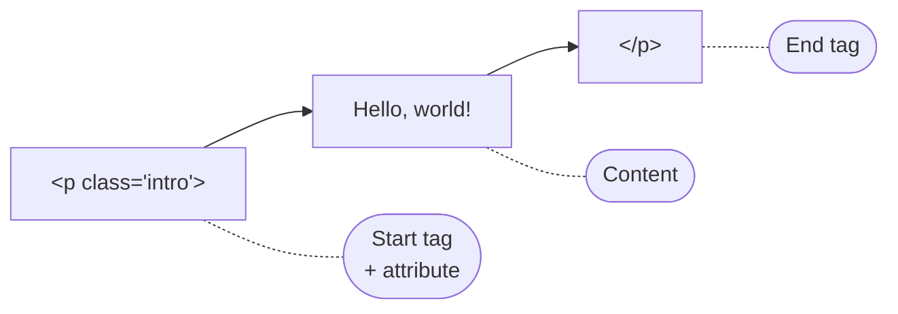
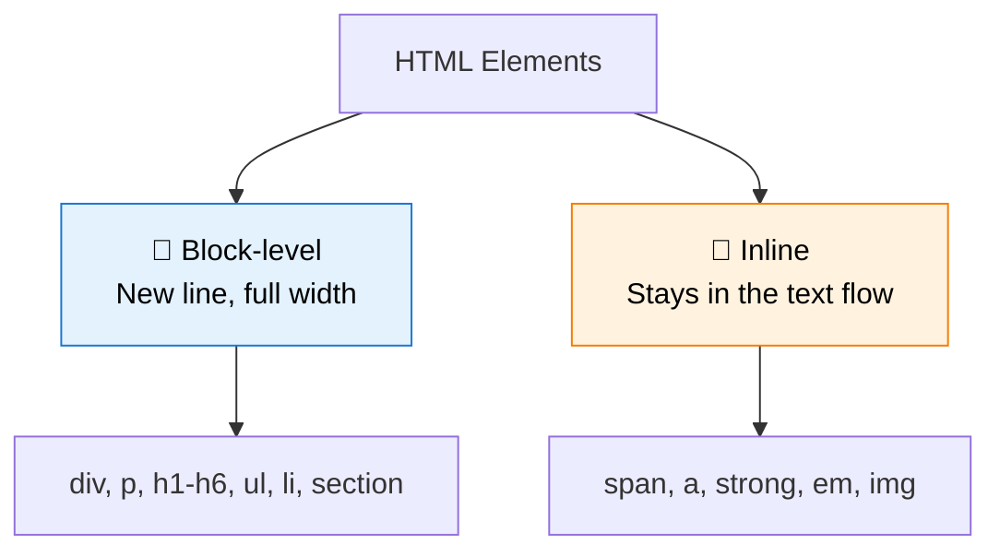
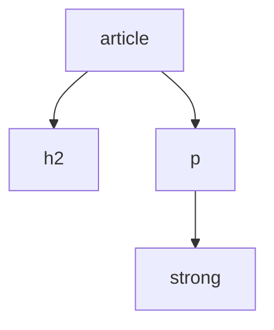
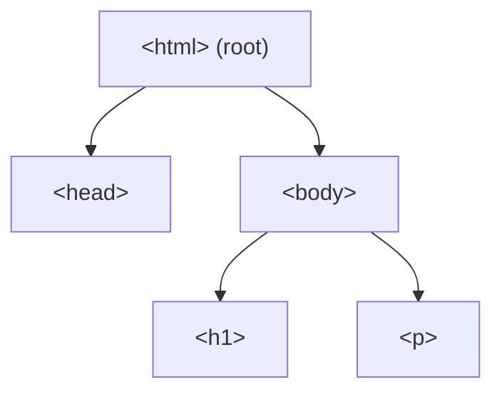

You have already used the word "element" many times in this tutorial series, but let's now give it the proper, focused explanation it deserves. Understanding elements deeply is what separates someone who *copies* HTML from someone who truly *understands* it.

:::info Quick definition
An **HTML element** is a complete unit made of a **start tag**, its **content**, and an **end tag** (some elements skip content and a closing tag entirely, as you'll see below). It is the actual "thing" a browser reads, interprets, and turns into part of your page.
:::

<AdsComponent />
<br />

## Anatomy of an Element

Let's dissect one, piece by piece:

```html
<p class="intro">Hello, world!</p>
```



| Part | Example | Role |
|------|---------|------|
| **Start tag** | `<p class="intro">` | Marks where the element begins, and can carry attributes. |
| **Content** | `Hello, world!` | The actual text or nested elements inside. |
| **End tag** | `</p>` | Marks where the element ends. |

Together, all three parts form **one single element**. Not the tag alone. Not the content alone. The whole package.

## Tag vs. Element: The Distinction That Trips Everyone Up

This is one of the most common points of confusion for beginners, so let's make it crystal clear once and for all.

<Tabs>
  <TabItem value="tag" label="🏷️ A Tag" default>

A **tag** is just the label written inside angle brackets.

```html
<p>
```

and

```html
</p>
```

are each, individually, a tag. One is the **start tag**, the other is the **end tag**. A tag by itself has no content, and it is not something a browser displays on its own.

  </TabItem>
  <TabItem value="element" label="🧩 An Element">

An **element** is the complete structure: start tag, content, and end tag together.

```html
<p>Hello, world!</p>
```

This entire line is **one paragraph element**. When people casually say "the `<p>` tag," they usually mean the paragraph *element*, but technically, the tag is only the bracketed label.

  </TabItem>
</Tabs>

:::tip A simple analogy
Think of a sandwich. The **tags** are the two slices of bread. The **content** is the filling. The **element** is the entire sandwich, bread and filling together. You wouldn't call just one slice of bread "a sandwich," and the same logic applies to tags and elements. 🥪
:::

## Types of Elements

Not all elements are built the same way. Let's look at the three categories you will meet constantly.

### 1. Normal (container) elements

These have a start tag, content, and an end tag. Most of the HTML you write falls into this category.

```html
<h1>A Heading</h1>
<p>A paragraph of text.</p>
<ul>
  <li>A list item</li>
</ul>
```

### 2. Void (empty) elements

Some elements represent something that **cannot contain content**, like an image or a line break. These are called **void elements**, and they never get a closing tag.

```html

<br />
<hr />
<input type="text" />
<meta charset="UTF-8" />
```

:::note Self-closing slash is optional in HTML5
In HTML5, writing `<br>` or `<br />` both work and mean the same thing. The trailing slash is a stylistic leftover from XHTML. Many style guides still recommend it for clarity, and this tutorial uses it consistently.
:::

Here is a quick reference of the most common void elements:

| Void element | Purpose |
|--------------|---------|
| `` | Embeds an image |
| `<br>` | Inserts a line break |
| `<hr>` | Inserts a horizontal rule |
| `<input>` | Creates a form input field |
| `<meta>` | Provides metadata in the head |
| `<link>` | Links an external resource, like CSS |
| `<source>` | Specifies media resources |
| `<area>` | Defines a clickable region in an image map |

### 3. Elements with optional closing tags

A very small number of legacy elements technically allow you to skip the closing tag, and browsers will still parse them correctly. **This tutorial does not recommend relying on this behavior.** Always close your tags explicitly. It keeps your code predictable and easy to maintain.

<AdsComponent />
<br />

## Block-Level vs. Inline Elements

Every HTML element also falls into one of two display categories by default. Understanding this distinction will save you countless layout headaches later, especially once you start learning CSS.

<Tabs>
  <TabItem value="block" label="🧱 Block-level" default>

Block-level elements:

- Start on a **new line**.
- Stretch to fill the **full available width** by default.
- Can contain other block-level or inline elements.

Common examples: `<div>`, `<p>`, `<h1>`–`<h6>`, `<ul>`, `<li>`, `<section>`, `<header>`, `<footer>`.

```html
<p>First block.</p>
<p>Second block.</p>
```

  </TabItem>
  <TabItem value="inline" label="📏 Inline">

Inline elements:

- Sit **within a line** of text, without forcing a line break.
- Only take up as much width as their **content needs**.
- Are meant to wrap small pieces of content inside a block.

Common examples: `<span>`, `<a>`, `<strong>`, `<em>`, ``, `<code>`.

```html
<p>This sentence has <strong>bold</strong> and <em>italic</em> words.</p>
```

  </TabItem>
</Tabs>

See the difference live:

<BrowserWindow url="http://127.0.0.1:5500/index.html">
<>
<p style={{background: '#e3f2fd', color: '#333', margin: '4px 0'}}>Block element one (full width)</p>
<p style={{background: '#e8f5e9', color: '#333', margin: '4px 0'}}>Block element two (full width)</p>
<p>
  This paragraph has <span style={{background: '#fff3e0', color: '#333'}}>an inline span</span>{" "}
  and <span style={{background: '#fce4ec', color: '#333'}}>another inline span</span> sitting right in the flow of the text.
</p>
</>
</BrowserWindow>



:::warning A nesting rule to remember
As a general rule, **block-level elements should not be nested inside inline elements**. For example, avoid putting a `<div>` inside a `<span>`. The reverse, an inline element inside a block element, is completely normal and extremely common.
:::

## Elements Can Contain Other Elements

Elements are rarely used alone. Most real HTML is made of elements **nested** inside other elements, forming a tree structure (you will study nesting rules in depth in the next lesson).

```html
<article>
  <h2>Understanding Elements</h2>
  <p>
    Elements can hold <strong>other elements</strong> inside them,
    building a structured tree of content.
  </p>
</article>
```



Here, the `<article>` element is the **parent** of `<h2>` and `<p>`. The `<strong>` element is nested inside `<p>`, making `<p>` its parent and `<strong>` its **child**.

## The Root Element

Every HTML document has exactly one top-level element that contains everything else: `<html>`. This makes it the **root element** of the entire page, the very top of the tree.



You met this structure already in the [HTML Document Structure](/html/getting-started/html-document-structure) lesson. Every element you will ever write lives somewhere inside this single tree.

<AdsComponent />
<br />

## Try It Yourself

Here is a small practice page. See if you can identify each element type before checking the answer.

```html title="practice.html"
<!DOCTYPE html>
<html lang="en">
  <head>
    <meta charset="UTF-8" />
    <title>Practice</title>
  </head>
  <body>
    <h1>Weekly Grocery List</h1>
    
    <p>Items I still need to buy:</p>
    <ul>
      <li>Milk</li>
      <li>Bread</li>
      <li><em>Fresh</em> vegetables</li>
    </ul>
    <hr />
  </body>
</html>
```

<details>
  <summary>👀 Click to check the element types</summary>

| Element | Type |
|---------|------|
| `<html>` | Normal element (root) |
| `<head>` | Normal element |
| `<meta>` | Void element |
| `<title>` | Normal element |
| `<h1>` | Normal, block-level element |
| `` | Void, inline element |
| `<p>` | Normal, block-level element |
| `<ul>` and `<li>` | Normal, block-level elements |
| `<em>` | Normal, inline element |
| `<hr>` | Void, block-level element |

</details>

## Common Mistakes with Elements

<details>
  <summary>1. Adding a closing tag to a void element's content</summary>

```html
<!-- ❌ Incorrect: img cannot have content or a closing tag -->
Some text</img>

<!-- ✅ Correct -->

```

</details>

<details>
  <summary>2. Forgetting to close a normal element</summary>

```html
<!-- ❌ Incorrect: missing closing tag -->
<p>This paragraph never ends

<!-- ✅ Correct -->
<p>This paragraph ends properly.</p>
```

</details>

<details>
  <summary>3. Treating "tag" and "element" as always interchangeable in technical writing</summary>

In casual conversation, this is fine and everyone will understand you. But when precision matters, such as in documentation or when discussing the DOM, remember: a **tag** is the bracketed label, and an **element** is the tag plus its content plus its closing tag.

</details>

## Quick Recap

- An **element** is made of a **start tag**, its **content**, and an **end tag**.
- A **tag** is just the bracketed label, not the whole element.
- **Void elements** (like ``, `<br>`, and `<input>`) have no content and no closing tag.
- Elements are either **block-level** (new line, full width) or **inline** (stays within the text flow).
- Elements can be **nested**, forming parent-child relationships in a tree.
- The **`<html>`** element is the single **root** of every HTML document.

## Frequently Asked Questions

<details>
  <summary>What is the difference between a tag and an element?</summary>

A tag is the bracketed label, like `<p>` or `</p>`. An element is the full structure: the start tag, the content inside it, and the end tag together.

</details>

<details>
  <summary>What is a void element?</summary>

A void element is one that cannot contain content and therefore has no closing tag, such as ``, `<br>`, `<hr>`, and `<input>`.

</details>

<details>
  <summary>Do I need the trailing slash on void elements, like `<br />`?</summary>

No, it is optional in HTML5. Both `<br>` and `<br />` are valid and behave identically. Many teams choose to include it for visual clarity and consistency with XHTML-style code.

</details>

<details>
  <summary>What is the difference between block-level and inline elements?</summary>

Block-level elements start on a new line and take up the full available width, while inline elements stay within the flow of surrounding text and only take up as much space as their content needs.

</details>

<details>
  <summary>Can an inline element contain a block-level element?</summary>

No, this is generally invalid and can cause unpredictable rendering. Block-level elements should not be placed inside inline elements, although the reverse is very common and completely valid.

</details>

<details>
  <summary>Which element is the root of every HTML document?</summary>

The `<html>` element is the root element. Every other element in the document is nested inside it.

</details>

## Test Your Understanding

1. What three parts make up a complete HTML element?
2. Give three examples of void elements.
3. Is `<span>` a block-level or an inline element?
4. In the phrase "the `<div>` tag has three paragraphs inside it," is the word "tag" being used precisely? What would be more accurate?
5. Which single element sits at the very top of every HTML document's tree?

<AdsComponent />
<br />