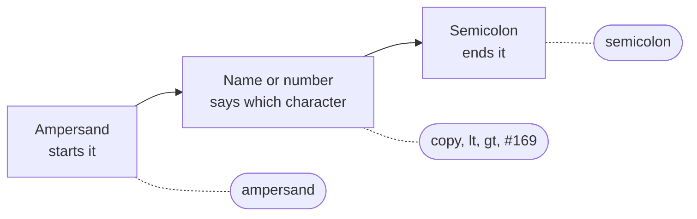
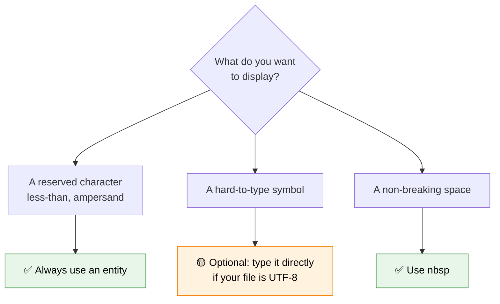

Imagine you are writing a tutorial about HTML, and you want to show your readers the paragraph tag on the page. You type this:

```html
<p>Use the <p> tag to create a paragraph.</p>
```

...and the browser shows **"Use the  tag to create a paragraph."** The `<p>` in the middle vanished! The browser thought you were starting a *new* paragraph element, not trying to display the characters themselves.

This is exactly the problem **HTML entities** solve. They let you display characters that either have a special meaning in HTML, or that are hard to type on a keyboard, in a completely safe way.

:::info Quick definition
An **HTML entity** (also called a **character reference**) is a special code that starts with an ampersand (`&`) and ends with a semicolon (`;`). The browser replaces it with the character it represents, for example `&copy;` becomes the copyright symbol.
:::

<AdsComponent />
<br />

## Anatomy of an Entity

Every entity follows the same simple pattern:



There are two ways to write an entity, and both give the same result.

<Tabs groupId="entity-type">
  <TabItem value="named" label="📛 Named entity" default>

A **named entity** uses a short, memorable name:

```html
<p>&copy; 2026 CodeHarborHub</p>
```

The name `copy` is easy to remember, which makes named entities the most readable option.

  </TabItem>
  <TabItem value="decimal" label="🔢 Decimal number">

A **decimal numeric reference** uses a `#` followed by the character's Unicode number:

```html
<p>&#169; 2026 CodeHarborHub</p>
```

The number `169` is the Unicode code point for the copyright symbol.

  </TabItem>
  <TabItem value="hex" label="🔣 Hexadecimal number">

A **hexadecimal numeric reference** uses `#x` followed by the code point in hex:

```html
<p>&#xA9; 2026 CodeHarborHub</p>
```

`A9` in hexadecimal is `169` in decimal, so this is the same character again.

  </TabItem>
</Tabs>

All three of those paragraphs display the same thing:

<BrowserWindow url="http://127.0.0.1:5500/index.html">
<>
<p>&copy; 2026 CodeHarborHub</p>
<p>&#169; 2026 CodeHarborHub</p>
<p>&#xA9; 2026 CodeHarborHub</p>
</>
</BrowserWindow>

:::tip Which style should you use?
Use **named entities** whenever one exists, because they are readable. Fall back to **numeric references** for characters that do not have a memorable name.
:::

## The Five Reserved Characters

Some characters have a **special job in HTML syntax**. If you want to show them as ordinary text, you must escape them with an entity. Otherwise, the browser will misread your code.

| Character | Entity name | Numeric | Why it is reserved |
|-----------|-------------|---------|--------------------|
| `<` | `&lt;` | `&#60;` | Starts a tag |
| `>` | `&gt;` | `&#62;` | Ends a tag |
| `&` | `&amp;` | `&#38;` | Starts an entity |
| `"` | `&quot;` | `&#34;` | Wraps attribute values |
| `'` | `&apos;` | `&#39;` | Wraps attribute values |

:::note Remember the names
`lt` means **l**ess **t**han, `gt` means **g**reater **t**han, and `amp` is short for **amp**ersand. Once you know that, the entities are easy to recall.
:::

### Fixing our opening problem

Now we can display the paragraph tag properly by escaping the angle brackets:

```html
<p>Use the &lt;p&gt; tag to create a paragraph.</p>
```

<BrowserWindow url="http://127.0.0.1:5500/index.html">
<>
<p>Use the &lt;p&gt; tag to create a paragraph.</p>
</>
</BrowserWindow>

The browser now displays the characters instead of trying to interpret them as a tag.

### Which reserved characters really need escaping?

You do not always have to escape all five. Here is the practical guide:

| Character | In normal text | Inside an attribute value |
|-----------|----------------|---------------------------|
| `<` | **Always escape** | Best to escape |
| `&` | **Always escape** | **Always escape** |
| `>` | Optional, but recommended | Optional |
| `"` | Safe to type directly | **Escape** when the value uses double quotes |
| `'` | Safe to type directly | **Escape** when the value uses single quotes |

```html
<!-- Quotes inside an attribute value need escaping -->
<p title="She said &quot;hello&quot; to me">Hover over this text</p>
```

<AdsComponent />
<br />

## The Non-Breaking Space

Probably the most famous entity of all is `&nbsp;`, the **non-breaking space**. You met it briefly in the [Whitespace](./whitespace.mdx) lesson. It creates a space that:

- Is **never collapsed** with neighboring spaces.
- **Prevents a line break** between the two words it joins.

<Tabs groupId="nbsp-demo">
  <TabItem value="collapsing" label="Regular spaces" default>

```html
<p>Hello          World</p>
```

Ten spaces collapse into one, so the result is *Hello World*.

  </TabItem>
  <TabItem value="preserved" label="With nbsp">

```html
<p>Hello&nbsp;&nbsp;&nbsp;&nbsp;&nbsp;World</p>
```

Each `&nbsp;` survives, so the gap is visibly wider.

  </TabItem>
</Tabs>

<BrowserWindow url="http://127.0.0.1:5500/index.html">
<>
<p>Hello          World</p>
<p>Hello&nbsp;&nbsp;&nbsp;&nbsp;&nbsp;World</p>
</>
</BrowserWindow>

### The *right* use of non-breaking spaces

Rather than using `&nbsp;` to push things around, use it to keep two pieces of text **together on the same line**:

```html
<p>The distance was 10&nbsp;km.</p>
<p>Call Dr.&nbsp;Sharma tomorrow.</p>
<p>Buy it for $5&nbsp;USD.</p>
```

This stops a number from being separated from its unit at the end of a line, which looks sloppy and can be confusing.

:::warning Not a layout tool
Using long chains of `&nbsp;` to indent text or align columns is a common beginner habit. It is fragile and hurts accessibility. Use CSS padding and margin for layout instead.
:::

## A Handy Reference of Common Entities

You do not need to memorize these. Bookmark this section and come back whenever you need a symbol.

<Tabs>
  <TabItem value="general" label="✍️ Text and Legal" default>

| Character | Entity | Description |
|-----------|--------|-------------|
| © | `&copy;` | Copyright |
| ® | `&reg;` | Registered trademark |
| ™ | `&trade;` | Trademark |
| § | `&sect;` | Section sign |
| ¶ | `&para;` | Paragraph sign |
| … | `&hellip;` | Horizontal ellipsis |
| – | `&ndash;` | En dash |
| — | `&mdash;` | Em dash |

  </TabItem>
  <TabItem value="currency" label="💰 Currency">

| Character | Entity | Description |
|-----------|--------|-------------|
| € | `&euro;` | Euro |
| £ | `&pound;` | Pound sterling |
| ¥ | `&yen;` | Yen |
| ¢ | `&cent;` | Cent |
| ₹ | `&#8377;` | Indian rupee (numeric only) |

  </TabItem>
  <TabItem value="math" label="➗ Math">

| Character | Entity | Description |
|-----------|--------|-------------|
| × | `&times;` | Multiplication |
| ÷ | `&divide;` | Division |
| ± | `&plusmn;` | Plus or minus |
| ≠ | `&ne;` | Not equal |
| ≤ | `&le;` | Less than or equal |
| ≥ | `&ge;` | Greater than or equal |
| ° | `&deg;` | Degree |

  </TabItem>
  <TabItem value="arrows" label="➡️ Arrows and Shapes">

| Character | Entity | Description |
|-----------|--------|-------------|
| ← | `&larr;` | Left arrow |
| → | `&rarr;` | Right arrow |
| ↑ | `&uarr;` | Up arrow |
| ↓ | `&darr;` | Down arrow |
| ♥ | `&hearts;` | Heart |
| ★ | `&#9733;` | Black star (numeric only) |

  </TabItem>
</Tabs>

Here is a quick preview of several entities working together on a page:

<BrowserWindow url="http://127.0.0.1:5500/index.html">
<>
<p>&copy; 2026 CodeHarborHub &mdash; All rights reserved&trade;</p>
<p>Price: &pound;25 &ndash; &pound;40</p>
<p>Temperature: 24&deg;C</p>
<p>5 &times; 4 = 20, and 20 &divide; 4 = 5</p>
<p>Next &rarr; &hearts; &#9733;</p>
</>
</BrowserWindow>

<AdsComponent />
<br />

## Entities and UTF-8: Do You Still Need Them?

In the earlier days of the web, developers had to use entities for nearly every accented letter or symbol, because character encodings were limited. Today, things are much easier.

If your page declares **`<meta charset="UTF-8" />`** (which every page in this tutorial does), you can type most characters **directly** into your HTML file:

```html
<p>© 2026 — Café, naïve, and 日本語 all work fine.</p>
```

So when do you still need entities?



| Situation | Entity needed? |
|-----------|----------------|
| Showing `<`, `>` or `&` as visible text | **Yes, always** |
| A non-breaking space | **Yes** |
| Invisible or easily confused characters | **Recommended**, for clarity |
| Accented letters like é and ü in a UTF-8 file | No, type directly |
| Symbols like © and € in a UTF-8 file | Optional, either works |

You will learn how encoding works in the [Character Encoding](./character-encoding.mdx) lesson.

## Entities for Emoji and Rare Symbols

Any Unicode character can be written as a numeric reference, even ones without a named entity, such as emoji.

```html
<p>Decimal: &#128512;</p>
<p>Hex: &#x1F600;</p>
```

<BrowserWindow url="http://127.0.0.1:5500/index.html">
<>
<p>Decimal: &#128512;</p>
<p>Hex: &#x1F600;</p>
</>
</BrowserWindow>

:::tip Finding a character's code
Search for the character on a Unicode reference site, or open your browser's DevTools console and type `"😀".codePointAt(0)` to get its decimal number. Add `.toString(16)` to convert it to hexadecimal.
:::

## Why Entities Matter for Security

Entities are not just about convenience. They play a key role in protecting websites from a serious attack called **Cross-Site Scripting (XSS)**.

Imagine a comment box where a visitor types this:

```html
<script>stealPasswords()</script>
```

If a website inserts that text directly into a page without escaping it, the browser would treat it as a real `<script>` element and **run it**. But if the site converts the special characters into entities first:

```html
&lt;script&gt;stealPasswords()&lt;/script&gt;
```

...the browser just displays it harmlessly as text.

:::warning A rule for the future
Whenever you display text that a **user typed**, always **escape it** first. Modern frameworks and templating tools usually do this automatically, but understanding *why* is what keeps you safe when they do not.
:::

## Common Entity Mistakes

<details>
  <summary>1. Forgetting the semicolon</summary>

```html
<!-- ❌ Risky: some browsers guess, others do not -->
<p>&copy 2026</p>

<!-- ✅ Correct -->
<p>&copy; 2026</p>
```

Browsers forgive some missing semicolons for older entities, but the behavior is inconsistent. Always include it.

</details>

<details>
  <summary>2. Getting the capitalization wrong</summary>

Entity names are **case-sensitive**. `&copy;` works, but `&Copy;` does not display the copyright symbol, and `&AMP;` behaves differently from `&amp;` in some contexts. Use the exact lowercase name unless the reference says otherwise.

</details>

<details>
  <summary>3. Leaving a bare ampersand in text or URLs</summary>

```html
<!-- ❌ Bare ampersand -->
<p>Salt & Pepper</p>
<a href="/search?q=html&lang=en">Search</a>

<!-- ✅ Escaped -->
<p>Salt &amp; Pepper</p>
<a href="/search?q=html&amp;lang=en">Search</a>
```

Browsers usually cope, but an unescaped ampersand followed by letters can be misread as the start of an entity. Escape it every time.

</details>

<details>
  <summary>4. Using nbsp to fake spacing</summary>

Stacking many non-breaking spaces to indent or align content breaks on different screens and confuses assistive technology. Use CSS instead.

</details>

<details>
  <summary>5. Double-escaping</summary>

```html
<!-- ❌ Shows the text "&lt;" literally on the page -->
<p>&amp;lt;p&amp;gt;</p>

<!-- ✅ Shows "<p>" on the page -->
<p>&lt;p&gt;</p>
```

Escaping something that is already escaped displays the entity code instead of the character.

</details>

## Try It Yourself

This snippet is supposed to show a line of HTML code and a price, but the browser mangles it. Can you fix it?

```html title="broken-entities.html"
<p>To make text bold, write <b>bold</b> in your HTML.</p>
<p>Fish & Chips costs £5 ~ £8</p>
<p>Copyright 2026 CodeHarborHub</p>
```

<details>
  <summary>👀 Click to reveal the solution</summary>

```html title="fixed-entities.html"
<p>To make text bold, write &lt;b&gt;bold&lt;/b&gt; in your HTML.</p>
<p>Fish &amp; Chips costs &pound;5 &ndash; &pound;8</p>
<p>&copy; 2026 CodeHarborHub</p>
```

1. The angle brackets around `b` had to be escaped, or the browser would turn "bold" into actual bold text and hide the tags.
2. The bare `&` became `&amp;`.
3. The pound signs and the range dash can be entities, and the copyright symbol got its proper `&copy;` entity.

</details>

<AdsComponent />
<br />

## Quick Recap

- An **entity** starts with `&` and ends with `;`, and the browser replaces it with a character.
- Entities come as **named** (`&copy;`), **decimal** (`&#169;`), or **hexadecimal** (`&#xA9;`) forms.
- The reserved characters `<`, `>`, `&`, `"`, and `'` must be escaped when you want to show them as text.
- **`&nbsp;`** is a non-breaking space, best used to keep related words together on one line.
- With **UTF-8**, most symbols and accented letters can be typed directly, but reserved characters still need entities.
- Escaping user-provided text with entities helps protect your site against **XSS attacks**.
- Always include the **semicolon**, and beware of **double-escaping**.

## Frequently Asked Questions

<details>
  <summary>What is an HTML entity?</summary>

An HTML entity is a code beginning with an ampersand and ending with a semicolon, such as `&lt;` or `&copy;`, that the browser replaces with the character it represents. Entities let you display reserved or hard-to-type characters safely.

</details>

<details>
  <summary>How do I display the less-than and greater-than signs in HTML?</summary>

Use `&lt;` for the less-than sign and `&gt;` for the greater-than sign. Typing the raw characters can cause the browser to think you are starting or ending a tag.

</details>

<details>
  <summary>How do I write an ampersand in HTML?</summary>

Use `&amp;`. This applies in normal text and also inside URLs in attributes, such as `href="/page?a=1&amp;b=2"`.

</details>

<details>
  <summary>What is the difference between a named and a numeric entity?</summary>

A named entity uses a memorable name, like `&copy;`. A numeric entity uses the character's Unicode number, like `&#169;` (decimal) or `&#xA9;` (hexadecimal). Both produce the same character.

</details>

<details>
  <summary>Do I still need entities if my page uses UTF-8?</summary>

Only for reserved characters like `<`, `>`, and `&`, and for the non-breaking space. Most other symbols and accented letters can be typed directly into a UTF-8 file.

</details>

<details>
  <summary>Are HTML entities case-sensitive?</summary>

Yes. Use the exact capitalization from a reference list. For most common entities, that means lowercase, such as `&amp;` and `&nbsp;`.

</details>

## Test Your Understanding

1. What two characters do all HTML entities start and end with?
2. Which entity would you use to display a less-than sign as visible text?
3. What is the difference between `&#169;` and `&#xA9;`?
4. When is `&nbsp;` a good choice, and when is it a poor one?
5. How do entities help protect a website from XSS attacks?