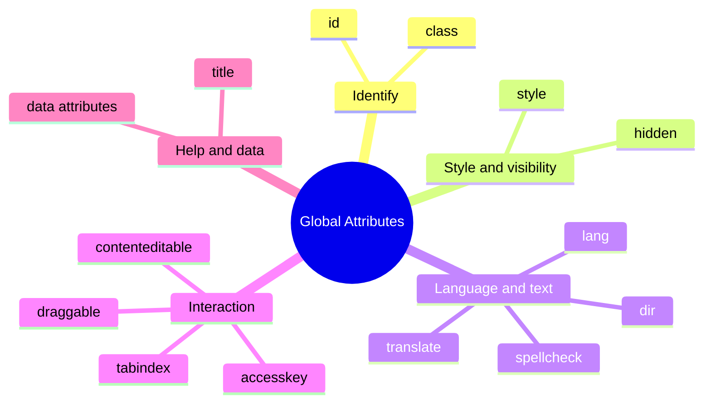

In the [Attributes](./attributes.mdx) lesson, you learned that many attributes belong to specific tags: `href` goes on links, `src` goes on images, `type` goes on inputs. But a special group of attributes breaks that pattern. They are valid on **almost every HTML element you will ever write**.

These are the **global attributes**, and they are some of the most-used pieces of HTML in the real world. Every professional web page relies on them for styling, navigation, accessibility, scripting, and more.

:::info Quick definition
A **global attribute** is an attribute that can be added to **any HTML element**, regardless of its tag name. Some may have no visible effect on certain elements, but they are still allowed.
:::

<AdsComponent />
<br />

## The Big Picture

There are quite a few global attributes, so it helps to sort them into groups by purpose. This map shows the ones you will meet most often:



Let's take them group by group.

## Group 1: Identifying Elements

### The `id` attribute

The `id` attribute gives an element a **unique name** within the page. Think of it like a passport number: no two elements on the same page should share one.

```html
<h2 id="pricing">Pricing</h2>
<p id="pricing-note">All prices include tax.</p>
```

Why is a unique name useful?

- **CSS** can target exactly one element: `#pricing { ... }`
- **JavaScript** can find it quickly: `document.getElementById("pricing")`
- **Links** can jump straight to it: `<a href="#pricing">Jump to pricing</a>`
- **Labels** can connect to form fields (you will see this in the forms module).

**Rules for a good `id`:**

| Rule | Good | Bad |
|------|------|-----|
| Must be **unique** in the document | `id="hero"` used once | `id="hero"` used twice |
| Must **not contain spaces** | `id="main-title"` | `id="main title"` |
| Is **case-sensitive** | `Hero` and `hero` are different | Mixing cases by accident |
| Should start with a **letter** | `id="section-1"` | `id="1-section"` (valid but awkward in CSS) |
| Should describe the **purpose** | `id="contact-form"` | `id="div7"` |

### The `class` attribute

While an `id` is unique, a **`class`** is meant to be **shared**. It groups elements that should look or behave alike, like labeling several students as "Team Blue".

```html
<p class="note">Remember to save your work.</p>
<p class="note">Take a break every hour.</p>
<p class="note important">Submit before Friday!</p>
```

An element can carry **several classes**, separated by **spaces**. In the last paragraph above, `note` and `important` both apply.

<Tabs groupId="id-vs-class">
  <TabItem value="id" label="🆔 id" default>

- Must be **unique** on the page
- An element has **at most one** `id`
- Targets **one specific element**
- CSS selector starts with `#`

```html
<header id="site-header">...</header>
```

  </TabItem>
  <TabItem value="class" label="🏷️ class">

- Can be **reused** on many elements
- An element can have **many** classes
- Targets **groups** of elements
- CSS selector starts with `.`

```html
<button class="btn btn-primary">Save</button>
```

  </TabItem>
</Tabs>

:::tip Beginner rule of thumb
Use **`class`** for styling and grouping (your default choice), and use **`id`** for the few cases where you need to point at one specific element, such as a link target or a script hook.
:::

## Group 2: Style and Visibility

### The `style` attribute

The `style` attribute lets you write **CSS directly on one element**:

```html
<p style="color: crimson; font-size: 20px;">This text is red and larger.</p>
```

<BrowserWindow url="http://127.0.0.1:5500/index.html">
<>
<p style={{color: 'crimson', fontSize: '20px'}}>This text is red and larger.</p>
</>
</BrowserWindow>

It is handy for quick experiments and for values that must be set per element. But for real projects, it is better to write styles in a separate CSS file and connect them with `class`.

<Tabs groupId="style-approach">
  <TabItem value="inline" label="🟡 Inline style" default>

```html
<p style="color: crimson;">Warning</p>
<p style="color: crimson;">Error</p>
<p style="color: crimson;">Alert</p>
```

Repeated everywhere. Changing the color means editing every line.

  </TabItem>
  <TabItem value="class-style" label="✅ Class + CSS file">

```html
<p class="danger">Warning</p>
<p class="danger">Error</p>
<p class="danger">Alert</p>
```

```css title="styles.css"
.danger {
  color: crimson;
}
```

Change the color once, and every element updates.

  </TabItem>
</Tabs>

### The `hidden` attribute

The `hidden` attribute is a **boolean attribute** (remember those?) that tells the browser this element is **not currently relevant**, so it should not be displayed.

```html
<p>This paragraph is visible.</p>
<p hidden>This paragraph is hidden.</p>
```

<BrowserWindow url="http://127.0.0.1:5500/index.html">
<>
<p>This paragraph is visible.</p>
<p hidden>This paragraph is hidden.</p>
</>
</BrowserWindow>

Hidden content is skipped by browsers and screen readers, which makes it useful for content you plan to reveal later with JavaScript, such as a popup message or a tab panel.

:::note Hidden is not private
Like a comment, a hidden element is still present in the page's source code. Anyone can see it through DevTools, so never hide sensitive information this way.
:::

<AdsComponent />
<br />

## Group 3: Language and Text

### The `lang` attribute

You already used `lang` on the `<html>` tag, but it can be applied to **any element**, which is perfect for marking a phrase in a different language.

```html
<html lang="en">
  ...
  <p>The French say <span lang="fr">c'est la vie</span>, meaning "that's life".</p>
</html>
```

This helps screen readers pronounce the phrase correctly, and helps browsers offer accurate translation and hyphenation.

### The `dir` attribute

The `dir` attribute sets the **text direction**. Languages such as Arabic, Hebrew, and Urdu are written from right to left.

| Value | Meaning |
|-------|---------|
| `ltr` | Left to right (default for most languages) |
| `rtl` | Right to left |
| `auto` | Let the browser detect it from the content |

```html
<p dir="rtl" lang="ar">مرحبا بكم في موقعنا</p>
```

<BrowserWindow url="http://127.0.0.1:5500/index.html">
<>
<p dir="ltr">This line reads left to right.</p>
<p dir="rtl" lang="ar">مرحبا بكم في موقعنا</p>
</>
</BrowserWindow>

### The `translate` and `spellcheck` attributes

Two smaller but useful helpers:

<Tabs>
  <TabItem value="translate" label="🔤 translate" default>

Tells translation tools whether to translate an element. Use `no` for brand names, code, or anything that should stay untouched.

```html
<p>Welcome to <span translate="no">CodeHarborHub</span>!</p>
```

  </TabItem>
  <TabItem value="spellcheck" label="✅ spellcheck">

Turns the browser's spell checker on or off for editable text, such as form fields.

```html
<textarea spellcheck="true"></textarea>
<input type="text" spellcheck="false" />
```

Turn it off for things like usernames or code, where red squiggly lines would only be distracting.

  </TabItem>
</Tabs>

## Group 4: Interaction

### The `tabindex` attribute

When people navigate a page with the **Tab key** (very common for keyboard and assistive-technology users), the browser moves through interactive elements like links and buttons. The `tabindex` attribute controls this behavior.

| Value | What it does |
|-------|--------------|
| `tabindex="0"` | Makes any element **reachable by keyboard**, in its natural page order |
| `tabindex="-1"` | Makes an element **focusable by script**, but skips it in Tab navigation |
| `tabindex="1"` or higher | Forces a custom tab order (**avoid this**) |

```html
<div tabindex="0">This div can now receive keyboard focus.</div>
```

:::warning Avoid positive tabindex values
Numbers greater than zero override the natural order and create a confusing, hard-to-maintain experience for keyboard users. Stick to `0` and `-1`.
:::

### The `contenteditable` attribute

Add `contenteditable="true"` and the visitor can **edit that element's text directly in the page**, no form required.

```html
<p contenteditable="true">Click here and start typing to change this text!</p>
```

<BrowserWindow url="http://127.0.0.1:5500/index.html">
<>
<p contentEditable="true" suppressContentEditableWarning>Click here and start typing to change this text!</p>
</>
</BrowserWindow>

Changes exist only in the visitor's browser and vanish on refresh, unless you add JavaScript to save them. It is the foundation of many rich text editors and note-taking apps.

### The `draggable` attribute

Set `draggable="true"` to let an element be **dragged with the mouse**. The full drag-and-drop behavior needs JavaScript, but the attribute is the starting point.

```html
<p draggable="true">Drag me!</p>
```

### The `accesskey` attribute

`accesskey` lets you assign a keyboard shortcut to an element:

```html
<a href="/search" accesskey="s">Search</a>
```

Browsers and operating systems use different key combinations to trigger it, and they often clash with existing shortcuts, so it is **rarely recommended** today.

<AdsComponent />
<br />

## Group 5: Help and Custom Data

### The `title` attribute

The `title` attribute adds **extra information that appears as a tooltip** when a visitor hovers over the element with a mouse.

```html
<abbr title="HyperText Markup Language">HTML</abbr>
```

<BrowserWindow url="http://127.0.0.1:5500/index.html">
<>
<p>Hover over <abbr title="HyperText Markup Language">HTML</abbr> to see the full name.</p>
</>
</BrowserWindow>

:::warning Don't rely on `title` for important information
Tooltips do not appear on touch screens, and many keyboard and screen-reader users never see them. Anything essential should be visible as normal text on the page. Think of `title` as a small bonus, not the main message.
:::

### The `data-*` attributes

You met these in the previous lesson. They let you attach your **own custom data** to any element, ready for JavaScript to use:

```html
<li data-product-id="8421" data-category="books">HTML for Everyone</li>
```

```js
const item = document.querySelector("li");
console.log(item.dataset.productId); // "8421"
console.log(item.dataset.category);  // "books"
```
## A Few Newer Global Attributes

Modern HTML keeps adding helpful global attributes. Here are two worth knowing about, even if you do not use them yet:

| Attribute | What it does |
|-----------|--------------|
| `inert` | Makes an element and everything inside it **non-interactive**: it cannot be clicked, focused, or read by assistive tools. Useful behind a modal dialog. |
| `popover` | Turns an element into a **popup** that can be shown and hidden without writing JavaScript. |

:::note
These are newer features, so it is a good habit to check browser support (for example on MDN) before using them in a production project.
:::

## Quick Reference Table

| Attribute | Purpose | Example |
|-----------|---------|---------|
| `id` | Unique identifier | `id="contact"` |
| `class` | Shared group name(s) | `class="card featured"` |
| `style` | Inline CSS | `style="color: red;"` |
| `hidden` | Hides the element | `hidden` |
| `lang` | Language of the content | `lang="fr"` |
| `dir` | Text direction | `dir="rtl"` |
| `translate` | Allow or block translation | `translate="no"` |
| `spellcheck` | Toggle spell checking | `spellcheck="false"` |
| `tabindex` | Keyboard focus behavior | `tabindex="0"` |
| `contenteditable` | Makes content editable | `contenteditable="true"` |
| `draggable` | Allows dragging | `draggable="true"` |
| `accesskey` | Keyboard shortcut | `accesskey="s"` |
| `title` | Tooltip text | `title="More info"` |
| `data-*` | Custom data for scripts | `data-user-id="42"` |

## Common Mistakes with Global Attributes

<details>
  <summary>1. Using the same id on more than one element</summary>

```html
<!-- ❌ Duplicate ids: which one does a link or script find? -->
<p id="note">First</p>
<p id="note">Second</p>

<!-- ✅ Use a class for repeated items -->
<p class="note">First</p>
<p class="note">Second</p>
```

</details>

<details>
  <summary>2. Putting spaces in an id, or commas in a class list</summary>

```html
<!-- ❌ Incorrect -->
<h1 id="main title" class="big, bold">Welcome</h1>

<!-- ✅ Correct -->
<h1 id="main-title" class="big bold">Welcome</h1>
```

An `id` cannot contain spaces, and multiple classes are separated by **spaces only**, never commas.

</details>

<details>
  <summary>3. Writing the same attribute twice on one element</summary>

```html
<!-- ❌ The second style is ignored -->
<p style="color: red" style="font-size: 20px">Hello</p>

<!-- ✅ Merge them into one attribute -->
<p style="color: red; font-size: 20px">Hello</p>
```

</details>

<details>
  <summary>4. Overusing inline styles</summary>

Inline styles are hard to reuse, hard to override, and make your HTML cluttered. Prefer classes and a separate stylesheet.

</details>

<details>
  <summary>5. Using a positive tabindex</summary>

Values like `tabindex="5"` create a custom, fragile tab order that confuses keyboard users. Use `0` or `-1` instead, and let the natural page order do the work.

</details>

## Try It Yourself

This snippet contains four mistakes related to global attributes. Can you find them all?

```html title="broken-global.html"
<h1 id="page title" class="big, bold">Welcome</h1>
<p id="intro" style="color: red" style="font-size: 20px">Hello!</p>
<div id="intro" tabindex="5">Extra content</div>
```

<details>
  <summary>👀 Click to reveal the solution</summary>

```html title="fixed-global.html"
<h1 id="page-title" class="big bold">Welcome</h1>
<p id="intro" style="color: red; font-size: 20px">Hello!</p>
<div id="extra" tabindex="0">Extra content</div>
```

1. `id="page title"` contained a space, so it became `page-title`.
2. `class="big, bold"` used a comma, but classes are separated by spaces only.
3. The paragraph had two `style` attributes, which were merged into one.
4. Two elements shared `id="intro"`, so the second was renamed. The `tabindex="5"` was also changed to `0`.

</details>

<AdsComponent />
<br />

## Quick Recap

- **Global attributes** work on almost every HTML element.
- **`id`** must be unique, while **`class`** can be shared, and elements can have several classes.
- **`style`** applies inline CSS, but classes with a stylesheet are the better long-term choice.
- **`hidden`** hides an element, and **`lang`** and **`dir`** describe language and text direction.
- **`tabindex`** controls keyboard focus. Stick to `0` and `-1`.
- **`contenteditable`** and **`draggable`** add interactivity, and **`title`** adds a helpful tooltip.
- **`data-*`** attributes store custom data for JavaScript.

## Frequently Asked Questions

<details>
  <summary>What are global attributes in HTML?</summary>

Global attributes are attributes that can be used on any HTML element, such as `id`, `class`, `style`, `title`, `lang`, and `hidden`. Unlike tag-specific attributes such as `href` or `src`, they are not tied to one kind of element.

</details>

<details>
  <summary>What is the difference between id and class?</summary>

An `id` uniquely identifies a single element and must not be repeated on a page. A `class` groups elements together and can be reused on as many elements as you like. An element can also have multiple classes.

</details>

<details>
  <summary>Can an element have more than one class?</summary>

Yes. Separate the class names with spaces, for example `class="card featured large"`.

</details>

<details>
  <summary>Should I use the style attribute or a CSS file?</summary>

For real projects, use a CSS file with classes. Inline styles are fine for quick tests, but they are harder to maintain and reuse.

</details>

<details>
  <summary>Is the title attribute good for accessibility?</summary>

Not on its own. Tooltips do not appear on touch devices and are often missed by keyboard and screen-reader users, so never put essential information only in a `title` attribute.

</details>

<details>
  <summary>What is the difference between hidden and CSS display none?</summary>

They have a similar visual effect, since hidden elements are not shown. The `hidden` attribute is part of the HTML itself and is easy to toggle with JavaScript, while `display: none` is a CSS rule that can also be applied conditionally through stylesheets.

</details>

## Test Your Understanding

1. What makes an attribute "global"?
2. Why must an `id` be unique, but a `class` can repeat?
3. How do you give an element three classes at once?
4. Which `tabindex` values are recommended, and which should you avoid?
5. Why is the `title` attribute a poor place for essential information?