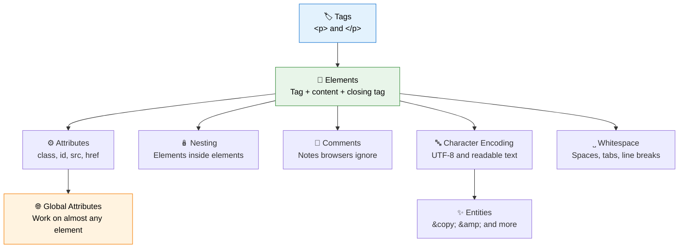

In the [Getting Started](/tutorials/html/getting-started) module, you learned what HTML is, how the web works, and you even built your very first page. Now it's time to slow down and learn the **grammar rules** that every single HTML document must follow.

Think of this the way you would think about learning any new language. Before you can write great sentences, you need to understand its **alphabet, punctuation, and grammar**. This module is exactly that for HTML: the small, precise rules that make your code valid, predictable, and readable, not just by browsers, but by other humans too.

:::tip Why syntax matters more than it seems
Two developers can know the same HTML tags, yet write code that looks completely different in quality. The difference almost always comes down to **syntax discipline**: consistent nesting, sensible attributes, correct encoding, and clean formatting. Master this module, and your code will already look professional.
:::

<AdsComponent />
<br />

## What You Will Learn

By the end of this module, you will be able to:

- Tell the difference between a **tag**, an **element**, and an **attribute**.
- Write and use **attributes** correctly, including quoting and common patterns.
- Use **global attributes** like `id`, `class`, and `style` on any element.
- **Nest** elements correctly and avoid overlapping tag mistakes.
- Add **comments** to your code without affecting the rendered page.
- Understand **character encoding** and why `<meta charset="UTF-8">` matters.
- Use **HTML entities** to safely display special characters like `&`, `<`, and `©`.
- Predict how browsers handle **whitespace** in your code.

## Module Roadmap

Follow the lessons in order for the smoothest learning curve. Each one builds on the last.

| # | Lesson | What you'll get |
|---|--------|-----------------|
| 1 | [Tags](./tags.mdx) | The building blocks written in angle brackets, and how opening and closing tags work. |
| 2 | [Elements](./elements.mdx) | How tags combine with content to form a complete HTML element. |
| 3 | [Attributes](./attributes.mdx) | Adding extra information and behavior to your tags. |
| 4 | [Global Attributes](./global-attributes.mdx) | Attributes like `id`, `class`, and `title` that work on almost every element. |
| 5 | [Nesting](./nesting.mdx) | The rules for placing elements correctly inside one another. |
| 6 | [Comments](./comments.mdx) | Leaving notes in your code that browsers ignore. |
| 7 | [Character Encoding](./character-encoding.mdx) | Making sure every language and symbol displays correctly. |
| 8 | [Entities](./entities.mdx) | Safely displaying reserved and special characters. |
| 9 | [Whitespace](./whitespace.mdx) | How browsers collapse spaces, tabs, and line breaks. |

## A Quick Preview of HTML Syntax

Here is a short snippet that uses almost every concept in this module at once. Don't worry about understanding all of it yet, just notice how the pieces fit together.

```html title="syntax-preview.html"
<!-- This is a comment: it will not appear on the page -->
<section id="intro" class="highlight" title="Introduction section">
  <h2>Why &amp; How Syntax Matters</h2>
  <p>
    HTML uses <strong>tags</strong> to create
    <em>elements</em>, and <code>attributes</code>
    add extra details like <code>id</code> or <code>class</code>.
  </p>
</section>
```

By the end of this module, every part of that snippet, the comment, the `id` and `class` attributes, the nested `<strong>` inside `<em>`, and the `&amp;` entity, will make complete sense.

## The Big Picture: How the Pieces Connect



Every lesson in this module is a piece of this same puzzle. Learn them one at a time, and by the end, reading and writing correct HTML will feel completely natural.

<AdsComponent />
<br />

## How to Get the Most Out of This Module

- **Type every example yourself.** Syntax is muscle memory, and typing beats copy-pasting.
- **Break things on purpose.** Remove a closing tag or a quotation mark and see what the browser does. Then fix it. Mistakes teach syntax rules faster than anything else.
- **Use your browser's DevTools.** Revisit the [Browser Developer Tools](/tutorials/html/getting-started/browser-developer-tools) lesson to inspect real websites and see these syntax rules in action.
- **Keep a small "cheat sheet."** As you learn each rule, jot it down. You will be surprised how quickly it becomes second nature.

:::info Good syntax is invisible
When your HTML syntax is correct, nobody notices. When it's wrong, browsers misbehave, screen readers stumble, and other developers struggle to read your code. This module is about becoming the kind of developer whose code "just works."
:::