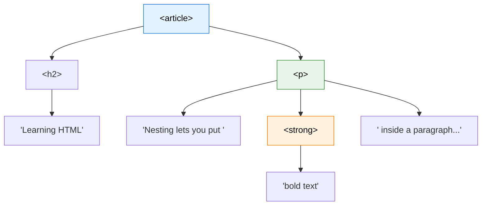
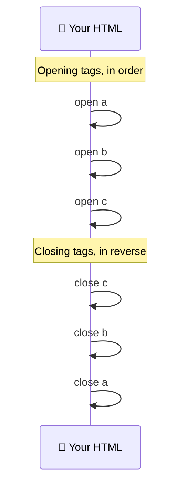
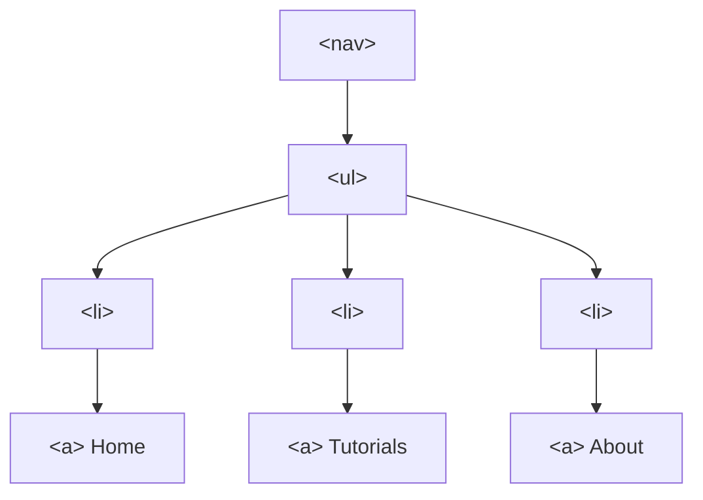

Look at any real web page and you will notice something: elements are almost never alone. A navigation bar holds a list, the list holds items, and each item holds a link. A blog post holds a heading, paragraphs, and images. Elements live **inside other elements**, layer after layer, like a set of Russian dolls.

This is called **nesting**, and it is the reason HTML can describe pages of any size and complexity. It is also the source of some of the most common beginner bugs, so it is worth learning the rules properly.

:::info Quick definition
**Nesting** means placing one HTML element inside another. The outer element is the **parent**, the inner element is the **child**, and together they form a tree-like structure that the browser calls the **DOM**.
:::

<AdsComponent />
<br />

## What Nesting Looks Like

Here is a small example with three levels of nesting:

```html
<article>
  <h2>Learning HTML</h2>
  <p>
    Nesting lets you put <strong>bold text</strong> inside a paragraph,
    and the paragraph inside an article.
  </p>
</article>
```

Read it like an outline:

- The `<article>` contains an `<h2>` and a `<p>`.
- The `<p>` contains some text and a `<strong>` element.
- The `<strong>` contains the words "bold text".

Here is the same structure drawn as a tree:



And this is what the browser shows:

<BrowserWindow url="http://127.0.0.1:5500/index.html">
<>
<article>
  <h2>Learning HTML</h2>
  <p>
    Nesting lets you put <strong>bold text</strong> inside a paragraph,
    and the paragraph inside an article.
  </p>
</article>
</>
</BrowserWindow>

## The Family Vocabulary

Because HTML is a tree, developers borrow words from family trees to describe how elements relate to each other.

| Term | Meaning | In the example above |
|------|---------|----------------------|
| **Parent** | An element that directly contains another | `<article>` is the parent of `<h2>` and `<p>` |
| **Child** | An element directly inside another | `<h2>` and `<p>` are children of `<article>` |
| **Sibling** | Elements sharing the same parent | `<h2>` and `<p>` are siblings |
| **Ancestor** | Any element above, at any distance | `<article>` is an ancestor of `<strong>` |
| **Descendant** | Any element below, at any distance | `<strong>` is a descendant of `<article>` |

:::tip Parent vs. ancestor
A parent is exactly **one level** above. An ancestor is **any level** above. So `<p>` is both the parent and an ancestor of `<strong>`, while `<article>` is an ancestor, but not the parent.
:::

This vocabulary matters more than it seems. When you learn CSS and JavaScript later, you will constantly write things like "select the direct child of..." or "find the closest ancestor that...".

## The Golden Rule: Last Opened, First Closed

There is one rule that governs almost all correct nesting:

> **Close tags in the reverse order that you opened them.**

Think of stacking plates. The last plate you put on the stack is the first one you take off.



<Tabs groupId="nesting-order">
  <TabItem value="correct" label="✅ Correct nesting" default>

```html
<p>This is <strong>very <em>important</em></strong> text.</p>
```

The `<em>` opens last, so it closes first. Then `<strong>` closes. Then `<p>` closes. Every element sits fully **inside** its parent.

  </TabItem>
  <TabItem value="incorrect" label="❌ Overlapping (wrong)">

```html
<p>This is <strong>very <em>important</strong></em> text.</p>
```

Here `<strong>` closes **before** `<em>`, so the two elements overlap instead of nesting. Browsers will try to repair this, but the result may not match what you intended.

  </TabItem>
</Tabs>

<AdsComponent />
<br />

## What Browsers Do When Nesting Goes Wrong

HTML is famously forgiving. If you write broken nesting, the browser does not stop or show an error. Instead, it **guesses what you meant** and quietly rearranges your elements to build a valid tree.

That sounds helpful, but it has a downside: the browser's guess may not match your intention, and different situations can produce surprising results.

```html
<!-- What you wrote -->
<p>Hello <b>World</p></b>
```

The browser will repair this into something like:

```html
<!-- What the browser builds -->
<p>Hello <b>World</b></p><b></b>
```

Notice the stray empty `<b></b>` that appeared. You never asked for it, and you would only find it by inspecting the page with DevTools.

:::warning Don't rely on browser repairs
Because every browser repairs mistakes using the same standard algorithm, broken HTML often *appears* to work. But it makes your code fragile, harder to style with CSS, and harder to debug. Always write correct nesting yourself.
:::

## Nesting Rules You Need to Know

Not every element is allowed to live inside every other element. Here are the most important rules for beginners.

### Rule 1: Block elements should not go inside inline elements

Inline elements like `<span>`, `<strong>`, and `<em>` are meant to wrap small pieces of text. Putting a large block-level element such as `<div>` or `<h1>` inside them is invalid.

<Tabs>
  <TabItem value="bad1" label="❌ Invalid" default>

```html
<span>
  <div>A block inside an inline element</div>
</span>
```

  </TabItem>
  <TabItem value="good1" label="✅ Valid">

```html
<div>
  <span>An inline element inside a block</span>
</div>
```

  </TabItem>
</Tabs>

There is one friendly exception: the `<a>` element can wrap block-level content in modern HTML5, which is handy for making a whole card clickable.

### Rule 2: A paragraph cannot contain block elements

A `<p>` element can only hold **inline** content. If the browser meets a block element like `<div>`, `<ul>`, or another `<p>` while inside a paragraph, it **automatically closes the paragraph first**.

```html
<!-- What you wrote -->
<p>
  Intro text
  <div>A block element</div>
</p>
```

The browser closes the `<p>` early, leaving the closing `</p>` stranded and creating an unexpected empty paragraph.

### Rule 3: Lists must contain list items

`<ul>` and `<ol>` may only have `<li>` as their **direct** children. Everything else has to go *inside* an `<li>`.

<Tabs groupId="list-nesting">
  <TabItem value="bad2" label="❌ Invalid" default>

```html
<ul>
  <p>This paragraph is not allowed here</p>
  <li>Item one</li>
</ul>
```

  </TabItem>
  <TabItem value="good2" label="✅ Valid">

```html
<ul>
  <li>
    <p>This paragraph lives safely inside a list item</p>
  </li>
  <li>Item two</li>
</ul>
```

  </TabItem>
</Tabs>

### Rule 4: Interactive elements cannot nest inside each other

You cannot place a link inside another link, or a button inside a link, because a click would be ambiguous. Which one should respond?

```html
<!-- ❌ Invalid: link inside a link -->
<a href="/one">Go to <a href="/two">two</a></a>

<!-- ✅ Valid: two separate links side by side -->
<a href="/one">Go to one</a> or <a href="/two">go to two</a>
```

### Rule 5: Some elements only make sense in specific parents

Certain elements are only valid in a specific context. A few you will meet later:

| Element | Must be inside |
|---------|----------------|
| `<li>` | `<ul>`, `<ol>`, or `<menu>` |
| `<td>` and `<th>` | `<tr>` |
| `<tr>` | `<table>`, `<thead>`, `<tbody>`, or `<tfoot>` |
| `<source>` | `<picture>`, `<video>`, or `<audio>` |
| `<title>` and `<meta>` | `<head>` |

<AdsComponent />
<br />

## Nesting Done Right: A Real Example

Let's build a small navigation menu. It contains a `<nav>`, which holds a `<ul>`, which holds `<li>` items, which hold `<a>` links. That is **four levels** of correct nesting.

```html title="navigation.html"
<nav>
  <ul>
    <li><a href="/">Home</a></li>
    <li><a href="/tutorials">Tutorials</a></li>
    <li><a href="/about">About</a></li>
  </ul>
</nav>
```

<BrowserWindow url="http://127.0.0.1:5500/navigation.html">
<>
<nav>
  <ul>
    <li><a href="/">Home</a></li>
    <li><a href="/tutorials">Tutorials</a></li>
    <li><a href="/about">About</a></li>
  </ul>
</nav>
</>
</BrowserWindow>



## Indentation: Making Nesting Visible

Browsers do not care how your code is indented, as you will see in the [Whitespace](./whitespace.mdx) lesson. But **humans** care a great deal. Indentation is how you make nesting visible at a glance.

The rule is simple: **indent every child one level deeper than its parent.**

<Tabs groupId="indent">
  <TabItem value="messy" label="❌ Hard to read" default>

```html
<div>
<ul>
<li>One</li>
<li>Two
<ul>
<li>Nested</li>
</ul>
</li>
</ul>
</div>
```

  </TabItem>
  <TabItem value="clean" label="✅ Easy to read">

```html
<div>
  <ul>
    <li>One</li>
    <li>
      Two
      <ul>
        <li>Nested</li>
      </ul>
    </li>
  </ul>
</div>
```

  </TabItem>
</Tabs>

Both versions produce the exact same page, but only one lets you instantly see which closing tag belongs to which opening tag.

:::tip Let your editor do the work
In VS Code, press **Shift + Alt + F** (Windows/Linux) or **Shift + Option + F** (macOS) to auto-format your file. Choose 2 or 4 spaces per level and stay consistent across a project.
:::

## How Deep Is Too Deep?

There is no official limit on nesting depth, but very deep structures are a warning sign. If you find yourself six or seven levels down inside a page, ask yourself:

- Are all these wrapper `<div>` elements really necessary?
- Could a semantic element like `<section>` or `<article>` replace some of them?
- Would this be easier to read if it were split into smaller pieces?

Deep nesting makes code harder to read, harder to style, and slightly slower for browsers to process. A useful habit is to keep your structure **as flat as it can be while still making sense**.

## Common Nesting Mistakes

<details>
  <summary>1. Overlapping tags</summary>

```html
<!-- ❌ Incorrect -->
<b><i>Bold and italic</b></i>

<!-- ✅ Correct -->
<b><i>Bold and italic</i></b>
```

</details>

<details>
  <summary>2. Forgetting a closing tag and swallowing the rest of the page</summary>

```html
<!-- ❌ The div is never closed -->
<div>
  <p>Some content</p>

<footer>Footer text</footer>

<!-- ✅ Correct -->
<div>
  <p>Some content</p>
</div>

<footer>Footer text</footer>
```

Without the closing `</div>`, the footer becomes a child of the div instead of a sibling, which can wreck your layout.

</details>

<details>
  <summary>3. Putting text or other tags directly inside a list</summary>

```html
<!-- ❌ Incorrect -->
<ul>
  Shopping list
  <li>Milk</li>
</ul>

<!-- ✅ Correct: heading goes outside the list -->
<h3>Shopping list</h3>
<ul>
  <li>Milk</li>
</ul>
```

</details>

<details>
  <summary>4. Nesting a link inside another link</summary>

Links cannot contain other links. Use two separate `<a>` elements instead.

</details>

## Try It Yourself

This snippet has three nesting problems. See if you can spot them before opening the answer.

```html title="broken-nesting.html"
<ul>
  <li>Apples
  <li>Oranges</li>
  <p>Bananas</p>
</ul>
<p>Learn <strong>HTML <em>today</strong></em></p>
```

<details>
  <summary>👀 Click to reveal the fixes</summary>

```html title="fixed-nesting.html"
<ul>
  <li>Apples</li>
  <li>Oranges</li>
  <li>Bananas</li>
</ul>
<p>Learn <strong>HTML <em>today</em></strong></p>
```

1. The first `<li>` was never closed with `</li>`.
2. A `<p>` was placed directly inside the `<ul>`. Only `<li>` is allowed there, so "Bananas" became its own list item.
3. `<strong>` and `<em>` overlapped. The `<em>` must close before `<strong>` does.

</details>

<AdsComponent />
<br />

## Quick Recap

- **Nesting** means placing one element inside another, forming a **tree** of parents, children, and siblings.
- The golden rule is **last opened, first closed**.
- Browsers silently **repair** broken nesting, but the result may surprise you, so write it correctly yourself.
- **Block elements should not go inside inline elements**, and a `<p>` cannot contain block elements.
- Lists may only have **`<li>`** as direct children, and **interactive elements** like links cannot nest inside each other.
- **Indent each level** of nesting so the structure is visible to human readers.

## Frequently Asked Questions

<details>
  <summary>What is nesting in HTML?</summary>

Nesting is placing one HTML element inside another. The outer element is the parent and the inner element is the child, which together form the tree-like structure of a web page.

</details>

<details>
  <summary>What is the correct order for closing nested tags?</summary>

Close them in the reverse order you opened them. The last tag opened must be the first one closed, so that each element sits completely inside its parent.

</details>

<details>
  <summary>What is the difference between a parent and an ancestor?</summary>

A parent is the element exactly one level above another. An ancestor is any element above it at any distance, including the parent, the grandparent, and so on.

</details>

<details>
  <summary>Can I put a div inside a paragraph?</summary>

No. A paragraph can only contain inline content. If a browser finds a div inside a paragraph, it closes the paragraph automatically before the div, which usually produces an unexpected layout.

</details>

<details>
  <summary>Will my page break if I nest elements incorrectly?</summary>

Usually it will not crash, because browsers repair mistakes automatically. But the repaired structure may differ from what you intended, causing styling and layout bugs that are hard to trace.

</details>

<details>
  <summary>How can I check whether my HTML nesting is valid?</summary>

Use the W3C Markup Validation Service, or inspect the page in your browser's DevTools to see the tree the browser actually built. Most code editors also highlight mismatched tags as you type.

</details>

## Test Your Understanding

1. What do we call an element that directly contains another element?
2. In what order should nested tags be closed?
3. Why is `<ul><p>Text</p></ul>` invalid?
4. What does a browser do when it finds a `<div>` inside a `<p>`?
5. Why does indentation matter if browsers ignore it?