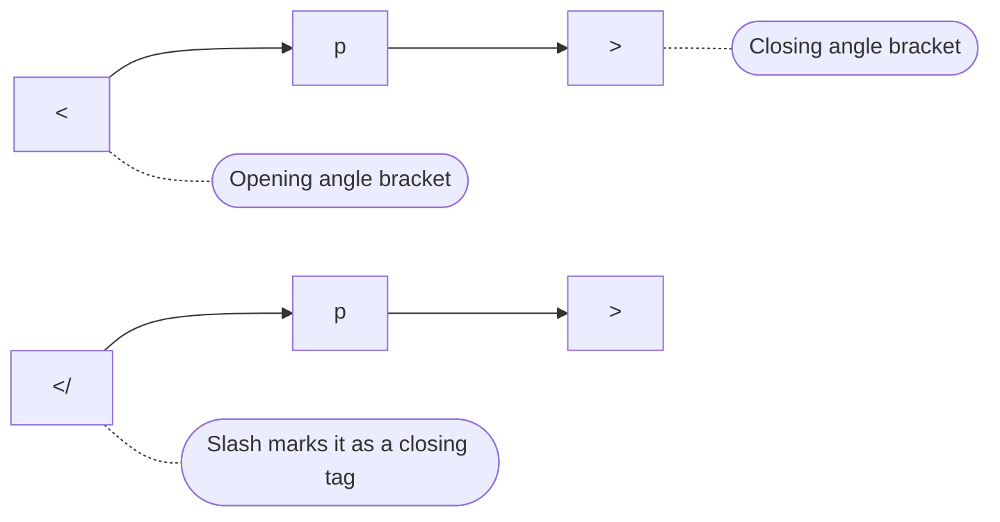
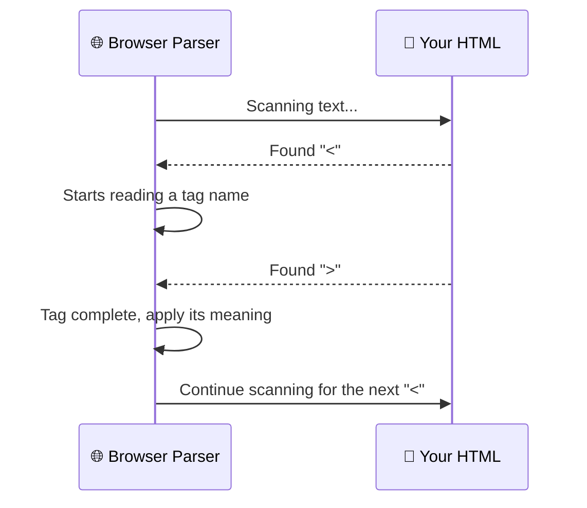

Every single thing you have built so far, headings, paragraphs, images, links, has been created using **tags**. They are the smallest, most fundamental unit of HTML syntax, and yet many learners never pause to look at them closely.

In this lesson, we slow right down and examine tags on their own: what they look like, how they behave, the rules around naming and casing, and the small mistakes that trip up almost every beginner at least once.

:::info Quick definition
A **tag** is a piece of markup written inside **angle brackets** (`< >`) that tells the browser where a certain kind of content begins or ends. Tags are the raw material that elements are built from.
:::

<AdsComponent />
<br />

## What Does a Tag Look Like?

A tag always starts with a **less-than sign** (`<`) and ends with a **greater-than sign** (`>`). Between them sits the **tag name**, and optionally, one or more **attributes**.

```html
<p>
```

This is a tag. On its own, it does nothing visible. It simply marks the *start* of a paragraph. Its matching closing tag looks almost identical, but with a forward slash before the name:

```html
</p>
```

Put together, a start tag, some content, and an end tag form a complete **element**, which you explored in depth in the [Elements](./elements.mdx) lesson. This lesson focuses purely on the tags themselves.



## Opening Tags and Closing Tags

Most HTML tags come in **matching pairs**: an **opening tag** that marks where something begins, and a **closing tag** that marks where it ends.

<Tabs>
  <TabItem value="opening" label="Opening tag" default>

```html
<h1>
```

Marks the **start** of a heading. Everything after it, until the matching closing tag, belongs to this heading.

  </TabItem>
  <TabItem value="closing" label="Closing tag">

```html
</h1>
```

Marks the **end** of the heading. Notice the forward slash `/` right after the `<`. That slash is the only visual difference between an opening and closing tag.

  </TabItem>
</Tabs>

```html
<h1>This entire sentence is the heading's content</h1>
```

<BrowserWindow url="http://127.0.0.1:5500/index.html">
<>
<h1>This entire sentence is the heading's content</h1>
</>
</BrowserWindow>

:::warning A missing closing tag causes real problems
If you forget `</h1>`, the browser has no clear signal about where the heading ends. It may swallow up the rest of your page's content into that heading, causing a layout mess that can be confusing to debug. Always close what you open.
:::

## Tags That Don't Need Closing: Void Tags

A small set of tags represent content that has **no inner content** to wrap, like a single image or a line break. These never get a matching closing tag.

```html

<br />
<hr />
<input type="text" />
```

You explored these in detail as **void elements** in the previous lesson. From a pure "tags" perspective, just remember: some tags are always solo, and that's expected, not a mistake.

<Tabs groupId="tag-type">
  <TabItem value="paired" label="👯 Paired tags" default>

```html
<p>...</p>
<div>...</div>
<ul>...</ul>
```

Used for content that wraps around something.

  </TabItem>
  <TabItem value="void" label="🔹 Void tags">

```html

<br />
<hr />
```

Used for content that stands alone, with nothing to wrap.

  </TabItem>
</Tabs>

<AdsComponent />
<br />

## Tag Naming Rules

HTML tag names are not random. They follow a small, predictable set of conventions.

| Rule | Example |
|------|---------|
| Tag names are usually short, descriptive keywords | `p` (paragraph), `img` (image), `nav` (navigation) |
| Multi-word concepts often get abbreviated | `h1` for "heading level 1", `br` for "break" |
| Tags are **not case-sensitive** in HTML5 | `<P>`, `<p>`, and `<Body>` are all technically valid |
| Convention is to always use **lowercase** | `<p>` rather than `<P>` |

### Why lowercase, if uppercase also works?

Because HTML5 tags are not case-sensitive, browsers will happily render `<DIV>` or `<Div>`. However:

- **XHTML and stricter tools require lowercase**, so lowercase code is more portable.
- **Consistency matters** when working in teams; mixing cases makes code harder to scan.
- Every major style guide, and virtually every real-world codebase, uses **lowercase tags**.

:::tip Best practice
Always write your tags in **lowercase**. It is the universal convention, and this entire tutorial series follows it strictly.
:::

## A Field Guide to Common Tags

You don't need to memorize every tag today, but it helps to recognize the categories they fall into.

<Tabs>
  <TabItem value="structure" label="🏗️ Structure" default>

```html
<html> <head> <body> <header> <main> <footer> <section> <article> <nav>
```

  </TabItem>
  <TabItem value="text" label="📝 Text content">

```html
<h1> <h2> <p> <span> <strong> <em> <blockquote>
```

  </TabItem>
  <TabItem value="lists" label="📋 Lists">

```html
<ul> <ol> <li> <dl> <dt> <dd>
```

  </TabItem>
  <TabItem value="media" label="🖼️ Media">

```html
 <video> <audio> <source>
```

  </TabItem>
  <TabItem value="forms" label="📮 Forms">

```html
<form> <input> <label> <button> <select> <textarea>
```

  </TabItem>
</Tabs>

Don't worry, you will meet each of these properly in dedicated modules later in this tutorial series. For now, just notice the pattern: **tag names describe purpose, not appearance.**

## How Browsers Read Your Tags

When a browser parses your HTML, it scans character by character, looking for `<` to know a tag is starting. Understanding this helps explain a few important behaviors.



This is exactly why the **less-than** (`<`) and **greater-than** (`>`) characters are special in HTML. If you want to display a literal `<` symbol as visible text on your page, you cannot just type it directly, because the browser will think a new tag is starting. You will learn the correct way to do this in the upcoming [Entities](./entities.mdx) lesson.

## Common Tag Mistakes

<details>
  <summary>1. Misspelling a tag name</summary>

```html
<!-- ❌ Browser won't recognize "praragraph" as any real tag -->
<praragraph>Hello</praragraph>

<!-- ✅ Correct -->
<p>Hello</p>
```

Browsers are very forgiving. An unknown tag like `<praragraph>` won't crash your page, but it also won't behave like a paragraph. It will simply be ignored as an unrecognized custom element.

</details>

<details>
  <summary>2. Mismatched opening and closing tag names</summary>

```html
<!-- ❌ Opens as h1, but closes as h2 -->
<h1>My Heading</h2>

<!-- ✅ Correct -->
<h1>My Heading</h1>
```

</details>

<details>
  <summary>3. Adding a space after the less-than sign</summary>

```html
<!-- ❌ Invalid: space breaks the tag -->
< p>Hello</p>

<!-- ✅ Correct -->
<p>Hello</p>
```

</details>

<details>
  <summary>4. Using uppercase inconsistently</summary>

```html
<!-- ❌ Works, but inconsistent and non-standard -->
<P>Hello</p>

<!-- ✅ Correct and consistent -->
<p>Hello</p>
```

</details>

<AdsComponent />
<br />

## Try It Yourself

Spot the three mistakes in this snippet before checking the answer:

```html title="broken.html"
<h2>Today's Weather</H2>
<p>It is sunny and warm today

```

<details>
  <summary>👀 Click to reveal the fixes</summary>

```html title="fixed.html"
<h2>Today's Weather</h2>
<p>It is sunny and warm today.</p>

```

1. `</H2>` should match the lowercase opening tag: `</h2>`.
2. The `<p>` element was never closed with `</p>`.
3. The `` tag was missing a descriptive `alt` attribute (a best practice, covered fully in the [Attributes](./attributes.mdx) lesson).

</details>

## Quick Recap

- A **tag** is markup written inside angle brackets, like `<p>` or `</p>`.
- Most tags come in **pairs**: an opening tag and a closing tag with a `/`.
- **Void tags**, like `` and `<br>`, never get a closing tag.
- HTML tags are **not case-sensitive**, but the universal convention is **lowercase**.
- Browsers read your HTML by scanning for `<` and `>` characters to detect tags.
- Common mistakes include misspelled names, mismatched tags, and forgotten closing tags.

## Frequently Asked Questions

<details>
  <summary>What is an HTML tag?</summary>

An HTML tag is a piece of markup enclosed in angle brackets, such as `<p>` or `</p>`, that tells the browser where a certain type of content begins or ends.

</details>

<details>
  <summary>Are HTML tags case-sensitive?</summary>

No, HTML5 tags are not case-sensitive, so `<p>`, `<P>`, and `<pArAgRaPh error>` would all technically be parsed the same way if valid, but lowercase is the strongly recommended convention.

</details>

<details>
  <summary>What happens if I use a tag that doesn't exist?</summary>

The browser will not crash. It simply treats the unknown tag as a generic, unstyled element with no special behavior, essentially ignoring its intended meaning.

</details>

<details>
  <summary>Do all tags need a closing tag?</summary>

No. Void tags, such as ``, `<br>`, and `<input>`, never have a closing tag because they cannot contain content.

</details>

<details>
  <summary>What is the difference between a tag and an attribute?</summary>

A tag defines the type of element, like `` or `<a>`. An attribute adds extra information to that tag, such as `src` on an image or `href` on a link. Attributes are covered in the next lesson.

</details>

## Test Your Understanding

1. What two characters mark the start and end of every tag?
2. What symbol distinguishes a closing tag from an opening tag?
3. Name two void tags that never require a closing tag.
4. Is `<Div>` valid HTML5? Is it good practice?
5. What does a browser do when it encounters a tag name it does not recognize?