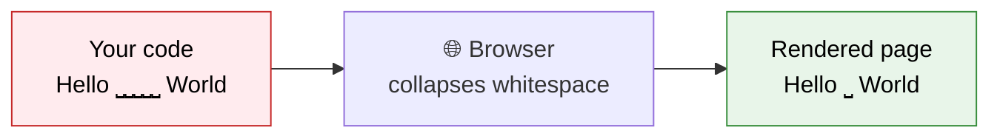

Here is a puzzle that confuses almost every beginner. You type a paragraph in your HTML file, press **Enter** a few times to add some breathing room, add a bunch of extra spaces for good measure, save, refresh... and the browser shows everything squashed together as if you had done nothing at all.

Is the browser broken? No. It is following a rule called **whitespace collapsing**, and once you understand it, you will know exactly how much control you have over spacing, and when you need a different tool.

:::info Quick definition
**Whitespace** is any invisible character that creates space in your code: the **space** bar, the **Tab** key, and **line breaks** (pressing Enter). In HTML, browsers treat almost all of these very differently from how a word processor would.
:::

<AdsComponent />
<br />

## The Core Rule: Whitespace Collapsing

When a browser reads your HTML, it takes every run of whitespace characters, however long, and **collapses it into a single space**. Tabs and line breaks are treated the same way.

Consider this code:

```html
<p>Hello         World</p>

<p>Hello
World</p>

<p>Hello


      World</p>
```

All three paragraphs contain very different amounts of whitespace between the two words, but they all render identically:

<BrowserWindow url="http://127.0.0.1:5500/index.html">
<>
<p>{"Hello         World"}</p>
<p>{"Hello\nWorld"}</p>
<p>{"Hello\n\n\n\n      World"}</p>
</>
</BrowserWindow>

Each one shows simply: **Hello World**.



### Why does HTML work this way?

It is actually a feature, not a bug. Because whitespace collapses, you are free to format your source code however you like, with indentation and line breaks, so it is easy for humans to read, **without changing how the page looks**.

If browsers preserved every space, you would have to write all your HTML on one long line just to avoid accidental gaps.

## What Else Gets Trimmed?

Collapsing is only part of the story. Browsers also **ignore whitespace** in a few other situations.

| Situation | What happens |
|-----------|--------------|
| **Multiple spaces or tabs in a row** | Collapsed into one space |
| **Line breaks inside text** | Treated as a single space |
| **Spaces at the start of a block element** | Removed |
| **Spaces at the end of a block element** | Removed |
| **Whitespace between block elements** | Ignored entirely |

That is why indenting your code with tabs or spaces never causes visible gaps at the beginning of your paragraphs.

<Tabs groupId="indent-demo">
  <TabItem value="indented" label="With indentation" default>

```html
<div>
    <p>
        Indented paragraph
    </p>
</div>
```

  </TabItem>
  <TabItem value="flat" label="No indentation">

```html
<div><p>Indented paragraph</p></div>
```

  </TabItem>
</Tabs>

Both versions display the same thing. Use indentation for readability, and trust the browser to ignore it.

## Taking Control: How to Add Space on Purpose

If the browser collapses your whitespace, how do you *intentionally* add space or line breaks? HTML gives you dedicated tools for each situation.

<Tabs>
  <TabItem value="paragraphs" label="📄 New paragraph" default>

Use a separate `<p>` element to start a new paragraph. Browsers automatically add vertical space between paragraphs.

```html
<p>This is the first paragraph.</p>
<p>This is the second paragraph.</p>
```

<BrowserWindow url="http://127.0.0.1:5500/index.html">
<>
<p>This is the first paragraph.</p>
<p>This is the second paragraph.</p>
</>
</BrowserWindow>

  </TabItem>
  <TabItem value="br" label="↩️ Line break">

Use `<br />` to force a **line break** inside the same paragraph, without starting a new one. This is ideal for addresses and poetry.

```html
<p>
  CodeHarborHub<br />
  Mandsaur, Madhya Pradesh<br />
  India
</p>
```

<BrowserWindow url="http://127.0.0.1:5500/index.html">
<>
<p>
  CodeHarborHub<br />
  Mandsaur, Madhya Pradesh<br />
  India
</p>
</>
</BrowserWindow>

  </TabItem>
  <TabItem value="nbsp" label="⎵ Non-breaking space">

Use the **`&nbsp;`** entity to insert a space that the browser will **not collapse** and will **not break across lines**.

```html
<p>Hello&nbsp;&nbsp;&nbsp;&nbsp;World</p>
```

<BrowserWindow url="http://127.0.0.1:5500/index.html">
<>
<p>Hello&nbsp;&nbsp;&nbsp;&nbsp;World</p>
</>
</BrowserWindow>

The four `&nbsp;` characters survive, so you can see a visibly wider gap. You will learn more about entities like this in the [Entities](./entities.mdx) lesson.

  </TabItem>
  <TabItem value="hr" label="➖ Horizontal rule">

Use `<hr />` to draw a **dividing line** between sections of content.

```html
<p>Section one</p>
<hr />
<p>Section two</p>
```

  </TabItem>
</Tabs>

:::warning Don't abuse `<br />` and `&nbsp;` for layout
It is tempting to stack many `<br />` tags or dozens of `&nbsp;` characters to push content around. This is fragile, hurts accessibility, and breaks on different screen sizes. For spacing and layout, the correct tool is **CSS** (margins, padding, and gaps), which you will learn in a later course.
:::

<AdsComponent />
<br />

## Preserving Whitespace with `<pre>`

Sometimes whitespace really matters: source code, ASCII art, poems, or text tables. For these situations, HTML provides the **`<pre>`** (preformatted text) element. Inside it, the browser **keeps every space and line break exactly as you typed it**, and uses a monospace font.

```html
<pre>
  /\_/\
 ( o.o )
  > ^ <
</pre>
```

<BrowserWindow url="http://127.0.0.1:5500/index.html">
<>
<pre>{`  /\\_/\\
 ( o.o )
  > ^ <`}</pre>
</>
</BrowserWindow>

Here is a side-by-side comparison of the same text with and without `<pre>`:

<Tabs groupId="pre-demo">
  <TabItem value="without-pre" label="Inside a normal <p>" default>

```html
<p>
  Name:    Ajay
  Age:     25
  City:    Mandsaur
</p>
```

Everything collapses onto one line: *Name: Ajay Age: 25 City: Mandsaur*

  </TabItem>
  <TabItem value="with-pre" label="Inside a &lt;pre&gt;">

```html
<pre>
Name:    Ajay
Age:     25
City:    Mandsaur
</pre>
```

Every space and line break is preserved, so the columns stay aligned.

  </TabItem>
</Tabs>

:::tip For code samples, pair `<pre>` with `<code>`
When displaying source code on a web page, wrap it like this: `<pre><code>...your code...</code></pre>`. The `<pre>` keeps the spacing, and the `<code>` element tells browsers and screen readers that the content is code.
:::

## Whitespace Control with CSS

You can also change how whitespace behaves using the CSS **`white-space`** property, without changing your HTML at all. Here are the most useful values:

| Value | Collapses spaces? | Keeps line breaks? | Wraps long lines? |
|-------|-------------------|--------------------|--------------------|
| `normal` (default) | Yes | No | Yes |
| `nowrap` | Yes | No | No |
| `pre` | No | Yes | No |
| `pre-wrap` | No | Yes | Yes |
| `pre-line` | Yes | Yes | Yes |

```css title="styles.css"
.poem {
  white-space: pre-line; /* keep line breaks, collapse extra spaces */
}

.no-wrap-title {
  white-space: nowrap; /* never wrap onto a second line */
}
```

:::note
You do not need to memorize this table now. Just remember that whitespace behavior can be changed with CSS. You will practice it properly once you reach the CSS module.
:::

## Sneaky Whitespace Effects

A few subtle behaviors surprise even experienced developers.

### 1. Whitespace between inline elements creates a visible gap

Because a line break between two inline elements is collapsed into **one space**, that space appears on the page.

<Tabs groupId="inline-gap">
  <TabItem value="gap" label="With a gap" default>

```html
<span>One</span>
<span>Two</span>
```

Renders as: **One Two** (there is a space between them).

  </TabItem>
  <TabItem value="nogap" label="Without a gap">

```html
<span>One</span><span>Two</span>
```

Renders as: **OneTwo** (there is no space).

  </TabItem>
</Tabs>

This is why side-by-side buttons or images sometimes show a mysterious small gap that seems impossible to remove. The culprit is the whitespace in your source code.

### 2. Empty paragraphs do not add space

Writing `<p></p>` or `<p>&nbsp;</p>` to create blank lines is a common beginner habit. It works by accident, but it is not meaningful markup and it hurts accessibility, since screen readers may announce empty paragraphs. Use CSS margins instead.

### 3. Whitespace inside an element still counts as content

```html
<p> Hello </p>
```

The leading and trailing spaces are trimmed inside block elements. But inside **inline** elements, they can affect spacing next to neighboring text, so pay attention when styling links or emphasized words.

## Formatting Your Source Code Cleanly

Since browsers ignore most of your whitespace, it is *your* job to use it well for the people who read your code. Follow these habits:

- **Indent consistently.** Use 2 or 4 spaces per nesting level, and never mix tabs and spaces in the same file.
- **Put each block element on its own line.** It makes the structure obvious at a glance.
- **Leave a blank line between major sections.** It works like paragraph breaks in an essay.
- **Avoid trailing spaces** at the ends of lines. Editors like VS Code can remove them automatically on save.
- **Let your editor format for you.** Press **Shift + Alt + F** (Windows/Linux) or **Shift + Option + F** (macOS) in VS Code.

<Tabs groupId="format-style">
  <TabItem value="messy" label="❌ Messy" default>

```html
<div><header><h1>Title</h1></header>
<main><p>Text</p>


<p>More text</p></main>
</div>
```

  </TabItem>
  <TabItem value="tidy" label="✅ Tidy">

```html
<div>
  <header>
    <h1>Title</h1>
  </header>

  <main>
    <p>Text</p>
    <p>More text</p>
  </main>
</div>
```

  </TabItem>
</Tabs>

Both render identically. Only one is a pleasure to maintain.

<AdsComponent />
<br />

## Try It Yourself

Below is an address that a beginner typed exactly like this, expecting three separate lines:

```html title="address.html"
<p>
  221B Baker Street
  London
  United Kingdom
</p>
```

**Challenge:** Fix the code so the address really shows on three lines.

<details>
  <summary>👀 Click to reveal the solution</summary>

```html title="address-fixed.html"
<p>
  221B Baker Street<br />
  London<br />
  United Kingdom
</p>
```

The browser had collapsed the line breaks into single spaces, so everything appeared on one line. Adding `<br />` after the first two lines forces the breaks the author wanted. Alternatively, you could put the address inside a `<pre>` element, or apply `white-space: pre-line` with CSS.

</details>

## Common Whitespace Mistakes

<details>
  <summary>1. Pressing Enter multiple times to create empty space</summary>

Extra line breaks in your code collapse into a single space, so nothing changes visually. Use separate elements, or CSS margin and padding, to control vertical spacing.

</details>

<details>
  <summary>2. Typing many spaces to indent text</summary>

Only one space survives. Use CSS padding or margin to indent text, not a row of spaces or `&nbsp;` characters.

</details>

<details>
  <summary>3. Stacking multiple &lt;br /&gt; tags for layout</summary>

Chains of line breaks are brittle and behave differently across screen sizes. They also create confusing experiences for screen reader users. Use CSS spacing instead.

</details>

<details>
  <summary>4. Forgetting that pre preserves the indentation of your source</summary>

Inside `<pre>`, every space you type appears on the page, including the indentation you used to keep your file tidy. Start the content at the left edge of your editor when using `<pre>`, or the output will look oddly shifted.

</details>

## Quick Recap

- Browsers **collapse any run of spaces, tabs, and line breaks into a single space**.
- This lets you **indent and format your source code freely** without changing the page.
- Use `<p>` for new paragraphs, `<br />` for a line break, and `<hr />` for a divider.
- Use **`&nbsp;`** for a space that will not collapse or break across lines.
- Use **`<pre>`** when whitespace must be preserved, such as code or ASCII art.
- The CSS **`white-space`** property can change whitespace behavior entirely.
- For spacing and layout, prefer **CSS** over stacked `<br />` tags or `&nbsp;` characters.

## Frequently Asked Questions

<details>
  <summary>Why does HTML ignore my extra spaces and line breaks?</summary>

Browsers collapse consecutive whitespace into a single space by design. This allows developers to format their source code for readability without accidentally changing how the page looks.

</details>

<details>
  <summary>How do I add multiple spaces in HTML?</summary>

Use the non-breaking space entity `&nbsp;` for each extra space, or better, use CSS properties such as padding or margin to create space in a controlled way.

</details>

<details>
  <summary>How do I create a line break in HTML?</summary>

Use the `<br />` element to force a line break inside a paragraph. To start a completely new paragraph with spacing, use a new `<p>` element instead.

</details>

<details>
  <summary>What does the pre tag do?</summary>

The `<pre>` element displays preformatted text. It preserves all spaces and line breaks exactly as written in the source code and typically renders in a monospace font.

</details>

<details>
  <summary>Does whitespace in my code affect SEO or page speed?</summary>

Not in any meaningful way for beginners. Search engines ignore extra whitespace, and the size difference is tiny. Production build tools often remove it automatically through a process called minification.

</details>

<details>
  <summary>What is the difference between a space and a non-breaking space?</summary>

A normal space can collapse with neighboring spaces and allows the line to wrap at that point. A non-breaking space (`&nbsp;`) never collapses and prevents the browser from breaking the line between the two words it connects.

</details>

## Test Your Understanding

1. What does a browser do with ten spaces typed in a row inside a paragraph?
2. Which element forces a line break without starting a new paragraph?
3. When would you choose `<pre>` instead of `<p>`?
4. Why is stacking many `&nbsp;` characters a poor way to indent text?
5. Which CSS property can change how whitespace is handled?

## 🎉 Module Complete!
 
Congratulations, you have finished the **HTML Syntax** module! Here is everything you have mastered:
 
- ✅ Understood [tags](./tags.mdx) and how opening and closing tags work.
- ✅ Learned how tags form complete [elements](./elements.mdx).
- ✅ Added detail with [attributes](./attributes.mdx) and [global attributes](./global-attributes.mdx).
- ✅ Placed elements correctly using [nesting](./nesting.mdx) rules.
- ✅ Documented your code with [comments](./comments.mdx).
- ✅ Displayed text correctly with [character encoding](./character-encoding.mdx) and [entities](./entities.mdx).
- ✅ Controlled spacing by understanding **whitespace**.

You now know the grammar of HTML. Every tag you learn from here on will follow the rules you have just studied, which means the rest of your journey will feel much more natural.