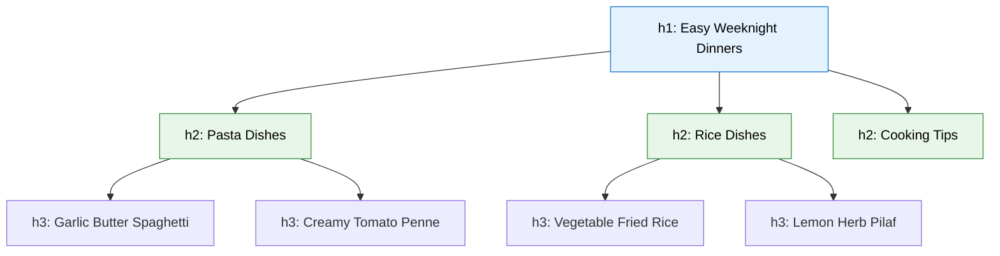
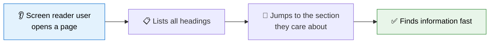

Open any newspaper, textbook, or well-written blog post, and you will notice the same thing: the content is broken into sections, and each section starts with a title. Those titles let you **skim** the page, find what you need, and understand how ideas relate to each other.

HTML has a built-in tool for exactly this: **headings**. There are six levels, from `<h1>` (the most important) down to `<h6>` (the least important), and using them well is one of the highest-impact habits you can build as a web developer.

:::info Quick definition
An **HTML heading** is a title for a section of content. Headings come in six levels, `<h1>` through `<h6>`, and together they form the **outline** of your page.
:::

<AdsComponent />
<br />

## The Six Heading Levels

Here they are, all six, in one snippet:

```html
<h1>Heading level 1</h1>
<h2>Heading level 2</h2>
<h3>Heading level 3</h3>
<h4>Heading level 4</h4>
<h5>Heading level 5</h5>
<h6>Heading level 6</h6>
```

And this is how a browser displays them by default:

<BrowserWindow url="http://127.0.0.1:5500/index.html">
<>
<h1>Heading level 1</h1>
<h2>Heading level 2</h2>
<h3>Heading level 3</h3>
<h4>Heading level 4</h4>
<h5>Heading level 5</h5>
<h6>Heading level 6</h6>
</>
</BrowserWindow>

Notice that the text gets smaller as the number gets larger. Browsers apply these default sizes to help you *see* the hierarchy:

| Element | Typical default size | Typical role |
|---------|----------------------|--------------|
| `<h1>` | Largest (about 2em) | The main title of the whole page |
| `<h2>` | About 1.5em | A major section |
| `<h3>` | About 1.17em | A subsection inside an h2 |
| `<h4>` | About 1em | A sub-subsection |
| `<h5>` | About 0.83em | Rarely needed |
| `<h6>` | About 0.67em | Rarely needed |

:::warning Size is a side effect, not the purpose
The default sizes exist only so the hierarchy is visible when there is no CSS. **Never pick a heading level because you like how big or small it looks.** Pick it because of where the section sits in your page's structure. You can always change the size later with CSS.
:::

## Headings Build an Outline

Think of headings as the **table of contents** of your page. Each level is a step deeper into the topic.

Here is a page about a cooking website:

```html title="recipes.html"
<h1>Easy Weeknight Dinners</h1>

<h2>Pasta Dishes</h2>
<h3>Garlic Butter Spaghetti</h3>
<h3>Creamy Tomato Penne</h3>

<h2>Rice Dishes</h2>
<h3>Vegetable Fried Rice</h3>
<h3>Lemon Herb Pilaf</h3>

<h2>Cooking Tips</h2>
```

Drawn as a tree, the structure becomes obvious:



A reader (or a search engine, or a screen reader) can understand what this page is about just by looking at the headings, without reading a single paragraph. That is exactly what a good outline achieves.

## The Golden Rules of Headings

### Rule 1: Use one `<h1>` per page

The `<h1>` is the **main title** of the page: the answer to "What is this page about?" Modern HTML technically allows more than one, but a **single `<h1>`** is the widely recommended practice because it keeps your page's purpose crystal clear.

```html
<h1>HTML Headings Tutorial</h1>
```

:::note `<h1>` vs. `<title>`
These two are often confused. The **`<title>`** sits in the `<head>` and appears on the browser tab and in search results. The **`<h1>`** sits in the `<body>` and appears at the top of the page content. They are usually similar, but they are not the same element and do not do the same job.
:::

### Rule 2: Do not skip levels

Go down **one level at a time**. An `<h2>` should be followed by `<h3>` subsections, not suddenly by an `<h5>`.

<Tabs groupId="heading-levels">
  <TabItem value="good" label="✅ Logical order" default>

```html
<h1>Travel Guide</h1>
<h2>Europe</h2>
<h3>France</h3>
<h3>Italy</h3>
<h2>Asia</h2>
```

Each level is one step deeper than the previous one.

  </TabItem>
  <TabItem value="bad" label="❌ Skipped levels">

```html
<h1>Travel Guide</h1>
<h4>Europe</h4>
<h2>France</h2>
<h6>Italy</h6>
```

The levels jump around randomly. The outline is broken, and screen reader users will be confused about how the sections relate.

  </TabItem>
</Tabs>

Going *back up* is perfectly fine. After an `<h3>` you can start a new `<h2>` for the next major section, as in the example above.

### Rule 3: Choose by meaning, style with CSS

Never use a heading just to make text big or bold. And never avoid a heading just because its default size looks too large.

<Tabs groupId="heading-style">
  <TabItem value="wrong-way" label="❌ Wrong reason" default>

```html
<!-- Using h4 only because I want smaller text -->
<h4>Welcome to My Website</h4>

<!-- Using h1 only because I want big bold text -->
<h1>Sale ends tonight!</h1>
```

  </TabItem>
  <TabItem value="right-way" label="✅ Right reason">

```html
<h1>Welcome to My Website</h1>
<p class="promo">Sale ends tonight!</p>
```

```css title="styles.css"
h1 {
  font-size: 1.5rem; /* smaller, but still the main heading */
}

.promo {
  font-size: 2rem;
  font-weight: bold; /* big and bold, but not a heading */
}
```

  </TabItem>
</Tabs>

<AdsComponent />
<br />

## Why Headings Matter for SEO

Search engines read your headings to figure out what each part of your page is about. While there is no magic formula, good heading habits help:

- **Your `<h1>` should describe the page's main topic** in clear, natural language.
- **Your `<h2>` and `<h3>` headings should describe the subtopics** people might search for.
- **Descriptive headings** make it easier for search engines to show your page for the right questions, and sometimes even to feature a section directly in results.

Compare these two headings for a page about houseplants:

| Weak heading | Stronger heading |
|--------------|------------------|
| `Introduction` | `How to Care for a Snake Plant` |
| `Tips` | `Watering: How Often Does a Snake Plant Need It?` |
| `More info` | `Common Snake Plant Problems and Fixes` |

:::tip Write headings for people first
Do not stuff headings with repeated keywords. A heading that reads naturally and clearly describes its section will serve both your visitors and search engines far better than one that sounds robotic.
:::

## Why Headings Matter for Accessibility

Sighted users skim a page by scanning large, bold titles. **Screen reader users do the same thing by ear**: their software can list every heading on the page or jump directly from one to the next.



That only works if your headings are **real headings** with a **logical hierarchy**. If you fake headings by styling a `<p>` to look big and bold, a screen reader sees just another paragraph, and the user has no way to skim.

<Tabs groupId="fake-heading">
  <TabItem value="fake" label="❌ Fake heading" default>

```html
<p style="font-size: 28px; font-weight: bold;">Our Services</p>
```

Looks like a heading to sighted users. To assistive technology, it is only a paragraph.

  </TabItem>
  <TabItem value="real" label="✅ Real heading">

```html
<h2>Our Services</h2>
```

Announced as a heading, listed in heading menus, and reachable by heading-jump shortcuts.

  </TabItem>
</Tabs>

## What Can Go Inside a Heading?

A heading can contain plain text and **inline elements** such as `<em>`, `<strong>`, `<a>`, and `<span>`:

```html
<h2>Why <em>everyone</em> should learn HTML</h2>
<h3><a href="/tutorials/html">HTML Tutorials</a></h3>
```

<BrowserWindow url="http://127.0.0.1:5500/index.html">
<>
<h2>Why <em>everyone</em> should learn HTML</h2>
<h3><a href="/tutorials/html">HTML Tutorials</a></h3>
</>
</BrowserWindow>

What you should **not** put inside a heading is block-level content, such as a `<div>` or a `<p>`. You learned why in the [Nesting](/tutorials/html/html-syntax/nesting) lesson: a heading is a text container, not a layout wrapper.

### Headings can be link targets

Combine a heading with the `id` attribute from the [Global Attributes](/tutorials/html/html-syntax/global-attributes) lesson, and you can link straight to that section from anywhere:

```html
<h2 id="pricing">Pricing</h2>

<!-- Elsewhere on the page, or on another page -->
<a href="#pricing">Jump to pricing</a>
```

This is exactly how the table of contents on the right side of these tutorial pages works.

## Headings and Sectioning Elements

HTML5 introduced elements like `<header>`, `<main>`, `<section>`, and `<article>`, which you will study in a later module. They work beautifully with headings:

```html title="blog-post.html"
<main>
  <article>
    <header>
      <h1>10 Tips for Learning to Code</h1>
    </header>

    <section>
      <h2>Tip 1: Practice Every Day</h2>
      <p>Consistency beats intensity...</p>
    </section>

    <section>
      <h2>Tip 2: Build Small Projects</h2>
      <p>Projects turn theory into skill...</p>
    </section>
  </article>
</main>
```

:::note About "resetting" heading levels inside sections
Early HTML5 drafts proposed that every `<section>` could restart its own heading levels at `<h1>`. **Browsers never implemented this**, and screen readers do not use it. So always use the real heading level that matches the page's overall outline, even inside sections and articles.
:::

## A Note on Subheadings and Taglines

Sometimes a heading has a subtitle or tagline, like "The Complete Guide" beneath "Learning HTML." A subtitle is not a new section, so it should **not** be another heading level. Use a paragraph instead:

```html
<h1>Learning HTML</h1>
<p>The complete beginner's guide to building web pages</p>
```

HTML also has an `<hgroup>` element for grouping a heading with its subtitle, but the simple heading-plus-paragraph pattern above works everywhere and is perfectly fine for beginners.

<AdsComponent />
<br />

## Writing Great Headings

Good headings are a writing skill as much as a technical one. Keep these habits in mind:

- **Be descriptive.** "Getting Started with Git" beats "Getting Started."
- **Be concise.** A heading is a label, not a sentence from the middle of a paragraph.
- **Be unique.** Avoid repeating the same heading text many times on one page.
- **Be parallel.** If your headings are "Installing Git" and "Configuring Git," keep that pattern instead of switching to "How Do I Make Commits?"
- **Never leave one empty.** An empty heading confuses assistive technology and adds nothing.

## Common Heading Mistakes

<details>
  <summary>1. Choosing a heading level for its size</summary>

```html
<!-- ❌ h5 used just because it looks small -->
<h5>Our Company History</h5>

<!-- ✅ Use the right level and shrink it with CSS if needed -->
<h2 class="small-heading">Our Company History</h2>
```

</details>

<details>
  <summary>2. Using bold paragraphs instead of headings</summary>

```html
<!-- ❌ Not a real heading -->
<p><strong>Contact Us</strong></p>

<!-- ✅ A real heading -->
<h2>Contact Us</h2>
```

</details>

<details>
  <summary>3. Skipping heading levels</summary>

Jumping from `<h2>` straight to `<h5>` breaks the outline. Move down one level at a time.

</details>

<details>
  <summary>4. Having no h1, or an h1 that does not match the page</summary>

Every page should have a clear `<h1>` that describes its main topic. A page whose first heading is an `<h3>`, or whose `<h1>` is only the site logo text on every page, loses much of the structure benefit.

</details>

<details>
  <summary>5. Using headings for layout or spacing</summary>

Do not wrap unrelated text in a heading just to push content down or make it stand out. Use CSS margins and padding for spacing.

</details>

## Try It Yourself

This travel blog snippet has a broken heading structure. Can you spot at least four problems?

```html title="broken-headings.html"
<h3>My Travel Blog</h3>
<h1>Day 1: Paris</h1>
<h4>Morning</h4>
<h4>Afternoon</h4>
<h2>Day 2: Rome</h2>
<p style="font-size: 30px; font-weight: bold;">Evening</p>
```

<details>
  <summary>👀 Click to reveal the solution</summary>

```html title="fixed-headings.html"
<h1>My Travel Blog</h1>
<h2>Day 1: Paris</h2>
<h3>Morning</h3>
<h3>Afternoon</h3>
<h2>Day 2: Rome</h2>
<h3>Evening</h3>
```

1. The main title "My Travel Blog" was an `<h3>`, but it should be the page's `<h1>`.
2. "Day 1: Paris" was the `<h1>`, but it is a major section, so it becomes an `<h2>`.
3. "Morning" and "Afternoon" jumped to `<h4>`, skipping `<h3>`. They become `<h3>`.
4. "Evening" was a styled paragraph faking a heading, so it became a real `<h3>`.

</details>

## Quick Recap

- HTML has six heading levels, **`<h1>` to `<h6>`**, forming the **outline** of your page.
- Use **one `<h1>`** per page as the main title, and go down **one level at a time**.
- Choose a heading level for **meaning and structure**, never for size. Use **CSS** to change how it looks.
- Good headings help **SEO** by describing your page's topics clearly.
- Real headings power **accessibility**, letting screen reader users skim and jump between sections.
- Headings can contain **inline elements**, and combined with `id`, they can be **link targets**.
- A subtitle is usually a **paragraph**, not another heading level.

## Frequently Asked Questions

<details>
  <summary>How many h1 tags should a page have?</summary>

HTML allows more than one, but using a single `<h1>` per page is the widely recommended practice. It keeps the page's main topic clear for visitors, search engines, and assistive technology.

</details>

<details>
  <summary>What is the difference between h1 and title?</summary>

The `<title>` element lives in the `<head>` and appears in the browser tab and search results. The `<h1>` lives in the `<body>` and is the main visible heading of the page content. They are usually related, but they are separate elements.

</details>

<details>
  <summary>Can I skip heading levels, like going from h2 to h4?</summary>

You should avoid it. Skipping levels breaks the logical outline and can confuse screen reader users. Go down one level at a time, though you may jump back up to a higher level when starting a new section.

</details>

<details>
  <summary>How do I make a heading smaller without changing its level?</summary>

Use CSS, for example `h2 { font-size: 1.2rem; }`. The heading level describes structure, while CSS controls appearance.

</details>

<details>
  <summary>Do headings affect SEO?</summary>

Yes. Search engines use headings to understand the structure and topics of a page. Clear, descriptive headings that reflect real content help, but keyword stuffing does not.

</details>

<details>
  <summary>Should I use h5 and h6?</summary>

Rarely. Most pages are well served by h1 through h3, and sometimes h4. If you find yourself needing h5 or h6 often, consider whether your content could be split into separate sections or pages.

</details>

## Test Your Understanding

1. What is the difference in meaning between `<h1>` and `<h6>`?
2. Why is it a bad idea to choose `<h4>` just because it looks the right size?
3. What does it mean to "skip a heading level," and why should you avoid it?
4. How does a screen reader user benefit from real headings?
5. Where should a subtitle like "The complete beginner's guide" go?

<AdsComponent />
<br />