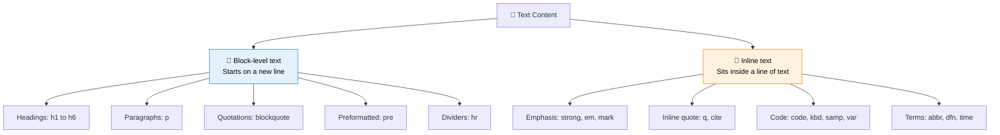

Words are the heart of the web. Articles, tutorials, product descriptions, error messages, buttons: almost everything people come to a website for is **text**. That makes text elements the most-used tools in your HTML toolbox.

In the [HTML Syntax](/tutorials/html/html-syntax) module, you learned the grammar of HTML: tags, elements, attributes, and nesting. Now you get to use that grammar to do what HTML does best: **give meaning and structure to written content.**

This module goes far beyond making text look bold or big. You will learn to choose the element that correctly describes *what your text is*: a heading, a quotation, a piece of code, an abbreviation, or an important warning. That choice helps search engines rank your pages, helps screen readers read them aloud properly, and makes your code easier for other developers to understand.

:::tip Think in meaning, not appearance
A beginner asks, "How do I make this text big and bold?" A professional asks, "What *is* this text?" If it is the title of a section, it is a **heading**. If it is a warning, it is **important**. Once the meaning is right, CSS can handle the look later.
:::

<AdsComponent />
<br />

## What You Will Learn

By the end of this module, you will be able to:

- Build a clear content outline with **headings** from `<h1>` to `<h6>`.
- Write and organize **paragraphs** correctly.
- Control **line breaks** and use **horizontal rules** to divide content.
- Emphasize text with **`<strong>`**, **`<em>`**, and other formatting elements, and know when *not* to use `<b>` and `<i>`.
- Mark up **quotations and citations** with `<blockquote>`, `<q>`, and `<cite>`.
- Display **code and preformatted text** using `<code>`, `<pre>`, `<kbd>`, and friends.
- Explain **abbreviations and definitions** with `<abbr>` and `<dfn>`.
- Mark up **dates, times, and contact information** meaningfully.

## Module Roadmap

Follow the lessons in order, since each one builds naturally on the last.

| # | Lesson | What you'll get |
|---|--------|-----------------|
| 1 | [Headings](./headings.mdx) | The six heading levels, how to build a proper outline, and why it matters for SEO. |
| 2 | [Paragraphs](./paragraphs.mdx) | The workhorse of text content, and how browsers treat it. |
| 3 | [Line Breaks](./line-breaks.mdx) and [Horizontal Rules](./horizontal-rule.mdx) | When to use `<br>` and `<hr>`, and when to reach for something else. |
| 4 | [Text Formatting](#) | `<strong>`, `<em>`, `<mark>`, `<small>`, `<sub>`, `<sup>`, and how they differ from `<b>` and `<i>`. |
| 5 | [Quotations](./quotations.mdx) and [Citations](./citations.mdx) | Marking up quoted material with `<blockquote>`, `<q>`, and `<cite>`. |
| 6 | [Code and Preformatted Text](./code-text.mdx) | Showing code samples, keyboard shortcuts, and text that keeps its spacing. |
| 7 | [Abbreviations and Definitions](./abbreviations.mdx) | Explaining terms with `<abbr>` and `<dfn>`. |
| 8 | [Dates and Contact Information](#) | Using `<time>` and `<address>` the right way. |

## A Quick Preview

Here is a small snippet that uses several of the elements you are about to master. Read it once, and see how each element describes a different kind of text.

```html title="text-preview.html"
<article>
  <h1>Why Learn HTML?</h1>
  <p>
    HTML is the <strong>foundation</strong> of every website. As
    <cite>Tim Berners-Lee</cite> designed it, it was meant to be
    <em>simple</em> enough for anyone to use.
  </p>
  <blockquote>
    The power of the Web is in its universality.
  </blockquote>
  <p>
    Press <kbd>Ctrl</kbd> + <kbd>S</kbd> to save, then open
    <code>index.html</code> in your browser.
  </p>
</article>
```

And here is how the browser displays it:

<BrowserWindow url="http://127.0.0.1:5500/index.html">
<>
<article>
  <h1>Why Learn HTML?</h1>
  <p>
    HTML is the <strong>foundation</strong> of every website. As <cite>Tim Berners-Lee</cite> designed it, it was meant to be <em>simple</em> enough for anyone to use.
  </p>
  <blockquote>The power of the Web is in its universality.</blockquote>
  <p>
    Press <kbd>Ctrl</kbd> + <kbd>S</kbd> to save, then open <code>index.html</code> in your browser.
  </p>
</article>
</>
</BrowserWindow>

Notice how each element tells the browser something different: a **heading**, an **important** word, an **emphasized** word, a **person's name being cited**, a **quotation**, **keyboard keys**, and a **piece of code**. Every one of those is an element you will learn to use with confidence.

## The Big Picture: Two Families of Text Elements

Most text elements fall into one of two families. You met this idea in the [Elements](/tutorials/html/html-syntax/elements) lesson, and it matters even more here.



- **Block-level text elements** create the *shape* of your content: sections, paragraphs, and quotes.
- **Inline text elements** add *meaning inside* those blocks: an important word, a piece of code, an abbreviation.

Good HTML uses both together: blocks for structure, inline elements for detail.

## Why Text Semantics Matter

Choosing the right text element is not just about tidiness. It has real, practical benefits:

| Benefit | How proper text markup helps |
|---------|------------------------------|
| **SEO** | Search engines use headings and emphasis to understand what your page is about and which parts matter most. |
| **Accessibility** | Screen reader users can jump between headings, hear emphasis, and understand quotations and abbreviations. |
| **Maintainability** | Meaningful elements make your code self-explanatory to teammates and your future self. |
| **Styling power** | When each kind of text has its own element, CSS can style them consistently across the whole site. |
| **Future-proofing** | Devices, apps, and tools you have never heard of can still interpret well-structured text correctly. |

:::info A fun fact about screen readers
Many blind and low-vision users navigate a page by **jumping from heading to heading**, much like a sighted reader skims bold titles in a newspaper. A page that uses headings properly is far easier for them to explore than one where every title is just a large, bold paragraph.
:::

## How to Get the Most Out of This Module

- **Ask "what is this text?" before choosing an element.** Let meaning drive your choice.
- **Write a real article as you learn.** Pick a topic you love and build a small page, adding one new element per lesson.
- **Use DevTools on real sites.** Inspect a news article or blog post and notice which text elements the authors chose. The [Browser Developer Tools](/tutorials/html/getting-started/browser-developer-tools) lesson shows you how.
- **Do not style with HTML.** If a piece of text should merely *look* different, that is a job for CSS, which you will learn later.